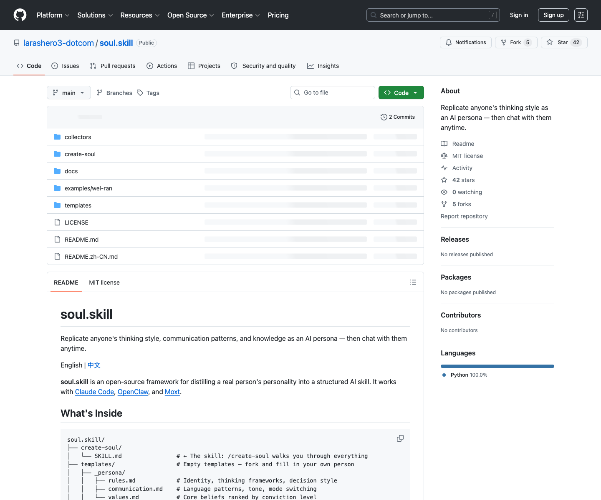

# 人格思维风格蒸馏 Skill：soul.skill

## 直观预览

> GitHub 页面截图；本次只收藏，不安装 Skill。

## 一句话价值

一个用于创建 AI persona 的 Skill 框架，把人物语料蒸馏成可对话的思维风格、沟通模式、价值观、典型语录和主题知识边界。

## AI 选用指南

| 项目 | 选用说明 |
| --- | --- |
| 优先选用条件 | 要将公开或授权资料整理成可对话的人格结构、主题知识和来源索引。 |
| 不适合或暂缓条件 | 只想统一文章语言与结构时选 Writing DNA；不提供语音识别或音色合成。 |
| 复用方式 | 读取 Skill；套用方法 |
| 输入与产出 | 人物材料、用途边界、来源 → persona、quotes、knowledge 与 sources 文件。 |
| 首次读取入口 | [本卡](./人格思维风格蒸馏Skill-Soul-Skill-2026-07-23.md) →「内容摘要」；随后读取[本地历史资料](../../_附件/项目备份/Soul-Skill/create-soul-SKILL-2026-07-23.md) |
| 同类选择依据 | Soul Skill 建人格与知识层；Writing DNA 建写作规则；Talk to 峰哥提供实时语音链路参考。 对照：[写作风格蒸馏 Skill：Writing DNA](./写作风格蒸馏Skill-Writing-DNA-2026-07-23.md)、[实时语音人格音色克隆项目：Talk to 峰哥](../../04-工具网站/开源项目/实时语音人格音色克隆项目-Talk-to-Fengge-2026-07-18.md)。 |
| 接入前提与待核实项 | 先阅读备份 Skill 确认输入要求，真实人物使用需明确授权和身份表达；收藏不证明当前客户端已安装。 |
| 检索词 | soul.skill create-soul persona quotes knowledge 数字分身 人格蒸馏 |

> 选用说明整理于 2026-09-20：适用与比较为基于收藏证据的建议；正文中的版本、数量、价格与功能范围按原收录时间理解。本次未安装或运行所收藏的工具，当前环境安装状态另查。未对外部来源作全量实时复核。

## 内容摘要

`larashero3-dotcom/soul.skill` 是一个“创建灵魂 / persona”的 Agent Skill 框架，目标是把某个人的公开或授权材料蒸馏成一个可被 AI 使用的人格 Skill。它支持 Claude Code、OpenClaw、Moxt 等 Agent 环境，核心入口是 `create-soul/SKILL.md`。

它的技术逻辑可以概括为：先确认要创建的人物和使用边界；再收集文章、访谈、视频、社媒、聊天记录等材料；随后做三轮蒸馏，把原始材料切块、打标签、聚类、去重、排序；最后组装成 persona 文档、quotes 文档、topic knowledge 文档和 sources 元数据。生成后的 Skill 不是一个长 prompt，而是一个按主题懒加载的知识与人格结构。

目录设计也很有参考价值：`templates/_persona/` 保存核心人格规则、沟通方式和价值观；`_quotes/` 保存标志性表达与内部语录；`_knowledge/` 按主题存放知识边界；`_meta/sources.md` 保存材料来源；`collectors/` 提供 URL、YouTube transcript、Twitter archive、即刻导出等采集脚本。

## 为什么值得收藏

1. 它比普通 persona prompt 更工程化：把人格、语录、知识边界、来源记录和采集脚本拆成可维护结构。
2. 适合研究“数字分身”的技术逻辑：语料输入、标签聚类、特征提取、知识分层、按需加载、最终 Skill 安装。
3. 对自己的长期知识库也有启发：可以把一个人的表达习惯和知识主题拆开保存，而不是全部塞进一个大文件。
4. 中文蒸馏指南写得清楚：50+ datapoints 可用，200+ 更可信，500+ 更接近真人风格。
5. MIT 许可证便于学习和改造，但真实人物人格复刻必须注意授权、隐私、冒充风险和身份披露。

## 未来可以怎么用

- 如果要做授权数字分身，可以参考它的语料收集、sources 记录、人格拆分和知识懒加载结构。
- 如果只是学习某个创作者的思考方式，可以把它当作分析框架，不用于冒充对话或误导发布。
- 和 `Writing DNA` 组合：前者负责可对话 persona，后者负责文章写作风格。
- 和实时语音项目组合时，可以作为“人格层”，再接入语音、记忆和实时对话技术栈。
- 参考其模板结构，设计自己的角色型 Agent Skill，例如项目顾问、写作导师、产品伙伴。

## 原始内容 / 链接

- GitHub：[https://github.com/larashero3-dotcom/soul.skill](https://github.com/larashero3-dotcom/soul.skill)
- 仓库：`larashero3-dotcom/soul.skill`
- 收录时语言：Python
- 收录时 Star / Fork：42 / 5
- 收录时最新提交：`b81d8fc1c9e1`，`2026-03-31T05:27:39Z`，`Remove soul-chat skill, keep only create-soul`
- License：MIT
- 本地截图：`../../_附件/收藏预览/Soul-Skill-GitHub-2026-07-23.png`
- 源码 zip：`../../_附件/项目备份/Soul-Skill/Soul-Skill-2026-07-23.zip`
- Git bundle：`../../_附件/项目备份/Soul-Skill/Soul-Skill-2026-07-23.bundle`
- README 快照：`../../_附件/项目备份/Soul-Skill/README-2026-07-23.md`
- 中文 README 快照：`../../_附件/项目备份/Soul-Skill/README-zh-CN-2026-07-23.md`
- create-soul Skill 快照：`../../_附件/项目备份/Soul-Skill/create-soul-SKILL-2026-07-23.md`
- 中文蒸馏指南快照：`../../_附件/项目备份/Soul-Skill/distillation-guide-zh-CN-2026-07-23.md`

## 相关联想

- 和 `Talk to 峰哥` 的关系很强：Talk to 峰哥偏实时语音与音色链路，soul.skill 偏人格与思维风格蒸馏。
- 和 `Writing DNA` 形成上下游：先理解人物写作风格，再扩展到可对话 persona。
- 可以作为“个人知识库人格化”的原型，把一个专家的公开材料变成可问答的知识角色。
- 风险边界要前置：需要授权、标注 AI 生成、避免冒充、避免处理隐私或敏感聊天记录。

## 适合反向调用的场景

- 我想做一个授权数字分身，有没有 persona Skill 框架？
- 我想把某个人的思维风格蒸馏成 AI 角色，应该怎么组织材料？
- 我想区分写作风格蒸馏和人格蒸馏，有哪些收藏可以参考？
- 我想给语音 Agent 加人格层，有没有可复用结构？
- 我需要一个带 sources、quotes、knowledge 和 persona 模板的 AI 人格仓库。
