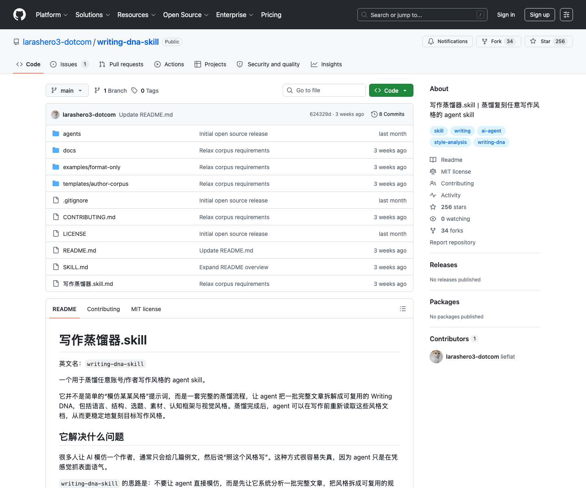

# 写作风格蒸馏 Skill：Writing DNA

## 直观预览

> GitHub 页面截图；本次只收藏，不安装 Skill。

## 一句话价值

一个“写作蒸馏器”式 Agent Skill，用至少 20 篇完整文章提取作者的语言、结构、选题、素材、认知框架和视觉表达，沉淀成可复用的 Writing DNA。

## AI 选用指南

| 项目 | 选用说明 |
| --- | --- |
| 优先选用条件 | 已有足够文章样本，想提炼作者语言、文章结构、选题与认知习惯，持续校准写作。 |
| 不适合或暂缓条件 | 只有一两句样本时不承诺稳定风格；需要可对话人格或声音时不靠本卡解决。 |
| 复用方式 | 读取 Skill；套用方法 |
| 输入与产出 | 文章语料与目标用途 → Writing-DNA 总索引、语言和结构规则。 |
| 首次读取入口 | [本卡](./写作风格蒸馏Skill-Writing-DNA-2026-07-23.md) →「内容摘要」；随后读取[本地历史资料](../../_附件/项目备份/Writing-DNA-Skill/SKILL-2026-07-23.md) |
| 同类选择依据 | Writing DNA 提炼长期写作风格；rnskill 的 rn-renhua 精修单篇表达；Soul Skill 组织人格。 对照：[雪踏乌云 AI Agent Skills 集合：rnskill](./雪踏乌云AI-Agent-Skills集合-rnskill-2026-07-07.md)、[人格思维风格蒸馏 Skill：soul.skill](./人格思维风格蒸馏Skill-Soul-Skill-2026-07-23.md)。 |
| 接入前提与待核实项 | 原卡建议通常至少 20 篇完整文本；先确认材料使用范围与样本代表性，安装状态需在当前环境另查。 |
| 检索词 | Writing DNA writing-dna-skill 语言DNA 文章结构 品牌表达 风格蒸馏 |

> 选用说明整理于 2026-09-20：适用与比较为基于收藏证据的建议；正文中的版本、数量、价格与功能范围按原收录时间理解。本次未安装或运行所收藏的工具，当前环境安装状态另查。未对外部来源作全量实时复核。

## 内容摘要

`larashero3-dotcom/writing-dna-skill` 的核心不是简单模仿语气，而是把写作风格拆成多层可复用结构。它要求先准备一批完整语料，通常至少 20 篇 `.md` 或 `.txt` 文章，并放在 `raw/` 或 `raw-corpus/` 目录。Skill 读取语料后，会从表层语言一路分析到认知框架和视觉表达，最终输出一套作者写作 DNA 文档。

它的技术逻辑可以概括为：输入原始文章语料；清洗和阅读样本；按六层模型提取稳定特征；把特征写入结构化文档；再用这些文档作为之后写作、改写、选题和风格校准的上下文。六层模型包括：表层语言、文章结构、选题逻辑、素材策略、认知框架、视觉风格。

默认输出包括 `_meta/`、`语言DNA.md`、`文章结构模板.md`、`写作视角与认知框架.md`、`视觉风格指南.md` 和 `Writing-DNA.md`。其中 `Writing-DNA.md` 更像总索引，其他文件则把语言习惯、结构节奏、思维方式和视觉呈现拆开保存，适合后续被 Agent 局部调用。

## 为什么值得收藏

1. 它把“像某个作者写”拆成可审计的分析层，而不是一句模糊 prompt。
2. 对建立个人写作系统很有价值：可以蒸馏自己的旧文章，得到可复用的表达规则、标题结构、段落节奏和认知框架。
3. 对品牌表达也有参考意义：可以把一个账号、产品或创作者的稳定文风变成团队可共享的写作规范。
4. 它明确写了使用边界：不公开提交未授权原文，不冒充作者，不误导读者，私密或付费内容需要授权。
5. MIT 许可证便于学习、二次改造和作为自己的 Skill 结构样本。

## 未来可以怎么用

- 蒸馏自己的历史文章，形成“我的写作 DNA”，之后让 Codex 按它改写微博、小红书、长文和产品文案。
- 分析公开账号或作者时，只做风格参考和结构学习，不做冒充发布。
- 给 glint.red 或其他项目建立品牌表达规则，把语言、视觉、认知框架拆开沉淀。
- 和 `rnskill` 的中文写作精修能力搭配：先按 Writing DNA 生成，再用去 AI 味规则精修。
- 参考它的六层模型，设计其他“风格蒸馏”类 Skill，例如演讲风格、视频脚本风格、品牌人格风格。

## 原始内容 / 链接

- GitHub：[https://github.com/larashero3-dotcom/writing-dna-skill](https://github.com/larashero3-dotcom/writing-dna-skill)
- 仓库：`larashero3-dotcom/writing-dna-skill`
- 收录时 Star / Fork：256 / 34
- 收录时最新提交：`624329d9cbcf`，`2026-06-29T10:56:33Z`，`Update README.md`
- License：MIT
- 本地截图：`../../_附件/收藏预览/Writing-DNA-Skill-GitHub-2026-07-23.png`
- 源码 zip：`../../_附件/项目备份/Writing-DNA-Skill/Writing-DNA-Skill-2026-07-23.zip`
- Git bundle：`../../_附件/项目备份/Writing-DNA-Skill/Writing-DNA-Skill-2026-07-23.bundle`
- README 快照：`../../_附件/项目备份/Writing-DNA-Skill/README-2026-07-23.md`
- SKILL 快照：`../../_附件/项目备份/Writing-DNA-Skill/SKILL-2026-07-23.md`
- 使用边界快照：`../../_附件/项目备份/Writing-DNA-Skill/usage-boundaries-2026-07-23.md`

## 相关联想

- 可以和 `人格思维风格蒸馏 Skill：soul.skill` 区分使用：Writing DNA 关注文章表达，soul.skill 关注可对话的人格和思维方式。
- 可以和 `雪踏乌云 AI Agent Skills 集合：rnskill` 组合成“风格生成 + 中文精修 + 去 AI 味”的写作链路。
- 可以作为长期内容资产：每次积累新的高质量文章，都可以继续补充语料重新蒸馏。
- 使用公开作者风格时要保留伦理边界：学习风格，不冒充身份。

## 适合反向调用的场景

- 我想让 AI 学我的写作风格，有没有收藏过相关 Skill？
- 我想分析一个账号的文章风格，应该怎么拆语言、结构和认知框架？
- 我想做品牌文案统一，有没有 Writing DNA 模板？
- 我想建立自己的中文写作提示词系统。
- 我需要一套比“模仿某某风格”更靠谱的写作蒸馏流程。
