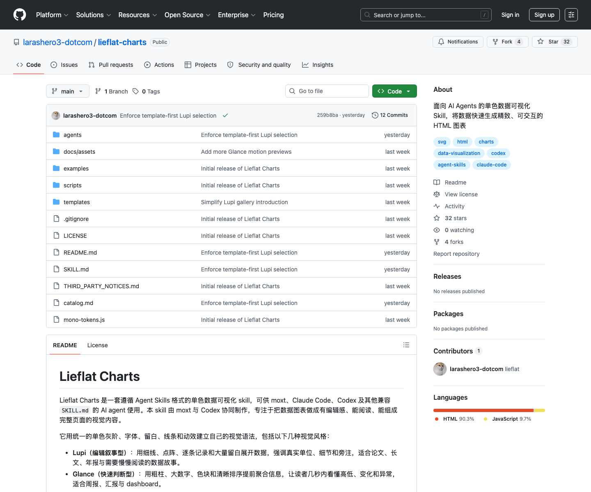

# 单色数据可视化 Skill：Lieflat Charts

## 直观预览

> GitHub 页面截图；本次只收藏，不安装 Skill。

## 一句话价值

一套面向 AI Agent 的单色数据可视化 Skill，把数据和使用场景转成无需构建、双击可打开、改数据只需改顶部数组的精致 HTML 图表。

## AI 选用指南

| 项目 | 选用说明 |
| --- | --- |
| 优先选用条件 | 要按数据关系生成单文件 HTML 图表，偏单色、编辑感或有注释的数据叙事。 |
| 不适合或暂缓条件 | 目标是完整 PPT、实时监控系统或商业交付且授权未明时，不直接作为执行方案。 |
| 复用方式 | 读取 Skill；套用模板 |
| 输入与产出 | 数据、单位、来源、读者任务 → 按 catalog 选型的 HTML 图表。 |
| 首次读取入口 | [本卡](./单色数据可视化Skill-Lieflat-Charts-2026-07-23.md) →「内容摘要」；随后读取[本地历史资料](../../_附件/项目备份/Lieflat-Charts/catalog-2026-07-23.md) |
| 同类选择依据 | Lieflat Charts 生成图表；DashiAI PPT、open-kimi-ppt 负责整套演示；Openpanel 是数据分析系统。 对照：[可编辑演示文稿生成 Skill：DashiAI PPT](./可编辑演示文稿生成Skill-DashiAI-PPT-2026-07-08.md)、[Kimi Slides 兼容 PPT 生成 Skill：open-kimi-ppt](./Kimi-Slides兼容PPT生成Skill-open-kimi-ppt-2026-08-06.md)、[开源产品分析平台：Openpanel](../../04-工具网站/开源项目/开源产品分析平台-Openpanel-2026-08-22.md)。 |
| 接入前提与待核实项 | 历史许可证为 PolyForm Noncommercial；商业用途先核实授权。图型建议不替代数据验证，当前安装状态未知。 |
| 检索词 | Lieflat Charts Lupi Glance catalog HTML图表 年报 单色 可视化 |

> 选用说明整理于 2026-09-20：适用与比较为基于收藏证据的建议；正文中的版本、数量、价格与功能范围按原收录时间理解。本次未安装或运行所收藏的工具，当前环境安装状态另查。未对外部来源作全量实时复核。

## 内容摘要

`larashero3-dotcom/lieflat-charts` 是一个遵循 Agent Skills 格式的数据可视化 Skill，目标不是生成通用图库默认样式，而是让 Agent 根据数据语义和阅读场景，从模板库里选择合适图型，再沿用模板骨架生成单文件 HTML。

它的技术逻辑可以概括为：用户给出数据、场景和阅读目标；Agent 先按 `catalog.md` 判断数据结构和读者任务；默认优先审查 `Lupi Editorial` 和 `Lupi Basics`，只有二者不适合或用户明确要 dashboard / 三秒快读时才使用 `Glance`；选型后沿用对应模板的 SVG、Canvas、Chart.js 或 ECharts 结构，替换数据、标题、注释、来源和必要布局；最终交付一个可直接打开的 HTML 文件。

模板体系分为 4 类：`Lupi Editorial` 偏年报、论文、公众号、海报和作品集，强调叙事、留白、真实单位和注释；`Lupi Basics` 覆盖柱、线、面积、环形、散点、瀑布、热力、进度等基础图型；`Glance` 偏周报、dashboard、监控和汇报，强调快速排序与比较；`Interactive` 用于网络、路径、多段流向和高密度关系数据。

## 为什么值得收藏

1. 它把“图表审美”写进了 Agent Skill：不是让模型随便画图，而是先选模板、再守住数据编码和视觉语法。
2. 对 Codex 很有复用价值：可直接参考它的 `SKILL.md`、`catalog.md`、模板目录和校验脚本，设计自己的可视化生成工作流。
3. 48 个模板覆盖叙事图、基础图、dashboard 快读图和交互大图，适合报告、周报、运营看板、产品复盘和公开传播。
4. 单文件 HTML 的交付方式很实用，数据放在文件顶部，后续手改、二次生成、嵌入 Obsidian 或发给别人都方便。
5. 许可证为 PolyForm Noncommercial 1.0.0，适合个人学习和非商业使用；商业项目使用前需要重新确认授权边界。

## 未来可以怎么用

- 做产品周报、增长复盘、运营分析时，让 Agent 用它生成更有编辑感的 HTML 图表。
- 建立自己的“数据 -> 图表选型 -> HTML 输出 -> Obsidian 收藏”的分析素材流程。
- 参考它的模板优先策略，写自己的可视化 Skill，避免 AI 每次从零瞎画。
- 和 DashiAI PPT、研究资料、工作记录组合，用于把数据分析快速转成汇报页。
- 如果以后要安装，优先按官方命令安装指定 skill；本次没有执行安装。

## 原始内容 / 链接

- GitHub：[https://github.com/larashero3-dotcom/lieflat-charts](https://github.com/larashero3-dotcom/lieflat-charts)
- 仓库：`larashero3-dotcom/lieflat-charts`
- 收录时语言：HTML
- 收录时 Star / Fork：32 / 4
- 收录时最新提交：`259b8ba9dc9b`，`2026-07-22T06:25:51Z`，`Enforce template-first Lupi selection`
- License：PolyForm Noncommercial License 1.0.0
- 本地截图：`../../_附件/收藏预览/Lieflat-Charts-GitHub-2026-07-23.png`
- 源码 zip：`../../_附件/项目备份/Lieflat-Charts/Lieflat-Charts-2026-07-23.zip`
- Git bundle：`../../_附件/项目备份/Lieflat-Charts/Lieflat-Charts-2026-07-23.bundle`
- README 快照：`../../_附件/项目备份/Lieflat-Charts/README-2026-07-23.md`
- SKILL 快照：`../../_附件/项目备份/Lieflat-Charts/SKILL-2026-07-23.md`
- Catalog 快照：`../../_附件/项目备份/Lieflat-Charts/catalog-2026-07-23.md`

## 相关联想

- 可以和 `可编辑演示文稿生成 Skill：DashiAI PPT` 组合：前者产图表，后者产可编辑 PPT。
- 可以和工作记录系统组合：周总结或月总结里有数据时，直接转成 Obsidian 可打开的 HTML 图表。
- 它的“先选型、再生成、保留模板骨架”的原则也适合 UI 组件、视频模板和写作模板类 Skill。
- 非商业许可证需要醒目标注，后续如果用于客户交付或商业产品，要先查清授权。

## 适合反向调用的场景

- 我想让 Codex 生成一张更好看的数据图表，有没有收藏过相关 Skill？
- 我有一组运营数据，想做成 HTML 图表或报告插图。
- 我想做 dashboard / 周报 / 年报图表，有没有模板库参考？
- 我想写自己的图表生成 Skill，应该怎么组织模板、目录和选型规则？
- 我需要一个“单文件 HTML + 顶部数据数组”的可视化交付方式。
