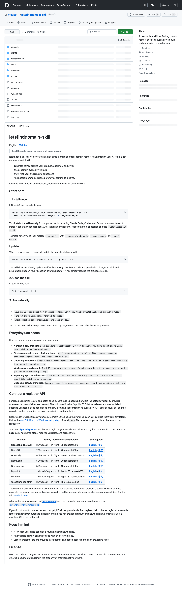

# 域名命名与可用性查询 Skill：letsfinddomain

## 直观预览

> letsfinddomain-skill GitHub 页面截图。已额外保存 README、中文 README、SKILL、LICENSE 和源码 zip 快照，方便后续离线回看。

## 一句话价值

letsfinddomain-skill 是一个只读 AI Skill，用于根据产品 brief 生成域名候选、批量查询可用性、比较首年价和续费价，并在购买前提醒明显品牌冲突。

## AI 选用指南

| 项目 | 选用说明 |
| --- | --- |
| 优先选用条件 | 项目命名阶段需要批量生成域名候选、查注册情况并比较首年与续费成本。 |
| 不适合或暂缓条件 | 购买、转移或改 DNS 不属于此 Skill；RDAP 未命中不能当成确定可购买。 |
| 复用方式 | 读取 Skill；查询服务 |
| 输入与产出 | 产品定位、命名风格、TLD 与预算 → 带查询依据和时间的候选清单。 |
| 首次读取入口 | [本卡](./域名命名与可用性查询Skill-letsfinddomain-2026-07-27.md) →「内容摘要」；随后读取[本地历史资料](../../_附件/项目备份/letsfinddomain-skill/SKILL-2026-07-27.md) |
| 同类选择依据 | letsfinddomain 用于命名与只读查询；Cloudflare 收藏卡只是进入已有账号管理页面。 对照：[Cloudflare 仪表盘管理入口](../../04-工具网站/服务平台/Cloudflare仪表盘管理入口-2026-07-08.md)。 |
| 接入前提与待核实项 | 注册商 API 可用性、凭据和结果时间影响可信度；价格与可注册状态必须当次查询，不能复用历史值。 |
| 检索词 | letsfinddomain 域名 命名 RDAP TLD premium 续费 注册商 |

> 选用说明整理于 2026-09-20：适用与比较为基于收藏证据的建议；正文中的版本、数量、价格与功能范围按原收录时间理解。本次未安装或运行所收藏的工具，当前环境安装状态另查。未对外部来源作全量实时复核。

## 内容摘要

`meepo-it/letsfinddomain-skill` 是一个面向 AI 工具的域名命名与查询 Skill。仓库描述为：`A read-only AI skill for finding domain names, checking availability in bulk, and comparing renewal prices.`

它的工作方式是让用户在 Claude Code、Codex、Cursor 等支持 slash skill 的工具里输入 `/letsfinddomain-skill`，然后直接用自然语言描述需求。例如：为图片压缩工具找 20 个 `.com` 域名、检查 `snapkit.com / snapkit.ai / snapkit.dev`、为 AI 会议纪要工具想 30 个名字并避开知名产品冲突。

Skill 的核心能力包括：

1. 根据产品、用户、风格、长度、TLD、预算和禁用词生成候选名字。
2. 批量查询域名可用性，不把未解析结果误报为可用。
3. 展示首年注册价和续费价格，避免低首年价掩盖高续费成本。
4. 提醒明显品牌、产品或商标碰撞风险。
5. 支持多个注册商 provider，包括 Spaceship、NameSilo、GoDaddy、Name.com、Namecheap、Dynadot、Porkbun、Cloudflare Registrar。
6. 严格只读：不会购买域名、转移域名，也不会修改 DNS。

README 推荐优先配置 Spaceship 作为默认可用性 provider；如果没有注册商 API，也可以用 RDAP 做有限试用，但 RDAP 只能查注册记录，不能保证注册商愿意出售，也不提供 premium 或续费价格。

## 为什么值得收藏

1. 它把“起名灵感”和“真实可买域名”连在一起，避免只得到一堆听起来不错但不可注册的名字。
2. 它明确要求同时看首年价和续费价，这对做独立站、SaaS、内容产品、工具站都很实用。
3. 它把 provider 配置、限速、批量查询和失败状态写进 Skill 规则，适合学习工具型 Skill 如何约束外部 API 调用。
4. 只读边界清晰，适合做 Agent Skill 的安全设计参考：查询可以自动化，购买和 DNS 变更必须留给用户。
5. 对以后启动项目很直接：想产品名、查 `.com / .ai / .app / .dev`、比较候选、筛掉明显冲突，都可以反向调用。

## 未来可以怎么用

- 给新产品、网站、工具、内容品牌起名时，让 Codex 先生成候选，再用这个 Skill 查可用性和续费价。
- 为 glint.red 或其他项目找相关域名时，用它批量比较 `.com`、`.ai`、`.app`、`.dev` 等 TLD。
- 做命名决策时，不只看“可不可买”，还让它比较记忆点、发音、品牌冲突风险和价格。
- 写自己的 Skill 时，参考它的只读边界、provider 配置、限速策略、失败状态处理和用户友好输出方式。
- 做域名注册商工具台时，参考它对 Spaceship、NameSilo、GoDaddy、Name.com、Namecheap、Dynadot、Porkbun、Cloudflare Registrar 的 provider 抽象。

## 原始内容 / 链接

- GitHub：[https://github.com/meepo-it/letsfinddomain-skill](https://github.com/meepo-it/letsfinddomain-skill)
- 仓库：`meepo-it/letsfinddomain-skill`
- GitHub API 观察时间：2026-07-27
- 创建时间：`2026-07-27T05:29:36Z`
- 更新时间：`2026-07-27T08:04:10Z`
- 推送时间：`2026-07-27T06:09:54Z`
- 语言：Python
- License：MIT
- 收录时 Star / Fork：27 / 1
- GitHub 描述：`A read-only AI skill for finding domain names, checking availability in bulk, and comparing renewal prices.`
- 本地 GitHub 截图：`../../_附件/收藏预览/letsfinddomain-skill-GitHub-2026-07-27.png`
- README 快照：`../../_附件/项目备份/letsfinddomain-skill/README-2026-07-27.md`
- 中文 README 快照：`../../_附件/项目备份/letsfinddomain-skill/README-zh-CN-2026-07-27.md`
- SKILL 快照：`../../_附件/项目备份/letsfinddomain-skill/SKILL-2026-07-27.md`
- LICENSE 快照：`../../_附件/项目备份/letsfinddomain-skill/LICENSE-2026-07-27`
- 源码 zip：`../../_附件/项目备份/letsfinddomain-skill/letsfinddomain-skill-source-2026-07-27.zip`

## 相关联想

- 和 [[写作风格蒸馏Skill-Writing-DNA-2026-07-23]] 的关系：Writing DNA 偏品牌语言与表达风格，letsfinddomain 偏品牌命名和域名可用性检查。
- 和 [[人格思维风格蒸馏Skill-Soul-Skill-2026-07-23]] 的关系：Soul Skill 可沉淀 persona，letsfinddomain 可为 persona 产品或数字分身项目寻找域名。
- 和 [[AI-Agent开源连接器网关-OpenConnector-2026-07-12]] 的关系：如果未来要把域名注册商 API 接入 Agent 工具层，可参考 OpenConnector 的 provider / action / credential 边界。
- 和 [[AI协作执行心得-Vibe开发-2026-07-03]] 的关系：项目立项前可以把“命名 + 域名 + 价格 + 冲突检查”加入 Vibe 开发启动清单。

## 适合反向调用的场景

- 我想给新产品起名字，并检查域名是否可用。
- 帮我找一批 `.com / .ai / .app / .dev` 域名候选。
- 我有几个项目名候选，帮我比较记忆点、品牌冲突风险和域名价格。
- 我想让 Codex 自动查域名，但不要购买或修改 DNS。
- 我想写一个外部 API 型 Codex Skill，有没有安全边界清晰的参考？
