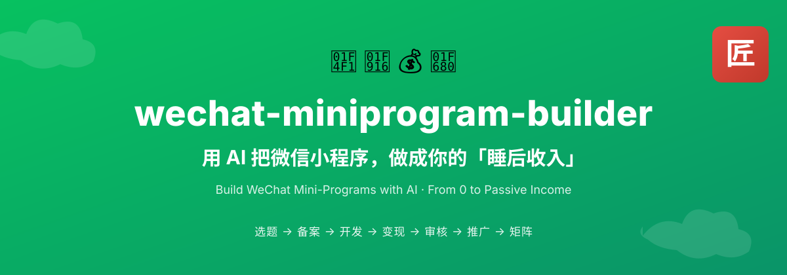

# 微信小程序全生命周期 AI 开发 Skill：wechat-miniprogram-builder

## 直观预览

> 项目自带 Banner。它把微信小程序从选题、备案、开发、变现、审核、推广到矩阵化运营组织成一条可供 AI 调用的工作流。

## 一句话价值

这是一套面向 AI 助手的微信小程序全生命周期方法论，用决策树把选题、注册备案、开发、广告变现、审核发布、推广和矩阵运营拆成按需加载的参考文件，并内置平台合规、收益承诺和密钥安全边界。

## AI 选用指南

| 项目 | 选用说明 |
| --- | --- |
| 优先选用条件 | 微信小程序从选题到开发、上线、推广，需要按当前阶段读取流程和模板。 |
| 不适合或暂缓条件 | 通用网站或原生 App 不能直接照搬小程序流程；不是已经运行的小程序工程。 |
| 复用方式 | 读取 Skill；套用方法 |
| 输入与产出 | 想法、主体条件、当前阶段、功能目标 → 阶段计划、开发 Brief 或上线检查表。 |
| 首次读取入口 | [本卡](./微信小程序全生命周期AI开发Skill-wechat-miniprogram-builder-2026-08-03.md) →「内容摘要」；随后读取[本地历史资料](../../_附件/项目备份/wechat-miniprogram-builder/UNIVERSAL-2026-08-03.md) |
| 同类选择依据 | 本卡是平台专用流程；YAO Meta Skill 是流程封装方法；JTBD 可先澄清用户任务。 对照：[Agent Skill 全生命周期工程化框架：YAO Meta Skill](./Agent-Skill全生命周期工程化框架-YAO-Meta-Skill-2026-08-05.md)、[JTBD 用户任务理论](../../09-研究资料/JTBD用户任务理论-2026-07-29.md)。 |
| 接入前提与待核实项 | 先读 UNIVERSAL 与相关 reference；平台审核、备案、变现规则执行时查官方最新要求，历史笔记不作为当前门槛依据。 |
| 检索词 | wechat-miniprogram-builder 微信小程序 WXML WXSS 提审 选题 上线清单 |

> 选用说明整理于 2026-09-20：适用与比较为基于收藏证据的建议；正文中的版本、数量、价格与功能范围按原收录时间理解。本次未安装或运行所收藏的工具，当前环境安装状态另查。未对外部来源作全量实时复核。

## 内容摘要

`wechat-miniprogram-builder` 不是可直接运行的小程序源码，而是一套“工具无关方法论 + WorkBuddy Skill 入口”。它把用户当前目标映射到不同的 `references/*.md`，再调用 `assets/` 中的提示词、上线检查清单和小红书笔记模板，帮助 AI 分阶段产出具体交付物。

仓库包含两种入口：

- `SKILL.md`：带触发元数据的 WorkBuddy 专用入口，可根据“小程序、流量主、备案、微信开发者工具、小程序推广”等关键词自动触发。
- `UNIVERSAL.md`：工具无关版本，可作为 Cursor、Claude Code、Cline、ChatGPT、通义灵码、CodeBuddy 等 AI 工具的项目上下文或系统指令。

方法模块覆盖：

1. 广告、订阅与其他变现方式的选择。
2. 选题和需求判断。
3. 小程序账号注册、备案、认证及主体类型差异。
4. AI 辅助开发、原生 WXML/WXSS/JS 提示词和广告接入。
5. 云开发、AI 能力接入及违规激活码方案的风险说明。
6. 上传、审核、发布和被拒后的修复。
7. 小红书冷启动、标题与笔记模板。
8. 多小程序矩阵化运营。

## 为什么值得收藏

1. 把“做一个小程序”拆成从选题到增长的完整链路，避免 AI 只关注写代码而漏掉主体、备案、审核和运营。
2. 用意图到 reference 的决策树按需加载材料，适合参考复杂 Agent Skill 的渐进式上下文结构。
3. 配套提示词、上线清单和小红书模板，能直接改造成项目交付物。
4. 明确写出五条底线：平台规则以官方最新为准、不承诺收益、违规激活码方案不可上线、个人与企业主体权限不同、密钥不得泄露。
5. 同时提供专用 Skill 和通用版文档，便于比较“自动触发入口”和“跨工具系统指令”两种封装方式。
6. 采用 MIT 许可，方法论与模板在保留许可声明的前提下便于二次整理。

## 未来可以怎么用

- 有具体微信小程序想法时，先调用选题与需求判断模块，再决定主体、变现方式和技术方案。
- 把 `release-checklist.md` 改造成每个小程序项目的提审前固定检查表。
- 给 Codex 提供 `UNIVERSAL.md` 和当前阶段的 reference，让它只解决当前问题，减少一次加载全部资料造成的上下文噪声。
- 参考其决策树，为其他垂直业务建立“总入口 + 分阶段 reference + 可复制模板”的 Agent Skill。
- 做推广时参考小红书模板的结构，但重新核查广告法、平台规范和具体产品事实，避免收益承诺。
- 所有备案、流量主门槛、支付、AI 能力和审核规则，在执行前回到微信公众平台官方文档确认最新要求。

## 原始内容 / 链接

- GitHub：[https://github.com/chenjin-cmd/wechat-miniprogram-builder](https://github.com/chenjin-cmd/wechat-miniprogram-builder)
- 作者：`chenjin-cmd`
- 默认分支：`main`
- 收藏时 HEAD：`e8bba7855d9209451b2d2b5a9fa17c15b8d42401`
- 许可证：MIT
- README 快照：[README-2026-08-03.md](../../_附件/项目备份/wechat-miniprogram-builder/README-2026-08-03.md)
- Skill 快照：[SKILL-2026-08-03.md](../../_附件/项目备份/wechat-miniprogram-builder/SKILL-2026-08-03.md)
- 通用版快照：[UNIVERSAL-2026-08-03.md](../../_附件/项目备份/wechat-miniprogram-builder/UNIVERSAL-2026-08-03.md)
- LICENSE 快照：[LICENSE-2026-08-03](../../_附件/项目备份/wechat-miniprogram-builder/LICENSE-2026-08-03)
- 源码快照：[wechat-miniprogram-builder-source-2026-08-03.zip](../../_附件/项目备份/wechat-miniprogram-builder/wechat-miniprogram-builder-source-2026-08-03.zip)
- 远程引用快照：[refs-2026-08-03.txt](../../_附件/项目备份/wechat-miniprogram-builder/refs-2026-08-03.txt)
- 收藏状态：只收藏，未安装。

## 相关联想

- 和 [[AI协作执行心得-Vibe开发-2026-07-03]] 的关系：前者提供通用 AI 开发执行纪律，这个项目把纪律进一步落到微信小程序的业务全周期。
- 和 [[域名命名与可用性查询Skill-letsfinddomain-2026-07-27]] 的关系：两者都采用入口文档、明确边界和按任务调用的 Skill 结构，但本项目更偏业务方法论。
- 可以把“官方规则复核”做成每个易变平台 Skill 的固定前置步骤，而不是把仓库中的具体门槛长期视为事实。

## 适合反向调用的场景

- 我想用 AI 做一个微信小程序，应该从哪里开始？
- 微信小程序选题、备案、开发、审核和推广有没有完整流程？
- 帮我做一份小程序上线前检查清单。
- 个人主体和企业主体做小程序分别有哪些限制？
- 收藏里有没有适合参考的分阶段 Agent Skill 结构？
- 我想给小程序写小红书推广内容，有哪些模板和合规边界？
