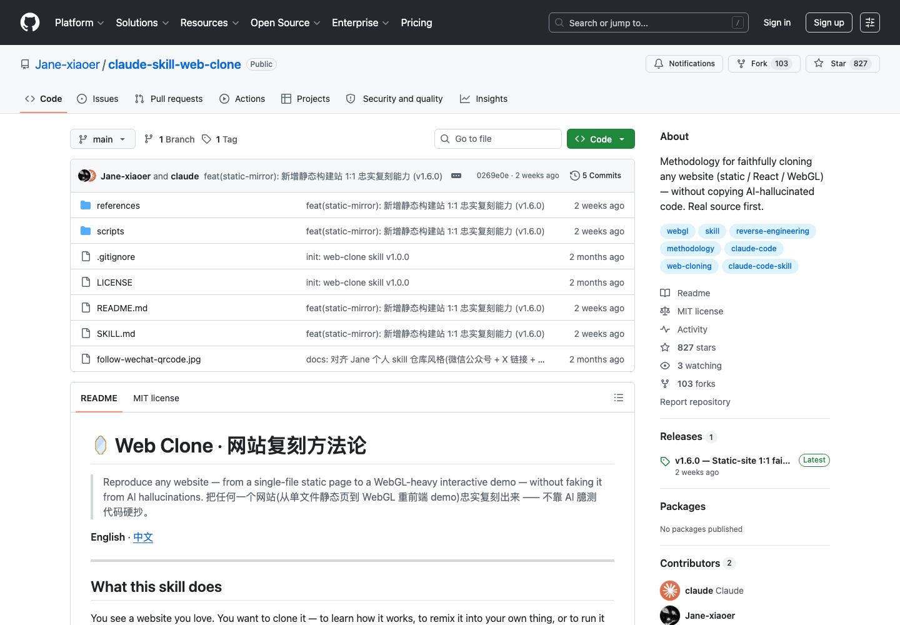

# 网站复刻真源码优先方法论：web-clone

## 直观预览

> web-clone GitHub 页面截图，直观看它是网站复刻和源码优先方法论 Skill。

## 一句话价值

一个面向 Claude / Codex / Cursor 的网站复刻 Skill，把“先拿真源码、再判路径、再逆向拆解、最后浏览器验证”做成可重复流程，避免 AI 臆造代码。

## AI 选用指南

| 项目 | 选用说明 |
| --- | --- |
| 优先选用条件 | 网站重建前需要判断源码、静态镜像、模板重建或 WebGL 逆向路径，并建立证据纪律。 |
| 不适合或暂缓条件 | 已有清晰规格只需普通开发时不必做完整侦察；资料不足时不能把猜测写成原站源码。 |
| 复用方式 | 读取 Skill；套用方法 |
| 输入与产出 | 目标网址、迁移范围、可访问资源 → 证据分级、重建路径和验证方案。 |
| 首次读取入口 | [本卡](./网站复刻真源码优先方法论-web-clone-2026-07-09.md) →「内容摘要」 |
| 同类选择依据 | web-clone 做证据与路线判断；ai-website-cloner 提供 Next.js 重建模板；设计词典帮助命名结构。 对照：[AI 网站反向重建模板：ai-website-cloner](../工作流/AI网站反向重建模板-ai-website-cloner-2026-07-09.md)、[Vibe Coding 视觉词典：布局、结构、导航与组件](../../01-界面设计/交互细节/Vibe-Coding视觉词典-布局结构导航组件-2026-08-05.md)。 |
| 接入前提与待核实项 | 读取目标 Skill 与工具依赖后再执行；可见页面不等于可重用资产，当前项目范围与授权按实际情况判断。 |
| 检索词 | web-clone 复刻 证据 SOURCE PARTIAL GUESS WebGL Canvas visual diff |

> 选用说明整理于 2026-09-20：适用与比较为基于收藏证据的建议；正文中的版本、数量、价格与功能范围按原收录时间理解。本次未安装或运行所收藏的工具，当前环境安装状态另查。未对外部来源作全量实时复核。

## 内容摘要

`Jane-xiaoer/claude-skill-web-clone` 是一个网站复刻 / 克隆方法论 Skill，核心原则是“真源码至上”。它明确要求：任何 AI 生成的复刻分析或施工图，只能参考概念骨架，里面的可执行代码默认都要当作臆造，必须逐行用真实源码、运行时证据或帧捕获核验。

它覆盖静态 HTML/CSS、React / Vue / Next 内容站、多页面站、SPA / SaaS 页面、复杂交互站、WebGL / Canvas / Three.js 重前端、Astro / Vite SSG / Hugo 静态构建站等不同分支。项目内置一组可执行脚本，包括站点侦察、资源采集、网络捕获、路由爬取、交互探针、source map 搜索、静态站镜像、visual diff、clone audit 和 design-dna scaffold。

它和 `AI 网站反向重建模板：ai-website-cloner` 的关系是互补的：后者更像 Next.js 复刻项目模板和多 agent 施工流；这个 Skill 更像复刻前的“证据纪律 + 决策树 + 逆向方法论 + 探针工具箱”。

## 为什么值得收藏

1. 它解决了 AI 复刻最常见的问题：看起来合理但实际完全跑不通的臆造代码。
2. 对复杂 WebGL / Canvas / Three.js 效果很有价值，强调 real source、runtime capture、baseline-first replay 和 evidence grading。
3. 对普通网站复刻也有流程价值：先搜 GitHub 真源码，再浏览器侦察，再选路径，而不是直接让 AI 猜。
4. 内置脚本能沉淀复刻证据：截图、资源、网络请求、路由、交互状态、visual diff、CLONE_REPORT 和 CLONE_AUDIT。
5. 许可纪律清楚：GitHub 公开不等于 MIT，无 license 默认 All Rights Reserved，只能本地学习，不能公开部署。

## 未来可以怎么用

- 遇到想学习或复刻的网站时，先用这个 Skill 的决策树判断该走源码 clone、静态镜像、模板重建还是 WebGL 逆向。
- 做 glint.red 或其他项目的视觉参考时，用 `design-dna.json` 抽取“设计身份”，保留视觉 DNA，替换成自己的内容。
- 复刻复杂交互或 WebGL 效果时，用 evidence grading 标记 `SOURCE / PARTIAL / GUESS`，防止无证据硬写。
- 和 `ai-website-cloner-template` 配合：这个 Skill 做侦察、证据和路径判断，后者负责 Next.js 模板重建和并行施工。
- 和 `BoardUI`、`Recordly` 一起构成“学习界面 -> 还原页面 -> 录制展示”的完整流程。

## 原始内容 / 链接

- GitHub：[https://github.com/Jane-xiaoer/claude-skill-web-clone](https://github.com/Jane-xiaoer/claude-skill-web-clone)
- 核心文件：`SKILL.md`
- 当前读取到的版本：`1.6.0`
- License：MIT
- 核心原则：real source first、never copy AI-guessed code
- 代表案例：`references/marbles-case.md`
- 关键脚本：`recon-site.mjs`、`mirror-site.mjs`、`route-crawl.mjs`、`interaction-probe.mjs`、`network-capture.mjs`、`sourcemap-hunt.mjs`、`visual-diff.mjs`、`audit-clone.mjs`、`dna-scaffold.mjs`

## 相关联想

- 可与 `AI 网站反向重建模板：ai-website-cloner` 组成完整复刻工作流：先证据侦察，再模板重建。
- 可与 `Dashboard 设计系统：BoardUI` 搭配：先学习 UI 语言，再用复刻流程约束 agent 还原。
- 可与 `Recordly` 搭配：复刻/重建完成后录制 walkthrough 和功能 demo。
- 可作为自己的 `AGENTS.md` 规则参考，把“真源码优先、浏览器验证、许可检查、可视 diff”沉淀成默认前端工作流。

## 适合反向调用的场景

- 我想复刻一个网站，但不想让 AI 瞎猜代码。
- 我想逆向 WebGL / Canvas / Three.js 交互效果。
- 我需要判断一个站应该镜像、重建模板，还是逐行逆向。
- 我想把某个网站的视觉 DNA 提取出来，换成自己的内容。
- 我想建立一套带证据、截图、visual diff 和许可检查的网站复刻流程。
