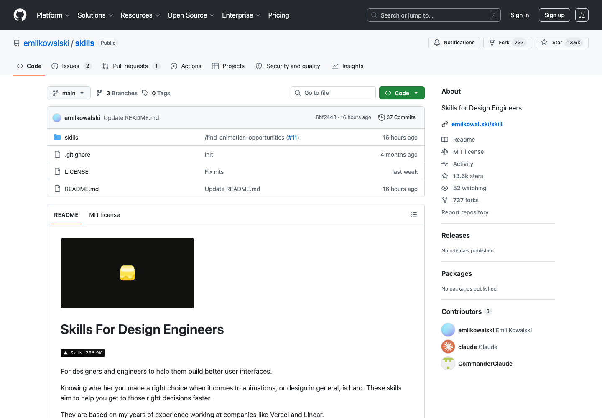

# 设计工程 AI 技能库：emilkowalski Skills

## 直观预览

> emilkowalski Skills 的 GitHub 页面截图，展示面向设计工程的 Agent Skill 集合入口。

## 一句话价值

一组将 UI 品味、动效判断、平台设计原则和原型探索流程编码为 Agent 指令的 Skills，适合提升 AI 生成前端的完成度。

## 内容摘要

这是 Emil Kowalski 维护的开源设计工程 Skill 仓库，README 定位为 `Skills For Design Engineers`。它不是让 AI 自动决定视觉风格的素材包，而是给代理补充具体的设计、动效、性能和可访问性判断规则。

截至 `2026-08-05`，README 列出 8 个 Skills：

1. `emil-design-eng`：面向 UI 打磨和动效设计的主 Skill，涵盖评审输出、动效频率、easing、时长、transform-origin、性能和 `prefers-reduced-motion` 等规则。
2. `review-animations`：对已有动画实现做严格审查，找出不自然、无必要或影响性能和可用性的动效。
3. `improve-animations`：基于全仓动画实现制定并执行改进计划。
4. `find-animation-opportunities`：识别真正值得加入动效的位置，避免为动而动。
5. `animation-vocabulary`：将口语化的动效感受映射为可用于需求和提示词的准确术语。
6. `apple-design`：将 Apple 设计原则用于产品界面与交互决策。
7. `pick-ui-library`：按项目需求选择合适的 UI 组件库。
8. `prototype`：在隔离的原型区做 3 个真正不同的方向，并用可切换选择器供用户比较；不直接改动生产代码。

本次只更新收藏资料和本地备份，未将该仓库安装到 Codex 或当前项目。远端默认分支为 `main`，本次记录的 HEAD 为 `da80201b64de7d608a6dc5f723797ce6c65b692b`，许可证为 MIT。

## 为什么值得收藏

1. 它补的是 AI 前端最容易缺失的判断层：代码可运行不代表界面、动效和反馈有质感。
2. 规则足够具体，可直接作为代理工作的上下文、评审清单或自建 Skill 的结构样本。
3. 覆盖从做之前的原型分叉、UI 库选型，到做之后的动效审查与改进，使用链条完整。
4. `prototype` 的隔离探索机制很实用：先提供可比较的真实方向，再选择，不用让试验污染生产实现。
5. MIT 许可证和本地快照便于长期参考、二次整理与版本对照。

## 未来可以怎么用

1. 生成界面前，用 `emil-design-eng` 与 `apple-design` 约束交互、密度、反馈和无障碍细节。
2. 动效完成后，依次用 `review-animations` 和 `improve-animations` 发现并修正问题。
3. 产品还没有明确视觉方向时，用 `prototype` 先在隔离区生成三种可操作的方案再决定。
4. 需要新增组件库时，以 `pick-ui-library` 的判断框架比较维护成本、可访问性和项目适配度。
5. 将其中稳定有效的规则整理为自己的中文 Agent Skill、设计验收清单或 `AGENTS.md` 约束。

## 原始内容 / 链接

- 仓库：[emilkowalski/skills](https://github.com/emilkowalski/skills)
- 作者：emilkowalski
- 安装命令（仅供后续需要时参考，未执行）：`npx skills@latest add emilkowalski/skills`
- 当前 README 快照：[README-2026-08-05.md](../../_附件/项目备份/emilkowalski-Skills/README-2026-08-05.md)
- 许可证快照：[LICENSE-2026-08-05.txt](../../_附件/项目备份/emilkowalski-Skills/LICENSE-2026-08-05.txt)
- 代表性 Skill 快照：[emil-design-eng](../../_附件/项目备份/emilkowalski-Skills/emil-design-eng-SKILL-2026-08-05.md)、[prototype](../../_附件/项目备份/emilkowalski-Skills/prototype-SKILL-2026-08-05.md)
- 完整源码快照：[main 分支 zip](../../_附件/项目备份/emilkowalski-Skills/emilkowalski-skills-main-2026-08-05.zip)
- 远端 refs 快照：[refs-2026-08-05.txt](../../_附件/项目备份/emilkowalski-Skills/refs-2026-08-05.txt)

## 相关联想

1. 可以把 "前端生成" 与 "动效审查" 拆成两个代理阶段，前者建立可用实现，后者专门收敛手感、性能和可访问性。
2. 可继续收集成熟团队的设计原则、动效规范和组件库选型文档，形成自己的设计工程 Skill 索引。
3. `prototype` 的三方向比较机制也可用于落地页、品牌页和产品功能的早期决策。

## 适合反向调用的场景

1. 我收藏过哪些能提升 AI 前端审美和交互细节的 Skill？
2. 现有界面的动画是否合理、流畅并兼顾 reduced motion？
3. 我需要先比较几个真实的 UI 方向，有什么收藏能约束原型流程？
4. 新项目该怎么选择 UI 组件库？
5. 我想搭自己的设计工程 Agent 规则库，有什么开源结构可参考？
