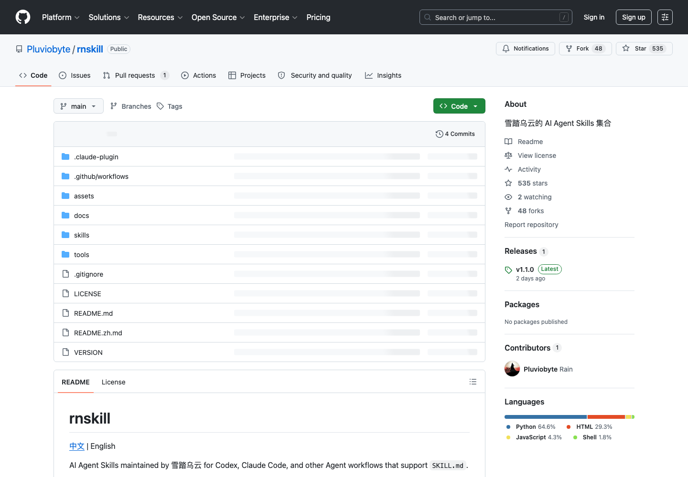

# 雪踏乌云 AI Agent Skills 集合：rnskill

## 直观预览



> rnskill GitHub 页面截图，直观看它是 AI Agent Skills 集合。


## 一句话价值

一组面向 Codex、Claude Code 等 AI Agent 的中文 Skill，覆盖“人话写作精修”、动效视频导演、暗色 SaaS 短片、黑白文字开场和参考视频复刻质检。

## AI 选用指南

| 项目 | 选用说明 |
| --- | --- |
| 优先选用条件 | 中文技术稿需要去 AI 味精修，或视频项目需要运动概念、黑白文字开场、暗色短片与复刻质检。 |
| 不适合或暂缓条件 | 不要把所有子 Skill 同时用于一篇稿件；客户商业交付前需核实非商业授权。 |
| 复用方式 | 读取 Skill；套用方法 |
| 输入与产出 | 原稿或视频 Brief、参考片、风格 → 精修文本、镜头运动方案或质检结果。 |
| 首次读取入口 | [本卡](./雪踏乌云AI-Agent-Skills集合-rnskill-2026-07-07.md) →「内容摘要」 |
| 同类选择依据 | rn-renhua 处理单篇表达；Writing DNA 提炼长期风格；Recordly 用于真实屏幕录制，不能由视频提示词替代。 对照：[写作风格蒸馏 Skill：Writing DNA](./写作风格蒸馏Skill-Writing-DNA-2026-07-23.md)、[开源演示视频录屏编辑器：Recordly](../../04-工具网站/开源项目/开源演示视频录屏编辑器-Recordly-2026-07-09.md)。 |
| 接入前提与待核实项 | 原卡记录 CC BY-NC 4.0；先核对使用范围和具体子 Skill 的依赖，收藏不等于已安装。 |
| 检索词 | rnskill rn-renhua rn-motion-director rn-replica-qc 去AI味 视频动效 |

> 选用说明整理于 2026-09-20：适用与比较为基于收藏证据的建议；正文中的版本、数量、价格与功能范围按原收录时间理解。本次未安装或运行所收藏的工具，当前环境安装状态另查。未对外部来源作全量实时复核。

## 内容摘要

`Pluviobyte/rnskill` 是雪踏乌云维护的 AI Agent Skills 集合，适用于支持项目级 `SKILL.md` 的 Agent 工作流。仓库版本为 `1.0.0`，许可证是 `CC BY-NC 4.0`。

它提供 5 个主要 Skill：

1. `rn-renhua`：中文 AI/技术写作去 AI 味精修，去除二元对比壳、伪洞察标记、冒号讲义腔等 AI 写作模式，同时保留作者判断和具体事实。
2. `rn-motion-director`：AI 动效导演元 Skill，把选题、脚本或主题转成运动优先的视频概念，强调视觉隐喻、运动语法、场景节拍和 Anti-PPT 质量门。
3. `rn-dark-saas-video`：暗色 SaaS 魔术短片 Skill，面向黑色星空舞台、紫色底光、大字动效、渐变 CTA 的产品视频风格。
4. `rn-bw-text-opener`：黑白文字打字机开场动画 Skill，包含黑底白字、逐字打字、同步音效和文字替换效果。
5. `rn-replica-qc`：参考视频复刻闭环质检 Skill，支持像素/视觉/风格三级保真度、帧对比、PSNR/SSIM 和可复用运动组件沉淀。

## 为什么值得收藏

1. `rn-renhua` 对中文技术写作很实用，直接针对 AI 味重、讲义腔、伪洞察句式等常见问题。
2. 视频相关 Skill 不是只写 prompt，而是把动效导演、风格生成、开场动画和复刻质检拆成了明确工作流。
3. Skill 结构清楚，适合参考如何写高质量 `SKILL.md`：触发条件、边界、必读文件、工作流、质量门都有定义。
4. 对 Codex/Claude Code 的长期能力沉淀有参考价值，可以借鉴其技能命名、路由方式和目录组织。

## 未来可以怎么用

- 安装 `rn-renhua`，用于中文技术文章、X/Twitter thread、产品笔记和模型评测稿的去 AI 味精修。
- 参考 `rn-motion-director`，给自己的视频制作 agent 增加“先找运动隐喻，而不是先做 PPT 页面”的约束。
- 参考 `rn-replica-qc`，建立视频复刻和动效对齐的证据链，包括帧采样、对比报告和修复日志。
- 如果做 glint.red 的内容表达，可以把 `rn-renhua` 作为中文公开写作的默认精修层。
- 如果后续整理自己的 Skill 仓库，可以参考它的 README、Claude 插件清单和每个 Skill 的边界写法。

## 原始内容 / 链接

- GitHub：https://github.com/Pluviobyte/rnskill
- 仓库：`Pluviobyte/rnskill`
- 版本：`1.0.0`
- License：CC BY-NC 4.0
- 作者：雪踏乌云 / @Pluvio9yte
- 安装全部 Skill：

```bash
npx -y skills add Pluviobyte/rnskill -g --all
```

- 安装单个 Skill：

```bash
npx -y skills add Pluviobyte/rnskill --skill rn-renhua
```

- Claude Code 插件市场：

```bash
claude plugin marketplace add Pluviobyte/rnskill
claude plugin install rn-renhua@rnskill
```

## 相关联想

- 可以和 `设计工程 AI 技能库：emilkowalski Skills` 一起作为 Skill 仓库结构参考。
- `rn-renhua` 值得单独拆成常用写作工具，尤其适合社媒、技术笔记和产品表达。
- 视频 Skill 可以和当前收录的动效素材库组合，用于建立“素材参考 + Agent 执行规则 + 质量检查”的闭环。

## 适合反向调用的场景

- 我收藏过哪些 Codex / Claude Code Skill？
- 有没有中文写作去 AI 味的 Skill？
- 想做 AI 视频动效，有没有可复用的 Agent 工作流？
- 想写自己的 `SKILL.md`，有哪些仓库结构可以参考？
- glint.red 的中文表达或演示视频可以用哪些 Agent 能力？
