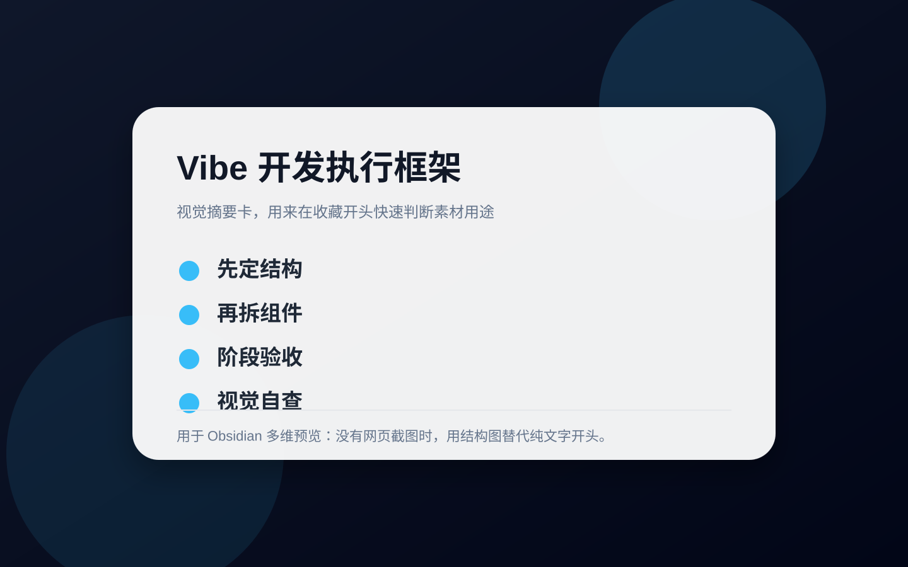

# AI 协作执行心得：Vibe 开发 5 条

## 直观预览

> 视觉摘要卡：把 Vibe 开发心得压缩成结构、组件、验收、自查四个动作。

## 一句话价值

这 5 条心得本质上是在给 AI 写产品这件事补一层“结构约束 + 阶段收拢 + 视觉验收 + 独立调试”的执行框架，能明显减少项目越做越乱的问题。

## AI 选用指南

| 项目 | 选用说明 |
| --- | --- |
| 优先选用条件 | AI 开发出现组件重复、样式混乱、验收缺失或调试范围过大，需要改善执行习惯。 |
| 不适合或暂缓条件 | 需要现成框架、部署工具或自动修复程序时，本卡只提供方法。 |
| 复用方式 | 套用方法 |
| 输入与产出 | 项目问题、当前规则与验收目标 → 简短协作约定、拆分方案和验证步骤。 |
| 首次读取入口 | [本卡](./AI协作执行心得-Vibe开发-2026-07-03.md) →「内容摘要」 |
| 同类选择依据 | Vibe 开发心得改善日常执行；Agency Agents 提供角色模板；YAO Meta Skill 将稳定流程封装为能力。 对照：[AI 专业角色 Agent 库：Agency Agents](../Agents规则/AI专业角色Agent库-Agency-Agents-2026-07-16.md)、[Agent Skill 全生命周期工程化框架：YAO Meta Skill](../Skills/Agent-Skill全生命周期工程化框架-YAO-Meta-Skill-2026-08-05.md)。 |
| 接入前提与待核实项 | 作为经验建议按项目取用；不要机械要求每个小修改都增加完整治理流程。 |
| 检索词 | Vibe开发 AGENTS.md 组件抽象 独立调试 验收 协作规范 |

> 选用说明整理于 2026-09-20：适用与比较为基于收藏证据的建议；正文中的版本、数量、价格与功能范围按原收录时间理解。本次未安装或运行所收藏的工具，当前环境安装状态另查。未对外部来源作全量实时复核。

## 内容摘要

这组心得围绕一个核心问题：AI 能很快把功能做出来，但如果缺少结构约束、阶段性清理和验收手段，项目很容易迅速失控，最后变成能跑但很难维护的堆叠物。

5 条具体做法分别是：

1. 在 `AGENTS.md` 或 `CLAUDE.md` 里提前约定代码结构、模块边界和实现前先做结构设计，避免所有逻辑无限堆进一个大文件。
2. 每完成一个小功能后，主动要求 AI 做一轮局部重构与稳定性整理，防止“补丁叠补丁”的实现方式不断累积。
3. 把样式、色彩、字号、间距等抽成 `Design.md`，并推动功能以可复用组件的形式维护，后续优先在组件层调整，而不是继续加一次性特殊样式。
4. 在前端预览阶段，让 AI 借助 Chrome DevTools MCP 或 Computer Use 做自查，确认还原效果接近预期或设计稿后再结束任务。
5. 在调试单个功能块或组件时，采用 isolated component preview harness 的思路，把目标组件独立渲染到临时页面，集中检查布局、间距、动效、截图和 DOM 状态。

它们组合起来，其实就是一套很实用的 AI 协作开发节奏：先约束结构，再允许生成；生成之后及时收拢；视觉上自查闭环；局部问题单独隔离验证。

## 为什么值得收藏

1. 它抓住了 AI 开发最常见的失控点，不是泛泛而谈，而是直接对应真实问题。
2. 每一条都能立刻转成提示词、规则或团队约定，执行成本不高。
3. 特别适合前端、产品原型、落地页、实验性小项目，因为这些场景最容易在快速迭代中越改越乱。
4. 它不是只讲“怎么让 AI 写代码”，而是补齐了“怎么让 AI 产物可维护、可验收、可复用”。

## 未来可以怎么用

1. 直接整理成你自己的 `AGENTS.md` / `CLAUDE.md` 默认规则模板。
2. 在每个新项目开始前，把“先做结构设计、再写功能”作为固定开场指令。
3. 在每完成一个阶段后，固定加一轮“重构、清理补丁、检查稳定性和性能”的整理动作。
4. 把样式体系、组件规范、验收方式沉淀成单独文档，让后续代理默认遵守。
5. 当某个组件或功能反复调不准时，用独立预览页面做隔离排查，而不是在整页环境里来回猜。

## 原始内容 / 链接

- 链接：无
- 来源平台：对话输入
- 作者或账号：用户分享

原始要点：

1. 提前约定代码结构与模块边界，避免单文件无限膨胀。
2. 每完成一个小功能后，让 AI 主动重构和清理补丁式堆叠。
3. 抽离设计规范到 `Design.md`，推动组件化维护。
4. 用 Chrome DevTools MCP 或 Computer Use 做前端还原自查。
5. 用 isolated component preview harness 做独立组件调试。

## 相关联想

1. 可以继续扩展成一套“AI 前端项目治理清单”，覆盖结构、命名、样式、验收、调试、发布。
2. 适合再拆出几张细卡，比如“组件化优先规则”“AI 前端验收规则”“局部隔离调试规则”。
3. 如果后续收集更多类似经验，可以汇成一张专门面向 Vibe 开发的执行手册。

## 适合反向调用的场景

1. 我想写一套更稳的 `AGENTS.md`，有哪些收藏过的原则能直接用？
2. AI 把前端越写越乱时，我之前收藏过哪些治理方法？
3. 我想让 AI 更重视组件化、样式规范和验收闭环，有没有现成素材？
4. 调某个组件总调不准时，我收藏过哪些独立调试思路？
