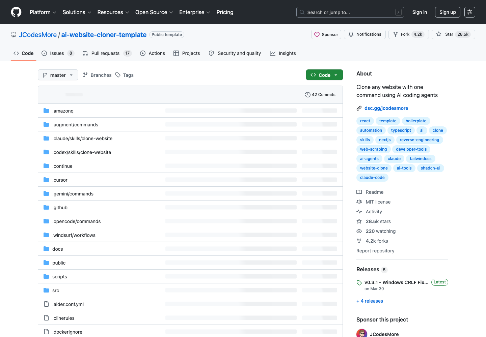

# AI 网站反向重建模板：ai-website-cloner

## 直观预览

> ai-website-cloner GitHub 页面截图，直观看网站反向重建模板的项目入口。

## 一句话价值

一个面向 AI coding agents 的网站反向重建模板：给定目标 URL 后，通过 `/clone-website` 工作流抓取设计、提取样式和资产，并生成现代 Next.js 代码库。

## AI 选用指南

| 项目 | 选用说明 |
| --- | --- |
| 优先选用条件 | 要将已有网站重建成 Next.js 项目，需要侦察、组件规格、实现与视觉对比的工程骨架。 |
| 不适合或暂缓条件 | 已有不同技术栈且不计划迁移时不整套引入；复杂 WebGL 也不保证模板可直接还原。 |
| 复用方式 | 使用项目模板；套用方法 |
| 输入与产出 | 目标站与范围、截图、响应式行为 → Next.js 重建项目和验证结果。 |
| 首次读取入口 | [本卡](./AI网站反向重建模板-ai-website-cloner-2026-07-09.md) →「内容摘要」 |
| 同类选择依据 | ai-website-cloner 提供工程模板；web-clone 先判断路线与证据；HeroUI 可作为控件方案另行比较。 对照：[网站复刻真源码优先方法论：web-clone](../Skills/网站复刻真源码优先方法论-web-clone-2026-07-09.md)、[现代 React 组件库：HeroUI](../../01-界面设计/组件/现代React组件库-HeroUI-2026-07-23.md)。 |
| 接入前提与待核实项 | 原卡记录 Next.js 16、React 19、Tailwind 4；先查当前依赖和已有项目兼容性，多 Agent 流程需符合当前任务权限。 |
| 检索词 | ai-website-cloner-template clone-website Next.js 迁移 组件规格 visual diff |

> 选用说明整理于 2026-09-20：适用与比较为基于收藏证据的建议；正文中的版本、数量、价格与功能范围按原收录时间理解。本次未安装或运行所收藏的工具，当前环境安装状态另查。未对外部来源作全量实时复核。

## 内容摘要

`JCodesMore/ai-website-cloner-template` 是一个可复用模板，用于把已有网站反向重建成干净的 Next.js 项目。它建议先用 GitHub 的 `Use this template` 创建自己的项目副本，再让 AI coding agent 在这个项目里运行 `/clone-website <target-url>`。

它的核心流程不是简单截图仿制，而是分阶段执行：先做 reconnaissance，抓取截图、交互、响应式状态和设计 token；再更新字体、颜色、全局样式并下载资产；然后写出组件规格文件；最后通过并行 builder agents 分段实现组件，组装页面并做 visual diff QA。

项目技术栈是 Next.js 16、React 19、TypeScript strict、Tailwind CSS v4、shadcn/ui、Lucide React，并提供多平台 Agent 配置，包括 Claude Code、Codex CLI、OpenCode、GitHub Copilot、Cursor、Windsurf、Gemini CLI、Cline、Roo Code、Continue、Amazon Q、Augment Code 和 Aider。

## 为什么值得收藏

1. 它把“让 AI 仿一个网站”拆成可执行流程：勘察、设计 token、资产下载、组件规格、并行构建、组装和 QA。
2. 对 Codex 工作流很有参考价值：项目有 `AGENTS.md` 作为单一规则源，并同步到不同 Agent 平台。
3. 适合做合法的网站迁移、遗失源码重建、旧站现代化、视觉拆解学习，而不是手动从零搭一遍。
4. 它强调组件规格和 computed CSS，而不是让 agent 靠视觉印象猜，实现质量更可控。

## 未来可以怎么用

- 迁移自己拥有的网站，把 WordPress、Webflow、Squarespace 或旧栈页面重建成 Next.js。
- 对一个公开页面做结构学习，拆解真实生产站点的布局、动画、响应式和设计 token。
- 给 Codex 设计更强的前端复刻流程时，参考它的 `AGENTS.md`、`/clone-website` skill 和多平台规则同步方式。
- 做页面重构时，先用它产出组件规格和资产清单，再决定是否完整重建。
- 和现有 UI 动效、设计工程 Skill、Recordly、DashiAI PPT 组合成“页面复刻 -> 演示材料 -> 视频展示”的完整链路。

## 原始内容 / 链接

- GitHub：[https://github.com/JCodesMore/ai-website-cloner-template](https://github.com/JCodesMore/ai-website-cloner-template)
- Demo 视频：[https://youtu.be/O669pVZ_qr0](https://youtu.be/O669pVZ_qr0)
- 当前读取到的版本：`0.3.1`
- License：MIT
- 核心命令：`/clone-website <target-url>`
- 技术栈：Next.js 16、React 19、TypeScript、Tailwind CSS v4、shadcn/ui
- 环境要求：Node.js 24+

## 相关联想

- 和 `Transitions.dev`、`Originkit`、`Paper Shaders` 这类前端视觉素材一起用，可以先还原结构，再替换或增强动效。
- 和 `emilkowalski Skills`、`rnskill` 一样，它属于能提升 Agent 实际产出质量的能力型仓库。
- 和 Recordly 可以串起来：先复刻/迁移网站，再录制功能 walkthrough。
- 它也提醒要注意合法边界：适合迁移自己拥有的网站或学习分析，不适合钓鱼、冒充、复制他人品牌资产或违反服务条款。

## 适合反向调用的场景

- 我想把一个旧网站迁移成 Next.js 项目。
- 我想用 Codex / Claude Code 反向还原一个页面，该怎么组织流程？
- 我想学习生产网站的布局、样式、响应式和动效实现。
- 我需要一个 AI agent 前端复刻模板。
- 我想把一个网站拆成组件规格，再交给多个 agent 并行实现。
