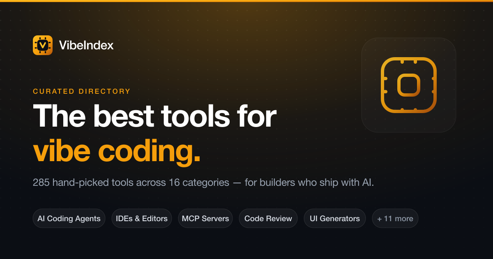

# Vibe Coding 工具目录：VibeIndex

## 直观预览

> VibeIndex 首页预览。它把面向 AI 辅助开发的工具按工作环节整理为可检索目录。

## 一句话价值

用于发现和初筛 Vibe Coding 工具的目录站，适合在新项目开始前快速寻找 AI IDE、Agent、测试、代码审查、MCP、UI 生成和安全工具候选。

## AI 选用指南

| 项目 | 选用说明 |
| --- | --- |
| 优先选用条件 | 已发现 AI 开发工作流缺口，需要寻找 IDE、Agent、测试或 MCP 工具候选。 |
| 不适合或暂缓条件 | 库中已有明确匹配资源时不必重新泛搜；目录收录不代表工具可靠或可直接安装。 |
| 复用方式 | 查询入口 |
| 输入与产出 | 能力缺口和筛选条件 → 待复核的外部工具候选。 |
| 首次读取入口 | [本卡](./Vibe-Coding工具目录-VibeIndex-2026-08-22.md) →「内容摘要」 |
| 同类选择依据 | VibeIndex 是发现目录；本库具体卡片才提供用途与证据；Agency Agents 提供角色而不是工具商店。 对照：[AI 专业角色 Agent 库：Agency Agents](../../03-Codex能力/Agents规则/AI专业角色Agent库-Agency-Agents-2026-07-16.md)。 |
| 接入前提与待核实项 | 目录数量、分类与工具状态属于历史记录；逐个查候选官方文档，再推荐用于项目。 |
| 检索词 | VibeIndex Vibe Coding 工具目录 AI IDE MCP 测试 工具发现 |

> 选用说明整理于 2026-09-20：适用与比较为基于收藏证据的建议；正文中的版本、数量、价格与功能范围按原收录时间理解。本次未安装或运行所收藏的工具，当前环境安装状态另查。未对外部来源作全量实时复核。

## 内容摘要

当前官网显示 **285 个工具、16 个分类**，覆盖浏览器 App Builder、AI IDE / 编辑器、IDE 插件、CLI、AI Coding Agent、代码审查、测试与 QA、文档、任务管理、MCP、UI 生成、安全、学习资源、桌面应用、开发效率与 AI 代码模型。它的定位是工具发现和横向浏览，不是某一项具体开发能力；可从分类进入，再按名称或 GitHub star 等顺序寻找候选工具。

## 为什么值得收藏

1. 覆盖构建、审查、测试、MCP 和安全等完整链路，不只收录代码生成器。
2. 可作为“寻找候选”的入口，再将真正核验过的工具沉淀为 Vault 独立卡片。

## 未来可以怎么用

- 新项目按“构建、Agent、质量、MCP、安全”列出缺口，再从对应分类筛 3 到 5 个候选。
- 要给 Codex 加能力时，进一步评估权限、成本、维护状态与当前项目兼容性。
- 不要把目录的所有项目无差别收藏；只收录经实际需求验证的部分。

## 原始内容 / 链接

- 官网：[https://vibeindex.dev/](https://vibeindex.dev/)
- 来源帖文：[https://x.com/csaba_kissi/status/2090328699992432716](https://x.com/csaba_kissi/status/2090328699992432716)
- 本地预览：`_附件/收藏预览/VibeIndex-2026-08-22.png`
- 本地快照：`_附件/网页快照/VibeIndex-2026-08-22/index.html`

## 相关联想

- 可组成“目录发现 -> 具体核验 -> 本地收藏 -> 反向调用”的工具筛选闭环。

## 适合反向调用的场景

- 我想找 Vibe Coding 领域的 AI IDE、Agent、测试或 MCP 工具。
- 我准备搭建 AI 开发工作流，有哪些工具类别需要先看？
