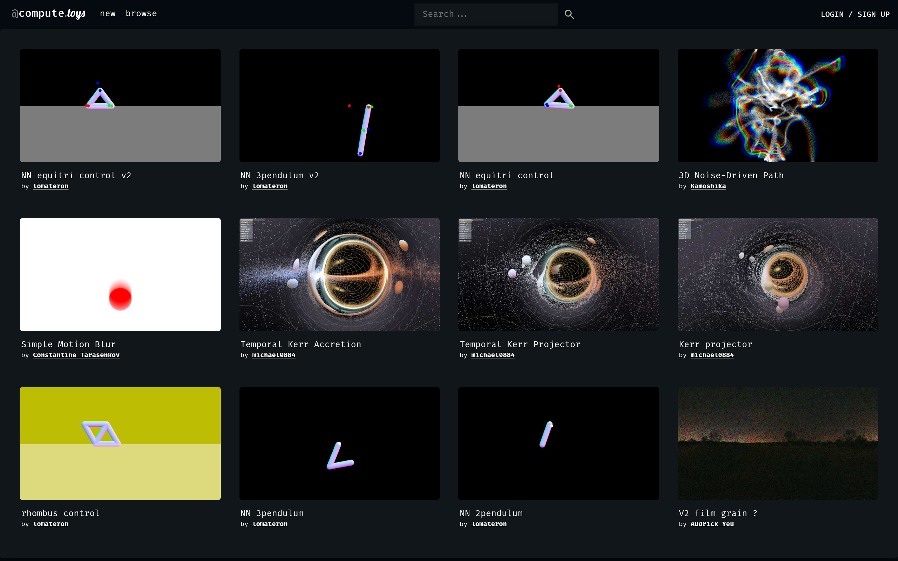

# WGSL 计算着色器沙盒：compute.toys

## 直观预览

> compute.toys 首页（1440×900）：WGSL 计算着色器作品画廊（3D 噪声路径、胶片颗粒、克尔黑洞吸积盘等），浏览器里直接改代码看效果。

## 一句话价值

在浏览器里直接写 WGSL **计算着色器**（compute shader）的在线沙盒 + 社区画廊——改代码即时看效果，44 页作品随便抄。

## AI 选用指南

| 项目 | 选用说明 |
| --- | --- |
| 优先选用条件 | 想学 WGSL / WebGPU 计算着色器，或找生成艺术、粒子、噪声类视觉灵感；想看"别人用计算着色器能玩出什么花"。 |
| 不适合或暂缓条件 | 只是想给页面加个现成背景时不适合——这是"写着色器"的地方，不是"挑组件"的地方（挑组件去 shadercn / Paper Shaders）。 |
| 复用方式 | 使用工具（在线编写运行）、视觉参考、复制代码思路 |
| 输入与产出 | WGSL 代码 → 浏览器里实时运行的计算着色器画面；或从画廊挑作品改。 |
| 首次读取入口 | [本卡](./WGSL计算着色器沙盒-compute-toys-2026-10-07.md) →「内容摘要」；官网 https://compute.toys（new / browse 入口）。 |
| 同类选择依据 | 库内暂无 WGSL 沙盒类收藏；与 [shadercn](../../01-界面设计/动效/React着色器组件库-shadercn-2026-10-07.md) 分工：compute.toys 负责"写和学"，shadercn 负责"装和用"。 |
| 接入前提与待核实项 | 需支持 WebGPU 的浏览器；未注册/登录验证社区功能；画廊作品各自许可另查，抄代码注意来源。 |
| 检索词 | compute.toys WGSL compute shader 计算着色器 沙盒 生成艺术 WebGPU |

> 核查记录：整理于 2026-10-07，基于官网首页（画廊 44 页作品，有 Discord 社区与 GitHub 组织 github.com/compute-toys）。未注册登录，未运行代码。

## 内容摘要

compute.toys（https://compute.toys）是一个 WGSL 计算着色器的在线创作与分享社区。

- **沙盒**：浏览器里直接写 WGSL compute shader 代码，实时看到运行画面，不用搭本地 WebGPU 环境。
- **画廊**：44 页社区作品，如 "3D Noise-Driven Path"（3D 噪声驱动路径）、"Simple Motion Blur"、"Temporal Kerr Accretion"（克尔黑洞吸积盘时间演化）、"film grain"（胶片颗粒）、"equitri control" 等——从数学美学到物理模拟都有。
- **社区**：有 Discord 频道，GitHub 组织为 github.com/compute-toys。
- 和 Shadertoy 的区别：Shadertoy 玩的是 fragment shader（像素着色器），compute.toys 专注 **compute shader**（计算着色器，GPGPU 那一路），更 geek。

## 为什么值得收藏

1. **库里没有同类**：shader 相关的收藏都是"拿来用"（Paper Shaders、shadercn），这是第一个"写和学"的。
2. **学 WGSL 最低成本入口**：不用配环境，打开就有几百个可运行的例子照着改。
3. **生成艺术灵感库**：画廊里的噪声、粒子、流体效果，可以直接转化成页面视觉或封面素材的思路。

## 未来可以怎么用

- 想给项目做粒子/流体/噪声类动效时，先来这里找思路和现成算法。
- 学 WebGPU/WGSL 时当练习场。
- 生成艺术、创意编程玩一玩（深夜快乐源泉）。
- 和 shadercn 搭配：这里学原理，那里装组件。

## 原始内容 / 链接

- 官网：https://compute.toys
- GitHub 组织：https://github.com/compute-toys
- 发现链：X @VibeEverything 推文 → Designeer（designeer.xyz）Shaders 分组 → 本站
- 未注册登录；画廊作品许可各自另查。

## 相关联想

- [React 着色器组件库：shadercn](../../01-界面设计/动效/React着色器组件库-shadercn-2026-10-07.md)：一个负责"写"，一个负责"装"
- [零依赖着色器效果库：Paper Shaders](./零依赖着色器效果库-Paper-Shaders-2026-07-03.md)：三者构成"着色器三件套"：学（compute.toys）→ 挑（Paper Shaders）→ 装（shadercn）

## 适合反向调用的场景

- 我想学 WGSL，有没有不用搭环境就能练手的地方？
- 粒子/噪声/流体这类生成艺术效果，有没有现成算法可以参考？
- 我收藏过哪些着色器相关的东西？写、挑、装分别去哪？
