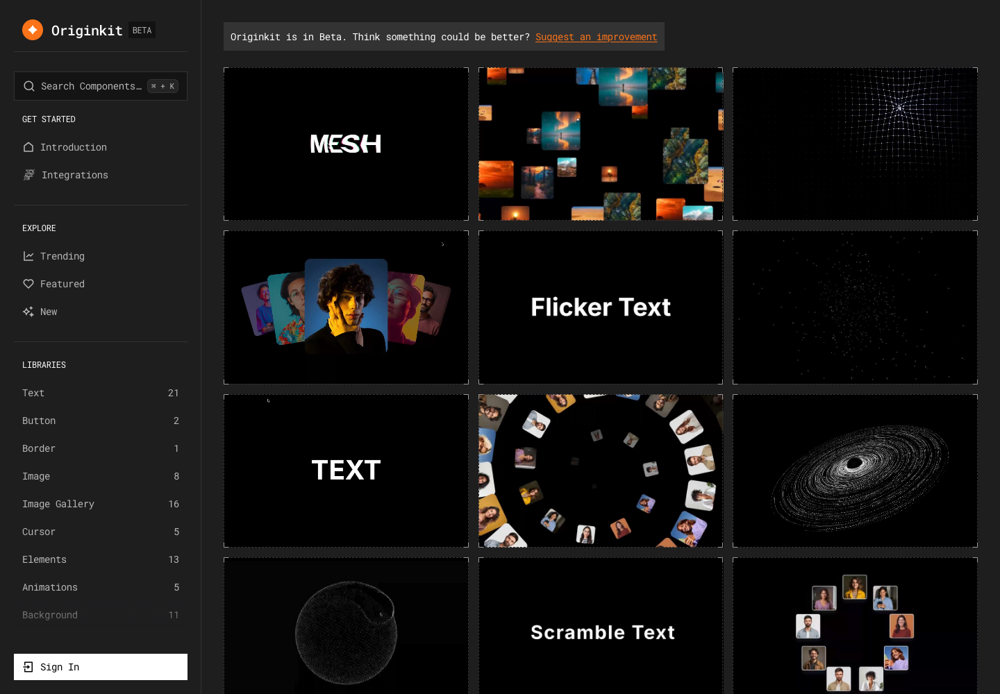

# 免费动画组件库：Originkit

## 直观预览

> Originkit 官网首屏截图，直观看它的免费动态组件和动效素材入口。

## 一句话价值

一个面向现代网站的免费动画组件库，适合快速寻找可复制、可预览、可接入 Framer / React / MCP 工作流的高质感动效组件。

## AI 选用指南

| 项目 | 选用说明 |
| --- | --- |
| 优先选用条件 | 落地页或 Framer 原型需要文字、图库、粒子、鼠标与背景等动态效果灵感。 |
| 不适合或暂缓条件 | 没有确认目标组件导出方式时，不承诺能直接装入任意 React 项目或通过 MCP 调用。 |
| 复用方式 | 视觉参考；复制代码（确认入口后） |
| 输入与产出 | 目标区域、视觉气质、技术栈 → 动效候选与实现规格。 |
| 首次读取入口 | [本卡](./免费动画组件库-Originkit-2026-07-06.md) →「内容摘要」 |
| 同类选择依据 | Originkit 偏视觉效果与原型；Amicro 有具体 React 编排；Paper Shaders 专注 shader 图像和背景。 对照：[React 微交互与过渡组件库：Amicro](../../01-界面设计/动效/React微交互与过渡组件库-Amicro-2026-08-23.md)、[零依赖着色器效果库：Paper Shaders](./零依赖着色器效果库-Paper-Shaders-2026-07-03.md)。 |
| 接入前提与待核实项 | 原卡为 Beta 阶段描述；Framer、MCP、免费范围和当前组件源码入口需在实际使用时核实。 |
| 检索词 | Originkit Framer 粒子 文字变形 图库 鼠标 背景动画 |

> 选用说明整理于 2026-09-20：适用与比较为基于收藏证据的建议；正文中的版本、数量、价格与功能范围按原收录时间理解。本次未安装或运行所收藏的工具，当前环境安装状态另查。未对外部来源作全量实时复核。

## 内容摘要

Originkit 是一个处于 Beta 阶段的动画组件库，官网定位为免费 animated component library。它提供文字动效、图库、交互元素、按钮、背景动画等组件，并强调可以复制代码、在 Framer 中使用，或通过 MCP 接入 AI 工具。

站点内的组件偏视觉表现和微交互，例如文字变形、粒子球、流体轨迹、图库动效、鼠标交互、发光粒子、ASCII 背景等。它不像纯截图灵感站，而是更接近“可直接拿来试、改、接入项目”的动效素材入口。

## 为什么值得收藏

1. 组件本身带有明确的视觉效果和交互场景，适合快速补充页面质感。
2. 同时覆盖 Framer、React 和 MCP，对设计原型、前端落地、AI 辅助搭建都有用。
3. 可以作为之后收集“可直接落地的动效组件库”的参考样本。
4. 对 glint.red 这类需要视觉氛围、交互反馈和现代感的项目，有较高复用价值。

## 未来可以怎么用

- 做 landing page 时，挑选背景动画、文字动效、按钮反馈，快速搭建第一版视觉亮点。
- 做 Framer 原型时，直接找可用组件验证动效方向。
- 做 React 项目时，把合适组件拆成局部交互模块，例如 gallery、hover text、particle background。
- 给 AI 代理生成页面时，把 Originkit 作为“动效组件参考库”提供给代理，让它按组件名或效果方向生成实现。
- 继续沉淀一个“前端动效资源索引”，和 Paper Shaders、Uiverse 等工具站放在一起反向调用。

## 原始内容 / 链接

- 链接：https://www.originkit.dev/
- 来源平台：Originkit 官网
- 作者或账号：Originkit
- 官网描述：免费现代网站动画组件库，可复制代码、用于 Framer，或通过 MCP 连接。

## 相关联想

- 可以和 Paper Shaders 一起用于视觉氛围层：Paper Shaders 偏 shader / 图形效果，Originkit 偏组件和交互动效。
- 可以和 Uiverse 一起用于界面组件灵感：Uiverse 偏 UI kit 和组件样式，Originkit 偏动画和可运行交互。
- 后续可继续按“文字动效、背景动画、图库交互、鼠标反馈、CTA 动效”拆成更细的复用索引。

## 适合反向调用的场景

- 我收藏过哪些前端动效组件库？
- 有没有适合 landing page 的动画组件参考？
- Framer 原型想加一点高级动效，有什么素材能用？
- React 项目里想快速加背景动画或文字 hover 效果，有没有参考？
- glint.red 页面想补视觉氛围和微交互，可以从哪里找灵感？
