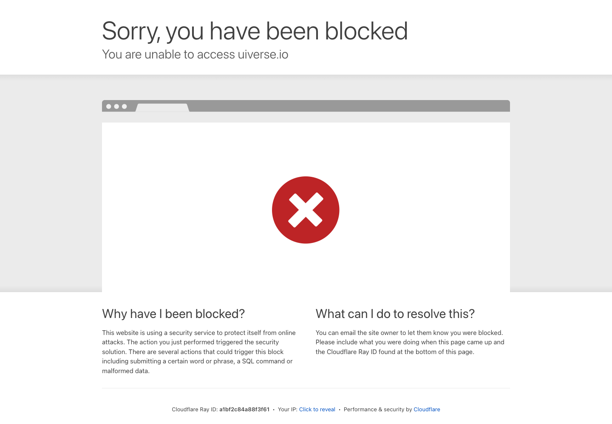

# 免费设计库：Uiverse UI Kits

## 直观预览

> Uiverse UI Kits 页面截图，直观看它是可浏览的 UI kit 设计资源。

## 一句话价值

适合在做网站、落地页或产品界面时，快速找到一整套风格统一的免费 UI 参考，而不是零散地到处拼组件。

## AI 选用指南

| 项目 | 选用说明 |
| --- | --- |
| 优先选用条件 | 设计早期要比较整套 UI kit 的配色、排版与组件气质，再确定网站视觉方向。 |
| 不适合或暂缓条件 | 目标是成熟生产控件、完整业务逻辑或自动生成网站时不足。 |
| 复用方式 | 视觉参考 |
| 输入与产出 | 项目定位、内容与风格偏好 → 候选风格及按钮、输入、卡片规范。 |
| 首次读取入口 | [本卡](./免费设计库-Uiverse-UI-Kits-2026-07-02.md) →「直观预览」 |
| 同类选择依据 | Uiverse UI Kits 用于整套风格探索；brands-design-md 将风格结构化；Animated Buttons 专注按钮。 对照：[品牌设计上下文参考库：brands-design-md](../../01-界面设计/灵感库/品牌设计上下文参考库-brands-design-md-2026-08-03.md)、[CSS 动画按钮库：Animated Buttons](../../01-界面设计/按钮/CSS动画按钮库-Animated-Buttons-2026-07-16.md)。 |
| 接入前提与待核实项 | 需逐个 kit 确认代码、来源和许可；标题“免费”不作为所有资产可商用的证明。 |
| 检索词 | Uiverse UI Kits UI套件 风格探索 配色 暗色 金融 极简 |

> 选用说明整理于 2026-09-20：适用与比较为基于收藏证据的建议；正文中的版本、数量、价格与功能范围按原收录时间理解。本次未安装或运行所收藏的工具，当前环境安装状态另查。未对外部来源作全量实时复核。

## 内容摘要

这是 Uiverse 的 UI Kits 页面，核心价值不是单个按钮或单个卡片，而是一批已经按视觉语言整理好的整套 UI kit。页面里能直接浏览不同风格的设计系统，并查看其中包含的按钮、卡片、输入框等组件，适合做整体界面方向选择和组件拆解。

目前页面里能看到多种不同气质的 kit，比如偏暗色编辑感、科技感、金融面板感、海报感、极简感等，适合在前期做风格探索时快速建立方向。

## 为什么值得收藏

1. 不是零散灵感，而是成体系的 UI kit，适合做整站风格参考。
2. 对前端和设计都友好，能同时看风格和组件落点。
3. 免费可浏览，适合日常高频翻看和灵感对比。
4. 很适合在做提案、搭 landing page、找设计基调时快速起步。

## 未来可以怎么用

1. 做新网站时先看几套 kit，快速确定整体视觉方向。
2. 给产品页、作品集页、活动页找成体系的版式和组件感觉。
3. 把看中的 kit 拆成按钮、表单、导航、卡片等局部参考。
4. 在给项目做界面提案时，直接从这里挑几套风格做对比说明。

## 原始内容 / 链接

- 链接：https://uiverse.io/ui-kits
- 来源平台：Uiverse
- 作者或账号：平台整理页

补充说明：
页面聚合了多套可浏览的 UI kit，支持继续点进具体 kit 查看设计系统和组件。当前可见示例包括 `Lucidbloom`、`Forge`、`Halo`、`Vista`、`Cirrus` 等不同风格方向。

## 相关联想

1. 很适合以后单独做一个“按气质筛选 UI 灵感”的二级索引。
2. 可以把喜欢的 kit 再拆成“适合金融产品”“适合内容品牌”“适合创意工作室”等子标签。
3. 后续如果遇到特别契合 glint.red 或其他项目的 kit，可以单独再收一张更细的卡片。

## 适合反向调用的场景

1. 我收藏过哪些可以找网站 UI 灵感的工具网站？
2. 有没有适合做整站视觉方向参考的免费资源？
3. 我想做一个落地页或作品集页，有哪些现成风格库可借用？
4. 我需要找成体系的按钮、卡片、输入框设计参考，有没有合适入口？
