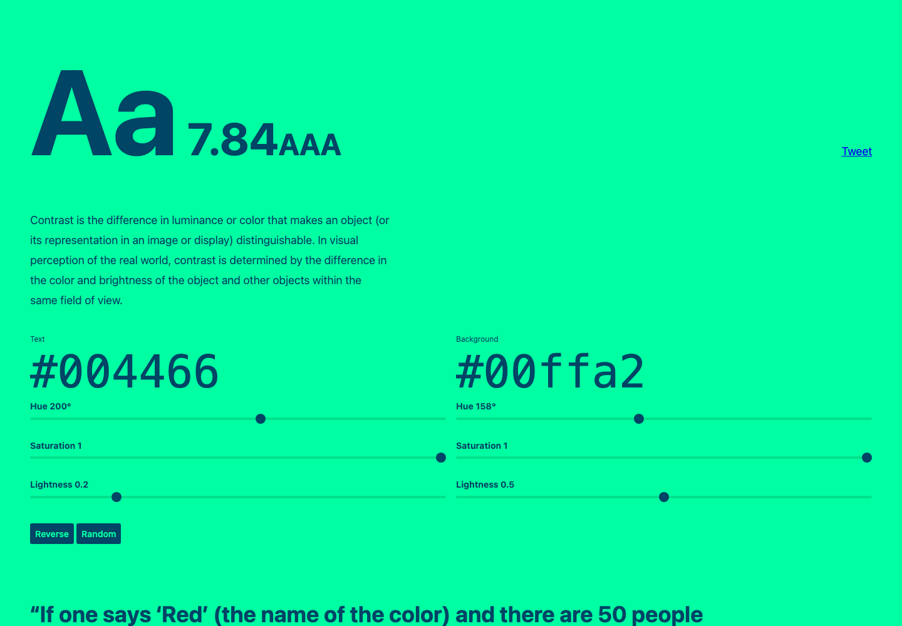

# 配色对比度检测工具：Colorable

## 直观预览

> Colorable 工具截图，直观看颜色对比度和 WCAG 检查界面。

## 一句话价值

一个用于检查颜色组合对比度的在线工具，可以快速判断配色是否满足 WCAG AA / AAA 可访问性标准。

## AI 选用指南

| 项目 | 选用说明 |
| --- | --- |
| 优先选用条件 | 已确定前景与背景颜色，需要检查文字、按钮或品牌色组合的对比度。 |
| 不适合或暂缓条件 | 不能单靠颜色对比度证明整个产品无障碍合格；不替代配色方向或交互评审。 |
| 复用方式 | 使用工具；套用检查方法 |
| 输入与产出 | 颜色值与实际文字用途 → 对比度结果及待调整组合。 |
| 首次读取入口 | [本卡](./配色对比度检测工具-Colorable-2026-07-07.md) →「原始内容 / 链接」 |
| 同类选择依据 | Colorable 检查配色可读性；品牌设计卡定义视觉方向；Emil Skills 评审更多交互细节。 对照：[品牌设计上下文参考库：brands-design-md](../../01-界面设计/灵感库/品牌设计上下文参考库-brands-design-md-2026-08-03.md)、[设计工程 AI 技能库：emilkowalski Skills](../../03-Codex能力/Skills/设计工程AI技能库-emilkowalski-Skills-2026-07-02.md)。 |
| 接入前提与待核实项 | 记录具体颜色、字号与用途；页面检测和 npm 包是不同使用路径，自动化前另查当前 API。 |
| 检索词 | Colorable contrast 前景色 背景色 对比度 可读性 无障碍 |

> 选用说明整理于 2026-09-20：适用与比较为基于收藏证据的建议；正文中的版本、数量、价格与功能范围按原收录时间理解。本次未安装或运行所收藏的工具，当前环境安装状态另查。未对外部来源作全量实时复核。

## 内容摘要

Colorable 是 Jxnblk 做的配色对比度检测工具。它可以输入一组颜色，然后自动生成颜色组合，并显示不同前景色 / 背景色之间的对比度评级。

它适合在设计系统、品牌色、按钮、卡片、文字层级和深浅主题设计时使用。相比只凭肉眼判断，Colorable 可以给出更明确的可访问性依据，降低“看起来好看但文字读不清”的风险。

项目也有对应的 GitHub 仓库 `jxnblk/colorable`，可作为 npm 包在工程或设计工具链里复用。

## 为什么值得收藏

1. UI 配色最终必须落到可读性，Colorable 可以快速检查颜色组合是否达标。
2. 支持批量颜色组合判断，适合设计系统和品牌色扩展，不只是检查单一前景 / 背景。
3. 对深色主题、浅色主题、按钮状态、提示色和文字层级都有直接使用价值。
4. 可作为前端交付前的可访问性验收工具。

## 未来可以怎么用

- 做 glint.red 的品牌色、背景色、正文色和 CTA 色组合时，用它验证对比度。
- 做设计系统时，先把主色、灰阶、语义色放进去，筛掉不适合承载文字的组合。
- 做网页验收时，把主要文字和按钮配色拿来检查，避免低对比度问题。
- 如果以后做自动化设计检查，可以参考 `jxnblk/colorable` 的 npm 包能力。

## 原始内容 / 链接

- 工具：https://colorable.jxnblk.com/
- GitHub：https://github.com/jxnblk/colorable
- 作者或账号：Jxnblk
- 核心用途：检查颜色组合对比度和 WCAG AA / AAA 可访问性评级。

## 相关联想

- 可以和 UI 动效素材分开，作为“设计系统校验工具”长期保留。
- 后续可继续收集色彩工具：调色板生成、可访问性校验、主题生成、色阶推导。
- 对产品界面来说，配色可访问性应作为上线前检查项，而不是视觉后期补救项。

## 适合反向调用的场景

- 我收藏过哪些配色和可访问性工具？
- 做设计系统时如何检查颜色对比度？
- glint.red 的品牌色和按钮颜色是否适合正文和 CTA？
- 前端上线前有没有快速的 UI 可读性检查工具？
