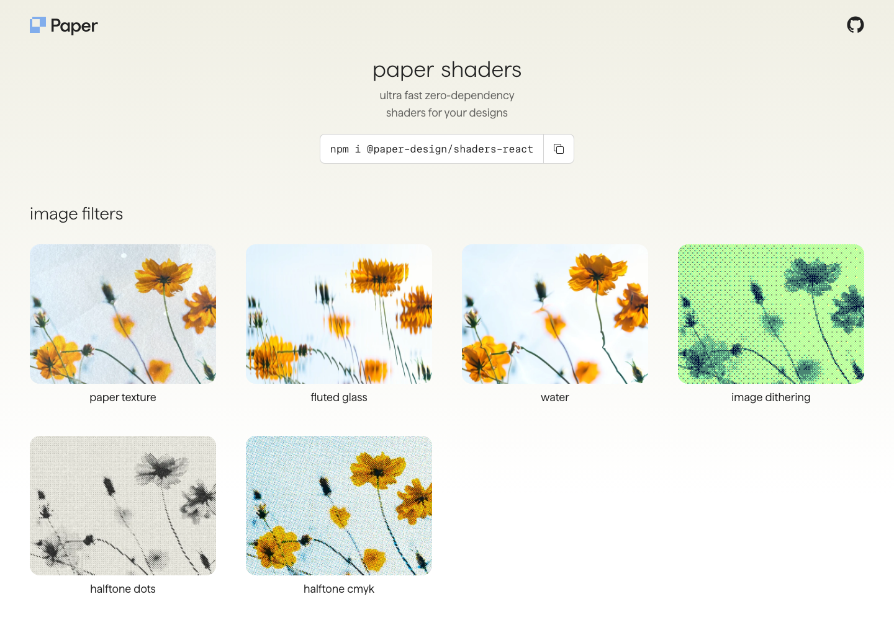

# 零依赖着色器效果库：Paper Shaders

## 直观预览

> Paper Shaders 官网截图，直观看 shader / 视觉效果的预览方式。

## 一句话价值

适合在做品牌站、落地页或实验性前端界面时，直接挑选高质量 shader 效果，并以 React 组件或 GLSL 的方式快速落地。

## 内容摘要

这是 Paper 提供的一个 shader 效果展示与使用入口，主打 `ultra fast zero-dependency shaders`，并明确支持以 React 组件或 GLSL 形式接入项目。首页不是只给静态截图，而是按效果类型整理成一个可浏览目录，当前能看到三类内容：

1. `Image Filters`：如 `paper texture`、`fluted glass`、`water`、`image dithering`、`halftone dots`、`halftone cmyk`
2. `Logo Animations`：如 `heatmap`、`liquid metal`、`gem smoke`
3. `Effects`：如 `mesh gradient`、`dot orbit`、`warp`、`spiral`、`waves`、`voronoi`、`metaballs`、`god rays`

页面还直接给出了安装方式：`npm i @paper-design/shaders-react`。这说明它不是单纯灵感站，而是兼具“效果预览 + 实际接入”的实用型素材入口。

## 为什么值得收藏

1. 既能看效果，也能直接用于项目，复用效率很高。
2. 效果风格整体比较现代，适合品牌页、作品集页、产品宣传页这种需要氛围感的场景。
3. 分类清楚，找图像滤镜、Logo 动画、背景特效都比较顺手。
4. 对前端非常友好，支持 React 组件接入，不用只停留在“看着好看但难落地”。

## 未来可以怎么用

1. 做 landing page 时，直接挑一个 shader 当 hero 区背景或滚动氛围层。
2. 做作品集、品牌页、活动页时，拿来增强视觉质感，避免页面太平。
3. 做 Logo reveal、封面动效、品牌标识动画时，优先参考其中的 `Logo Animations`。
4. 给 glint.red 这类需要更强视觉记忆点的项目找背景、纹理、噪声、流体类效果参考。
5. 如果后续常用，可以继续拆成单独卡片，比如“适合按钮边框的效果”“适合大背景的效果”“适合品牌 Logo 的效果”。

## 原始内容 / 链接

- 链接：https://shaders.paper.design/
- 来源平台：Paper
- 作者或账号：paper.design 团队

补充说明：
页面标题为 `Paper Shaders – Ultra-fast zero-dependency shaders`，描述为 “Shaders for you to use in your projects, as React components or GLSL.”

## 相关联想

1. 可以以后专门做一组“前端可直接接入的视觉效果库”索引，而不是把它们和普通灵感站混在一起。
2. 可以按“适合品牌页”“适合内容产品”“适合按钮或边框”“适合 Logo 动画”继续二次分类。
3. 如果 glint.red 之后想强化气质，可以从这里先试 `mesh gradient`、`paper texture`、`liquid metal` 这类效果方向。

## 适合反向调用的场景

1. 我收藏过哪些适合做页面背景和视觉特效的工具网站？
2. 有没有既能看效果又能直接接入 React 项目的 shader 资源？
3. 我想给品牌页或作品集页增加一点高级感，有什么可复用素材？
4. 我现在做 glint.red，有没有适合增强视觉氛围的收藏参考？
