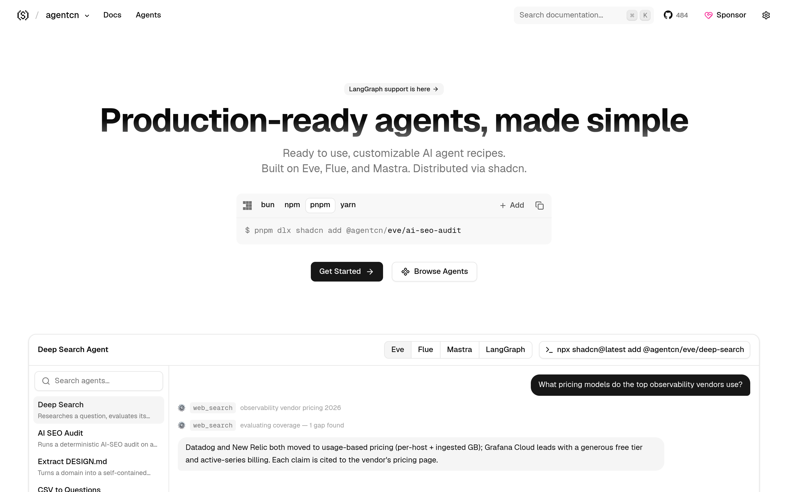

# AI Agent 脚手架：agentcn

## 直观预览

> agentcn 官网首页（1440×900）："Production-ready agents, made simple"——可安装 AI agent 的开源脚手架：CLI、registry、文档，agent 源码直接进你的仓库。

## 一句话价值

"shadcn/ui，但 for 造 agent"：可安装 AI Agent 的开源脚手架——CLI + registry + 文档，agent 源码直接可编辑地装进你的仓库（基于 Vercel AI SDK）。

## AI 选用指南

| 项目 | 选用说明 |
| --- | --- |
| 优先选用条件 | 要动手搭一个生产级 AI agent（不是 demo），想要可编辑的源码脚手架而非黑盒；技术栈是 TypeScript + Vercel AI SDK。 |
| 不适合或暂缓条件 | 只想调 API 跑个简单对话时太重；非 TS 技术栈不适合；已有成熟 agent 框架在用时没必要换。 |
| 复用方式 | 安装依赖（CLI + registry）、复制源码思路 |
| 输入与产出 | CLI 命令 → 一个带可编辑源码的 agent 项目骨架（含 registry 可装的 agent 组件）。 |
| 首次读取入口 | [本卡](./AI-agent脚手架-agentcn-2026-10-09.md) →「内容摘要」；官网 https://www.agentcn.run（CLI / registry / docs）。 |
| 同类选择依据 | 库内暂无 agent 脚手架类收藏；与 03-Codex能力 下的 Skills/工作流卡分工：那些是"用法"，agentcn 是"造 agent 的架子"。 |
| 接入前提与待核实项 | MIT；TypeScript + Vercel AI SDK；未在本机安装验证，脚手架实际体验以官网为准。 |
| 检索词 | agentcn AI agent 脚手架 shadcn agents CLI registry Vercel AI SDK |

> 核查记录：整理于 2026-10-09，基于官网 meta 描述（"Open source kit for installable AI agents. CLI, registry, docs, and editable agent source in your repo."）+ GitHub（shadcn-labs/agentcn，2026-06-17 创建，收录时 488 stars，MIT，TypeScript）。未安装验证。

## 内容摘要

agentcn（https://www.agentcn.run）是 shadcn-labs "*cn" 家族中的 AI agent 脚手架。

- **定位**：自述 "shadcn/ui, but for building agents"——不是组件库，是"造 agent 的架子"。
- **形态**：开源 kit，含 CLI、registry、文档；agent 源码以可编辑形态装进你的仓库（不是 npm 黑盒依赖），方便魔改。
- **技术栈**：TypeScript，基于 Vercel AI SDK。
- **仓库**：github.com/shadcn-labs/agentcn，2026-06-17 建仓，收录时 488 stars，MIT。

## 为什么值得收藏

1. **xiegao2.0 直接相关**：他正在用 Codex 造写作 agent，这是"造 agent"的脚手架——思路、结构、registry 模式都值得参考。
2. **"源码进仓库"理念对味**：和他"工具不替我做判断、要能掌控"的口味一致——可编辑源码，不是黑盒。
3. **shadcn-labs 出品**：registry + CLI 的分发模式已经在他收的 shadercn/termcn 里验证过，同一套。

## 未来可以怎么用

- xiegao2.0 产品化时，参考它的"可安装 agent"结构（CLI + registry + 可编辑源码）。
- 起新 agent 项目时直接用它搭架子。
- 对比他现在的 Codex 工作流，看哪些环节能被脚手架标准化。

## 原始内容 / 链接

- 官网：https://www.agentcn.run（另见 agentcn.dev）
- 仓库：https://github.com/shadcn-labs/agentcn（MIT，488 stars，2026-06-17 创建）
- 发现链：X @shadcnlabs 推文（2026-10-07，10 个 *cn 站之一）→ 本站
- 未安装验证。

## 相关联想

- xiegao2.0 项目：造 agent 的脚手架 vs 他正在造的写作 agent——结构参考
- [React 着色器组件库：shadercn](../../01-界面设计/动效/React着色器组件库-shadercn-2026-10-07.md)：同属 *cn 家族，同一套 registry 分发哲学

## 适合反向调用的场景

- 我想搭一个生产级的 AI agent，有没有脚手架而不是从零写？
- "可安装、可编辑源码"的 agent 和黑盒 API 方案各有什么优劣？
- shadcn-labs 的 *cn 家族里，和 agent 相关的有哪些？
