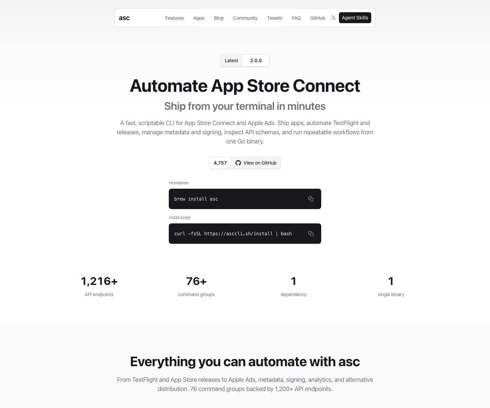

# App Store Connect 自动化 CLI：asc

## 直观预览



> 已保存官网首屏截图，并在 Vault 内备份源码 zip、Git bundle、README 快照和最近提交记录。这个项目适合长期作为 Apple 应用发布自动化和 Agent Skills 参考。

## 一句话价值

`asc` 是一个面向 App Store Connect API 的快速、轻量、可脚本化 CLI，可把 iOS、macOS、tvOS、visionOS 的 TestFlight、构建、提交、签名、截图、订阅、分析和元数据流程接入终端、IDE 或 CI/CD。

## 内容摘要

asc 的官网是 `https://asccli.sh/`，GitHub 仓库是 `rorkai/App-Store-Connect-CLI`。项目 README 将它描述为一个 fast、lightweight、scriptable 的 App Store Connect API CLI，强调可以从 terminal、IDE 或 CI/CD pipeline 自动化 Apple 平台应用发布工作流。

它的几个核心特点：

1. **JSON-first**：适合脚本、CI 和自动化系统读取结果，不依赖交互式提示。
2. **覆盖发布链路**：支持 apps、builds、TestFlight feedback / crashes、submissions、signing、analytics、screenshots、subscriptions 等工作流。
3. **认证与诊断**：支持 App Store Connect API Key 登录、Keychain 或 config-backed auth，并提供 `asc auth status --validate`、`asc auth doctor`。
4. **CI 友好**：非交互输出默认 JSON，交互终端默认 table，适合在 GitHub Actions、脚本和 Agent 流程里稳定调用。
5. **内置 Agent Skills 方向**：README 专门提到 `asc install-skills`，以及通过 `npx skills add rorkai/app-store-connect-cli-skills --global --agent codex` 安装面向 Codex 的 Skills。
6. **隐私与 telemetry 可控**：默认有命令级匿名 telemetry，但 README 明确说明不包含 raw arguments、stderr、credentials、private keys、Apple account、app id、file paths 等敏感信息，并支持 `asc telemetry disable`、`ASC_TELEMETRY_DISABLED=1`、`DO_NOT_TRACK=1`。

GitHub API 当前显示项目主语言是 Go，topics 包含 `app-store-connect`、`apple`、`automation`、`cicd`、`cli`、`developer-tools`、`devops`、`ios`、`macos`、`testflight`、`xcode`，License 为 MIT。

## 为什么值得收藏

1. 它把 App Store Connect 的繁琐 Web 操作变成可脚本化 CLI，适合构建可重复、可审计、可交给 Agent 执行的发布流程。
2. 它对 Codex 很有价值：有专门的 Agent Skills 仓库和安装命令，可以研究“CLI + Skills + 自动化工作流”如何组合。
3. 它适合移动端团队和独立开发者：TestFlight 反馈、crash、build、submission、metadata、screenshots 等都可以纳入自动化。
4. 它的 JSON-first 和 TTY-aware 输出设计值得复用：交互终端人类可读，CI/管道机器可读。
5. 它对 Apple 开发链路有基础设施意义：后续如果做 App、Mac 工具、iOS 产品或自动发布系统，可以直接把 asc 放进工具链。

## 未来可以怎么用

1. 做 iOS / macOS App 时，用 asc 自动列出 apps、查询 builds、管理 TestFlight 反馈和 crash 日志。
2. 做 CI/CD 时，把 asc 接入 GitHub Actions 或本地脚本，自动生成发布状态、上传元数据、提交审核或同步截图。
3. 做 Codex 发布助手时，安装 `app-store-connect-cli-skills`，让 Codex 能按固定步骤执行构建检查、TestFlight、metadata sync 和 submission。
4. 做内部开发者平台时，参考 asc 的 CLI 设计，把复杂平台 API 包成 JSON-first、可诊断、可配置、可 telemetry opt-out 的命令行工具。
5. 做移动应用运营后台时，参考它的 TestFlight feedback、crash、analytics、subscriptions 等命令边界，反向设计数据采集和展示模块。

## 原始内容 / 链接

- 官网：[https://asccli.sh/](https://asccli.sh/)
- GitHub：[https://github.com/rorkai/App-Store-Connect-CLI](https://github.com/rorkai/App-Store-Connect-CLI)
- Agent Skills：[https://github.com/rorkai/app-store-connect-cli-skills](https://github.com/rorkai/app-store-connect-cli-skills)
- 安装命令：`brew install asc`
- 安装脚本：`curl -fsSL https://asccli.sh/install | bash`
- Codex Skills 安装：`npx skills add rorkai/app-store-connect-cli-skills --global --agent codex`
- License：MIT
- 当前截图：`_附件/收藏预览/ASC-CLI-2026-07-18.png`
- 源码备份：`_附件/项目备份/ASC-CLI/ASC-CLI-2026-07-18.zip`
- Git bundle 备份：`_附件/项目备份/ASC-CLI/ASC-CLI-2026-07-18.bundle`
- README 快照：`_附件/项目备份/ASC-CLI/README-2026-07-18.md`
- 提交记录快照：`_附件/项目备份/ASC-CLI/commits-2026-07-18.txt`

## 相关联想

- 和 [[可编辑演示文稿生成Skill-DashiAI-PPT-2026-07-08]] 的关系：DashiAI PPT 是“生成交付物”的 Skill，asc 是“发布 Apple App”的 CLI + Skills，二者都适合研究复杂工具如何交给 Agent 稳定执行。
- 和 [[AI-Agent开源连接器网关-OpenConnector-2026-07-12]] 的关系：OpenConnector 偏连接器和 Action schema，asc 偏 Apple 官方 API 的命令行封装；都可以作为 Agent 工具调用层参考。
- 和 [[网站复刻真源码优先方法论-web-clone-2026-07-09]] 的关系：web-clone 解决复杂前端复刻流程，asc 解决复杂 App Store 发布流程，二者都强调可验证步骤、工具边界和自动化质量门。
- 和 Cloudflare 收藏的关系：Cloudflare 是网站域名和部署管理入口，asc 是 Apple App 发布管理入口，可以分别作为 Web 产品和 Apple App 产品的基础运维入口。

## 适合反向调用的场景

```text
请参考我的收藏：
/Users/youfei/Desktop/obsidian/04-工具网站/开源项目/App-Store-Connect自动化CLI-asc-2026-07-18.md

当当前项目涉及 iOS、macOS、TestFlight、App Store Connect、发布自动化或 CI/CD 时，请优先考虑 asc：
1. 检查是否需要 App Store Connect API Key；
2. 使用 JSON 输出而不是解析人类文本；
3. 在 CI 或 Codex 自动化里优先使用非交互命令；
4. 对认证、Keychain、telemetry 和私钥处理保持谨慎；
5. 如果要让 Codex 操作发布流程，先安装或参考 app-store-connect-cli-skills；
6. 把发布步骤拆成可验证的阶段：auth doctor、apps list、builds、TestFlight、metadata、submission。

不要让 Agent 直接执行高风险发布命令。涉及提交审核、修改订阅、生产元数据、证书和签名时，必须先输出计划并等待人工确认。
```
