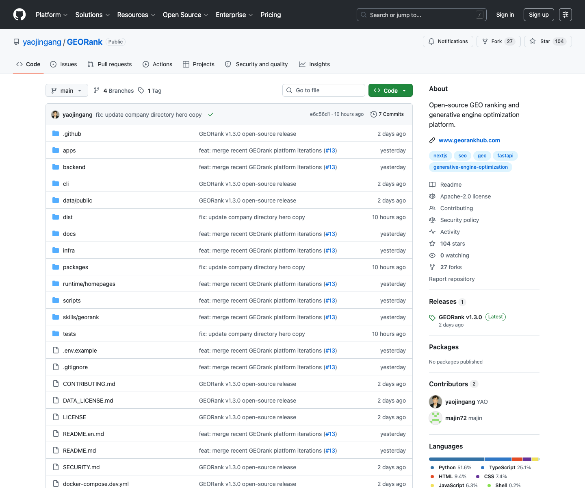

# GEO 开源工作台：GEORank

## 直观预览



> 已保存 GitHub 页面截图，并在 Vault 内备份源码 zip、Git bundle、README 中英快照和最近提交记录，防止项目后续删除或内容变动。

## 一句话价值

GEORank 是一个面向 GEO（生成式引擎优化）的开源工作台，把网站诊断、AI 问答、行动方案、关键词拓展、结构化工具和后台管理收束成一套可私有化部署、可二次开发的 AI 搜索可见性工具箱。

## 内容摘要

GEORank 的核心目标是帮助团队判断自己的网站、品牌和内容在 ChatGPT、Claude、Perplexity、Gemini 等 AI 搜索 / AI 回答系统里的可见性，并把诊断结果转化成可执行的优化计划和可持续管理的内容资产。

它不是单一 SEO 小工具，而是一个更完整的 GEO 工作台：

1. **发现**：收录和管理 GEO 相关公司、工具、专家、教程和案例。
2. **诊断**：检查网站结构、Schema、Meta、内容可读性、引用信号和 AI 搜索可见性。
3. **问答**：围绕 GEO、AI 搜索和品牌可见性生成结构化回答。
4. **规划**：把诊断结果和业务目标转化成 30/60/90 天行动方案。
5. **拓展**：生成关键词、问题词、场景词和内容选题资产。
6. **结构化**：生成 JSON-LD、llms.txt、标题和知识库草稿。
7. **管理**：通过后台管理公司、诊断、问答、拓词、专家、教程、用户、系统设置、API 池、模块开关和自定义首页。

项目仓库描述为 `Open-source GEO ranking and generative engine optimization platform.`，官方演示是 GEORankHub。GitHub API 显示项目主要语言为 Python，同时包含 TypeScript、HTML、CSS、JavaScript，主题包含 `fastapi`、`generative-engine-optimization`、`geo`、`nextjs`、`seo`。

## 为什么值得收藏

1. GEO 是 SEO 之后很值得跟踪的新方向：用户正在从“搜索结果页点链接”迁移到“直接问 AI 要答案”，品牌能不能被 AI 理解、引用和推荐会越来越重要。
2. GEORank 把 GEO 从概念拆成了可操作模块：诊断、问答、方案、拓词、结构化数据、知识库和后台管理，适合反向学习产品结构。
3. 它适合私有化部署和二次开发：README 明确提到团队可以配置自己的模型 API、数据库、统计代码和访问策略。
4. 它的技术栈适合参考：FastAPI、SQLAlchemy、Alembic、Celery、PostgreSQL、Redis、Qdrant、Neo4j、MinIO、Next.js、pnpm workspace、Turborepo、OpenAPI SDK、Docker Compose。
5. 和之前收藏的 TokHub 同源作者，适合一起观察作者在 AI 基础设施、网关、监控和增长工具方向的产品化思路。

## 未来可以怎么用

1. 做 AI 搜索 / GEO 产品时，参考它的工作流：先诊断，再问答，再生成方案，再沉淀关键词、结构化数据和知识库。
2. 做品牌官网或产品官网时，用它提醒 Codex 检查页面是否具备 AI 可读结构：Schema、Meta、FAQ、教程、引用信号、llms.txt 和知识库内容。
3. 做客户服务或增长咨询工具时，可以复用它的 30/60/90 天行动方案思路，把诊断结果变成交付物。
4. 做自托管 SaaS 时，参考它的 API 池、Provider 测试、轮询、故障转移、后台模块开关和自定义首页设计。
5. 做内容资产管理时，参考它把关键词、问答、教程、专家资料、工具和知识库归一到同一工作台的方式。

## 原始内容 / 链接

- GitHub：[https://github.com/yaojingang/GEORank](https://github.com/yaojingang/GEORank)
- 官方演示：[https://www.georankhub.com/](https://www.georankhub.com/)
- 作者：yaojingang
- License：Apache-2.0
- GitHub 描述：Open-source GEO ranking and generative engine optimization platform.
- GitHub topics：`fastapi`、`generative-engine-optimization`、`geo`、`nextjs`、`seo`
- 当前截图：`_附件/收藏预览/GEORank-GitHub-2026-07-18.png`
- 源码备份：`_附件/项目备份/GEORank/GEORank-2026-07-18.zip`
- Git bundle 备份：`_附件/项目备份/GEORank/GEORank-2026-07-18.bundle`
- README 快照：`_附件/项目备份/GEORank/README-2026-07-18.md`
- README 英文快照：`_附件/项目备份/GEORank/README-en-2026-07-18.md`
- 提交记录快照：`_附件/项目备份/GEORank/commits-2026-07-18.txt`

## 相关联想

- 和 [[AI-API中转站监控与网关系统-TokHub-2026-07-07]] 的关系：TokHub 偏 AI API 网关和监控运营，GEORank 偏 AI 搜索可见性和 GEO 增长工具，二者都体现了“AI 基础设施 + 管理后台 + 可私有化部署”的产品方向。
- 和 Cloudflare 收藏的关系：GEORank 可作为部署在自有域名上的增长工具或服务平台，Cloudflare 可负责域名、DNS、缓存、WAF 和访问控制。
- 和 OpenConnector 的关系：GEORank 后续如果连接搜索、CMS、Analytics、CRM 等外部系统，可以参考 OpenConnector 的 Action schema、MCP、OpenAPI 和凭据边界设计。
- 和 BoardUI 的关系：如果重做 GEORank 的后台或诊断报告页，可以参考 BoardUI 的 dashboard、KPI card、筛选表格和状态标签设计。

## 适合反向调用的场景

```text
请参考我的收藏：
/Users/youfei/Desktop/obsidian/04-工具网站/开源项目/GEO开源工作台-GEORank-2026-07-18.md

当我要做 AI 搜索、GEO、SEO、品牌增长、内容资产管理或自托管工具台时，请优先借鉴 GEORank 的产品结构：
1. 网站诊断；
2. AI 问答；
3. 30/60/90 天行动方案；
4. 关键词 / 问题词 / 场景词拓展；
5. JSON-LD、llms.txt、标题和知识库生成器；
6. 后台管理、API 池、Provider 测试、轮询和故障转移；
7. 私有化部署和二次开发边界。

不要直接照搬全部模块。请先判断当前项目是否真的需要 GEO 全流程，如果只是官网优化，就只抽取 Schema、Meta、FAQ、llms.txt、知识库和内容结构检查。
```
