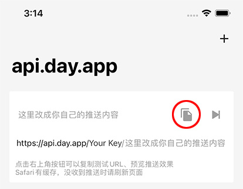

# iOS 自定义推送工具：Bark

## 直观预览

> README 中的使用示例截图：请求一个 URL，iPhone 立刻收到推送。

## 一句话价值

给 iPhone 发自定义推送的最简方案：请求一个 URL，手机立刻收到 APNs 推送；支持自建服务端与加密推送，MIT 开源。

## AI 选用指南

| 项目 | 选用说明 |
| --- | --- |
| 优先选用条件 | 需要把服务器端事件（脚本跑完、服务异常、定时任务结果、监控告警）直接推送到 iPhone，且不想经过聊天应用中转时。 |
| 不适合或暂缓条件 | 已有稳定的聊天推送通道（如 cron → Muse 聊天）且够用时，不必重复建设；只需要 Android 推送时不适用。 |
| 复用方式 | 使用服务（App Store 安装 Bark App + 公共服务端 api.day.app）、自部署服务端、复制源码 |
| 输入与产出 | 一个 HTTP GET/POST 请求（/:key/:title/:body，可带分组/图标/跳转 URL）→ iPhone 上的 APNs 推送（支持分组、自定义图标/声音、危急警报）。 |
| 首次读取入口 | [本卡](./iOS自定义推送工具-Bark-2026-10-06.md) →「内容摘要」；文档 https://bark.day.app |
| 同类选择依据 | 库内暂无推送通知类收藏；与 cron 聊天推送的分工：聊天推送适合人读的简报和日常提醒，Bark 适合机器事件的即时告警。 |
| 接入前提与待核实项 | 需要在 iPhone 上安装 Bark App（App Store 免费）；公共服务端走 api.day.app，隐私敏感可自建服务端；未实际安装测试。 |
| 检索词 | Bark iOS 推送 APNs 通知 服务器告警 push notification 自定义通知 |

> 核查记录：整理于 2026-10-06，基于 GitHub README（含中文 README.zh.md；Finb/Bark，2018-03-07 创建，收录时约 9,233 stars，Swift，MIT）。仅阅读文档，未安装测试。截图为 README 中的使用示例图。

## 内容摘要

Bark 是一个 iOS 推送工具 App：免费、简单、安全，走 APNs 不耗电。用法极简——在 App 里复制测试 URL，改一下内容请求这个 URL，手机立刻收到推送：

- URL 结构：`/:key/:body`、`/:key/:title/:body`、`/:key/:title/:subtitle/:body`；GET / POST 均可。
- 支持 iOS 通知高级特性：分组、自定义推送图标（iOS 15+）、声音、时间敏感通知、危急警报等。
- 支持自建服务端，并提供加密推送保证隐私安全。
- SkyWT 实证："利用 APNs 给 iOS 推送通知，很好用"，是其保留的 7 个自部署应用之一。

## 为什么值得收藏

1. **极简**：推送 = 请求一个 URL，无 SDK、无复杂配置，任何脚本 / cron / n8n 都能直接调用。
2. **干净的基础设施原语**：对跑着多个服务、配了一堆 cron 的用户来说，服务器异常/任务完成需要一条不经过聊天应用的即时告警通道。
3. **MIT + 自建选项**：9.2k star、2018 年至今维护；隐私敏感可自建服务端 + 加密推送。
4. **与现有体系互补不重复**：cron 聊天推送管"人读的简报"，Bark 管"机器事件的即时告警"，分工明确。

## 未来可以怎么用

- n8n / 服务器脚本的异常告警：失败时 Bark 推送到 iPhone。
- 定时任务完成通知（如每晚的 pipeline 跑完）。
- 和 cron 聊天推送互补：urgent 级别走 Bark，日常简报走聊天。
- 在腾讯云服务器上自建 Bark 服务端（隐私敏感场景）。

## 原始内容 / 链接

- 仓库：https://github.com/Finb/Bark（含中文 README）
- 文档：https://bark.day.app
- App Store：Bark - Custom Notifications（免费）
- 9,233 stars（收录时），Swift，MIT，2018-03-07 创建。
- 未安装测试。

## 相关联想

- [那些「酷，但用不着」的 self-hosted 应用](./那些酷但用不着的self-hosted应用-2026-10-06.md)（作者保留的 7 个应用之一，评价"很好用"）
- iOS 快捷指令自动化：Bark 推送可作为自动化链路的一环
- 与现有 cron 聊天推送体系的配合：告警分级

## 适合反向调用的场景

- 服务器上的脚本跑完/挂了，怎么第一时间推到我 iPhone 上？
- 有没有不经过微信/聊天应用、直接调 URL 就能发 iPhone 推送的方案？
- 哪些机器事件值得配即时告警？
