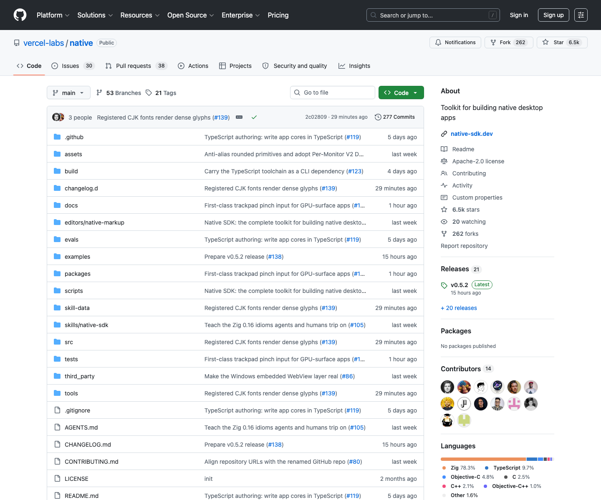

# 原生桌面应用开发工具包：Native SDK

## 直观预览



> 已保存 GitHub 页面截图，并在 Vault 内备份源码 zip、Git bundle、README 快照和最近提交记录。这个项目更新很快，适合保留本地快照，方便后续回看它的架构和 Agent 友好设计。

## 一句话价值

Native SDK 是 Vercel Labs 推出的原生桌面应用工具包：用 `.native` 声明界面，用 TypeScript 或 Zig 写核心逻辑，由 Zig 引擎直接绘制到真实 OS 窗口，目标是在不依赖浏览器、WebView 或运行时 JS 的前提下获得现代 UI 表达力和原生性能。

## 内容摘要

Native SDK 的定位是 `Toolkit for building native desktop apps`。它想解决的问题是：开发者喜欢 Web 技术的表达力、迭代速度和可控 UI，但不一定想把整个浏览器运行时塞进桌面应用。Native SDK 的路线是保留声明式视图和 TypeScript 逻辑体验，同时把渲染、运行和打包落到原生层。

它的核心结构可以拆成几层：

1. **声明式视图**：界面写在 `.native` 文件里，使用元素、flex layout、绑定和事件分发，而不是 HTML / WebView。
2. **可预测状态**：逻辑集中在 Model、Msg 和纯 `update` 函数里，事件生成消息，消息更新状态，状态重新渲染界面。
3. **原生渲染引擎**：Native SDK 自己绘制像素到 OS 窗口，保留系统滚动、菜单、对话框、托盘、文本输入等原生能力。
4. **TypeScript / Zig 双入口**：默认可以用 TypeScript 写 app core，也可以选择 Zig-first 的模板。
5. **开发体验**：CLI 支持 `native init`、`native dev`、`native check`、`native build`，强调热更新、快速检查和优化后的 release binary。
6. **Agent 友好**：每个 app 可嵌入 automation server，Agent 能读取 accessibility snapshot、驱动 widget、断言 live state、生成 deterministic screenshot；CLI 还带有 `native skills list` 这类 Agent Skills 入口。

README 中展示了 Soundboard、Notes、Calculator、Deck、Feed 等例子，覆盖音乐库、三栏笔记、计算器、硬件风播放器和 100,000 行虚拟列表。平台支持方面，macOS 是当前最成熟的主开发平台；Linux、Windows 有对应 host 和 CI 覆盖；iOS / Android 还处在实验阶段，桌面端是主要成熟面。

GitHub API 当前显示项目主语言是 Zig，同时包含 TypeScript、Objective-C、C、C++、Objective-C++、Shell、JavaScript、Java、PowerShell、Dockerfile、Python。仓库 License 为 Apache-2.0，默认分支为 `main`，官网文档在 `native-sdk.dev`。

## 为什么值得收藏

1. 这是一个值得持续观察的“非 WebView 桌面应用”路线：它不是把网页包成桌面壳，而是把声明式 UI、状态模型、原生窗口和打包产物重新组合。
2. 它对 AI Agent 开发很有启发：automation server、accessibility snapshot、widget driving、state assertion、deterministic screenshot 这些能力，天然适合让 Codex 或其他 Agent 做端到端验证。
3. 它给 TypeScript 原生化提供了一个新参考：逻辑可以用 TypeScript 写，但最终不是把 JS runtime 放进二进制，而是编译到原生代码路径。
4. 它的 UI 模型适合研究：`.native` markup、设计 token、组件目录、状态绑定、消息分发、热更新和 frame-by-frame replay 都可以成为未来自研工具或桌面 app 的灵感。
5. 它由 Vercel Labs 维护，技术野心很明确，且项目仍在 pre-1.0 快速迭代期，适合现在建立观察点。

## 未来可以怎么用

1. 做 macOS / Windows / Linux 桌面工具时，参考它的“声明式视图 + 纯状态更新 + 原生渲染”架构，而不是默认选择 Electron / Tauri / WebView。
2. 做 AI Agent 可操作的软件时，参考它的 automation server 设计：让 Agent 能读状态、驱动控件、截图、回放、断言，而不是只靠视觉猜测。
3. 做本地生产力工具时，参考它的 Native UI 组件、设计 token、系统菜单、托盘、对话框和打包流程。
4. 做 Codex 前端 / 客户端工作流时，可以借鉴 `native check` 这种快速结构校验，把 UI、绑定、消息和可访问性错误提前暴露。
5. 做跨平台运行时研究时，把它和 Electron、Tauri、SwiftUI、Flutter、Qt、React Native Desktop 放在一起比较：体积、性能、可访问性、测试、自动化、生态和打包边界。

## 原始内容 / 链接

- GitHub：[https://github.com/vercel-labs/native](https://github.com/vercel-labs/native)
- 官方文档：[https://native-sdk.dev](https://native-sdk.dev)
- Quick Start：[https://native-sdk.dev/quick-start](https://native-sdk.dev/quick-start)
- Platform Support：[https://native-sdk.dev/platform-support](https://native-sdk.dev/platform-support)
- 安装 CLI：`npm install -g @native-sdk/cli`
- 创建示例应用：`native init my_app`
- 开发运行：`native dev`
- License：Apache-2.0
- 当前截图：`_附件/收藏预览/Native-SDK-GitHub-2026-07-18.png`
- 源码备份：`_附件/项目备份/Native-SDK/Native-SDK-2026-07-18.zip`
- Git bundle 备份：`_附件/项目备份/Native-SDK/Native-SDK-2026-07-18.bundle`
- README 快照：`_附件/项目备份/Native-SDK/README-2026-07-18.md`
- 提交记录快照：`_附件/项目备份/Native-SDK/commits-2026-07-18.txt`

## 相关联想

- 和 [[App-Store-Connect自动化CLI-asc-2026-07-18]] 的关系：asc 代表“把外部平台发布流程交给 CLI / Agent”，Native SDK 代表“把桌面应用运行、测试、截图和可访问性检查做成 Agent 可驱动系统”。两者都适合研究 Agent-friendly 工具边界。
- 和 [[开源演示视频录屏编辑器-Recordly-2026-07-09]] 的关系：Recordly 是 Electron 桌面应用，Native SDK 可以作为更轻量原生运行时路线的对照。
- 和 [[AI-Agent开源连接器网关-OpenConnector-2026-07-12]] 的关系：OpenConnector 解决 Agent 连接外部工具，Native SDK 解决 Agent 直接操作本地 app。一个偏服务连接层，一个偏客户端自动化层。
- 和 [[Dashboard设计系统-BoardUI-2026-07-09]] 的关系：Native SDK 内置组件和设计 token 也走“可生成、可检查、可维护”的方向，后续做本地 dashboard 工具时可以组合借鉴。

## 适合反向调用的场景

```text
请参考我的收藏：
/Users/youfei/Desktop/obsidian/04-工具网站/开源项目/原生桌面应用开发工具包-Native-SDK-2026-07-18.md

当我要做桌面应用、原生客户端、Agent 可操作软件、跨平台工具或本地生产力产品时，请优先参考 Native SDK 的这些思路：
1. 用声明式视图描述 UI，但不要默认依赖浏览器或 WebView；
2. 把状态更新限制在 Model / Msg / update 这类可检查的闭环中；
3. 给 Agent 留出 automation server、accessibility snapshot、widget driving、state assertion 和 deterministic screenshot；
4. 把 `check` 设计成快速质量门，提前发现绑定、消息、可访问性和视图错误；
5. 评估平台成熟度：macOS 优先，Linux / Windows 次之，移动端实验性；
6. 和 Electron / Tauri / SwiftUI / Flutter 做清晰对比，不要只凭“原生”二字选型。

如果只是快速做内部工具，不要盲目追新框架；先判断生态、文档、平台支持、打包、团队熟悉度和未来维护成本。
```
