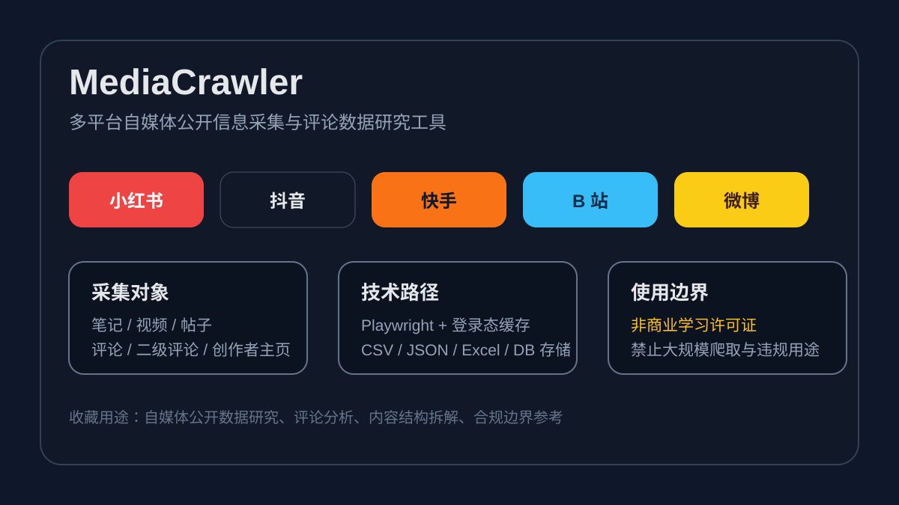

# 多平台自媒体数据采集工具：MediaCrawler

## 直观预览

> 当前环境未生成真实 GitHub 截图，因此先保存项目视觉摘要卡。核心信息来自 GitHub 仓库 README 与 LICENSE。

## 一句话价值

MediaCrawler 是一个多平台自媒体公开信息采集项目，覆盖小红书、抖音、快手、B 站、微博、贴吧、知乎等平台，适合研究内容采集架构、评论数据分析和自媒体内容结构拆解，但许可证和 README 都明确限制非商业学习用途。

## AI 选用指南

| 项目 | 选用说明 |
| --- | --- |
| 优先选用条件 | 非商业学习研究多平台内容、评论采集的适配层、登录态与任务 WebUI 架构。 |
| 不适合或暂缓条件 | 商业生产采集、大规模抓取或未确认平台权限时，不推荐直接接入。 |
| 复用方式 | 架构参考；研究源码 |
| 输入与产出 | 研究问题、允许的数据与平台 → 采集模型、任务与导出流程分析。 |
| 首次读取入口 | [本卡](./多平台自媒体数据采集工具-MediaCrawler-2026-07-27.md) →「内容摘要」 |
| 同类选择依据 | MediaCrawler 研究内容和评论采集；Yoinks 保存视频文件；GEORank 研究搜索可见性，任务不同。 对照：[终端视频下载工具：Yoinks](./终端视频下载工具-Yoinks-2026-07-18.md)、[GEO 开源工作台：GEORank](./GEO开源工作台-GEORank-2026-07-18.md)。 |
| 接入前提与待核实项 | 原卡明确记录非商业学习许可；本次不解释或扩张授权范围。运行前核实许可证、平台要求及登录依赖。 |
| 检索词 | MediaCrawler 评论采集 小红书 抖音 Playwright WebUI 数据导出 |

> 选用说明整理于 2026-09-20：适用与比较为基于收藏证据的建议；正文中的版本、数量、价格与功能范围按原收录时间理解。本次未安装或运行所收藏的工具，当前环境安装状态另查。未对外部来源作全量实时复核。

## 内容摘要

`NanmiCoder/MediaCrawler` 的定位是自媒体平台爬虫工具。GitHub README 描述其支持小红书笔记与评论、抖音视频与评论、快手视频与评论、B 站视频与评论、微博帖子、百度贴吧帖子与评论回复、知乎问答文章与评论等公开信息抓取。

项目的技术路径偏浏览器自动化：核心基于 Playwright 保存和复用登录态，不主打复杂 JS 逆向，而是通过保留登录态的浏览器上下文获取签名参数，降低维护门槛。README 还说明项目默认支持 CDP 模式连接已有 Chrome 浏览器，复用浏览器登录状态、Cookie 和扩展。

数据侧支持 CSV、JSON、JSONL、Excel、SQLite 和 MySQL 等保存方式。项目还提供 WebUI，可视化配置爬虫参数、查看运行状态与日志、预览和导出数据。

需要重点注意的是许可证。仓库 LICENSE 是 `NON-COMMERCIAL LEARNING LICENSE 1.1`，明确限定非商业学习和研究目的，并禁止大规模爬取或干扰平台运营。README 也有免责声明，强调不得用于非法用途、商业用途或侵犯第三方权益。

## 为什么值得收藏

1. 它覆盖的平台和数据对象广，适合研究自媒体内容采集的通用抽象：平台、搜索、详情、评论、二级评论、创作者主页、登录态、代理、存储。
2. 对当前“抖音热点脚本网站”有参考价值：可以借鉴其平台适配层、登录态缓存、评论采集、WebUI 和数据导出结构。
3. Playwright + CDP + 登录态复用的思路，比纯接口逆向更适合作为长期学习样本。
4. WebUI 部分可参考成“采集任务配置台”：平台选择、采集类型、任务状态、日志、数据预览、导出。
5. 它的合规边界写得很明确，适合作为之后设计采集工具时的风险提醒。

## 未来可以怎么用

- 做自媒体内容研究时，参考它的平台抽象和数据存储方式，而不是直接把采集能力用于生产爬取。
- 做抖音热点脚本网站时，可借鉴其“平台适配层 + 登录态缓存 + 任务状态 + 数据导出”结构，但 v1 应继续保留上传视频、字幕、文本的兜底路径。
- 做评论分析或舆情观察原型时，参考它对评论、二级评论和创作者主页的采集模型。
- 做 WebUI 工具台时，参考它的任务配置、环境检测、运行日志、数据预览和导出流程。
- 写项目规范时，把它的非商业学习许可证和免责声明作为合规边界样本，明确不做大规模采集、不绕平台规则、不侵犯用户权益。

## 原始内容 / 链接

- GitHub：[https://github.com/NanmiCoder/MediaCrawler](https://github.com/NanmiCoder/MediaCrawler)
- LICENSE：[https://github.com/NanmiCoder/MediaCrawler/blob/main/LICENSE](https://github.com/NanmiCoder/MediaCrawler/blob/main/LICENSE)
- 仓库：`NanmiCoder/MediaCrawler`
- GitHub 页面观察时间：2026-07-27
- GitHub 页面显示：`792 Commits`，Fork 数约 11k 量级
- Star History 页面显示：约 57.2k stars、11.4k forks、81 contributors、Python 项目
- 主要技术：Python、Playwright、Chrome CDP、Node.js、WebUI、SQLite / MySQL / CSV / JSON / Excel
- 支持平台：小红书、抖音、快手、B 站、微博、贴吧、知乎
- 许可证：`NON-COMMERCIAL LEARNING LICENSE 1.1`

## 相关联想

- 和 [[终端视频下载工具-Yoinks-2026-07-18]] 的关系：Yoinks 偏合法视频素材下载与 ffmpeg 封装，MediaCrawler 偏多平台公开信息和评论采集。
- 和“抖音热点脚本网站”的关系：MediaCrawler 可以作为采集层架构参考，但不能让项目依赖违规或大规模爬取作为唯一入口。
- 和 [[AI提示词视频编辑器-ChatCut-2026-07-12]] 的关系：采集到的公开内容和评论可以进入后续脚本拆解、视频脚本生成和剪辑流程。
- 和 [[Dashboard设计系统-BoardUI-2026-07-09]] 的关系：如果做采集任务后台，可用 BoardUI 的 dashboard、data table、status badge、filter bar 和日志面板设计任务工作台。

## 适合反向调用的场景

- 我收藏过哪些自媒体平台数据采集或评论采集项目？
- 抖音热点脚本网站如果要接采集层，有什么开源架构可以参考？
- 想做小红书、抖音、B 站、微博、知乎评论分析，有没有项目可研究？
- 想做采集任务 WebUI，如何设计平台选择、任务状态、日志和导出？
- 做爬虫工具时需要注意哪些许可证和合规边界？
