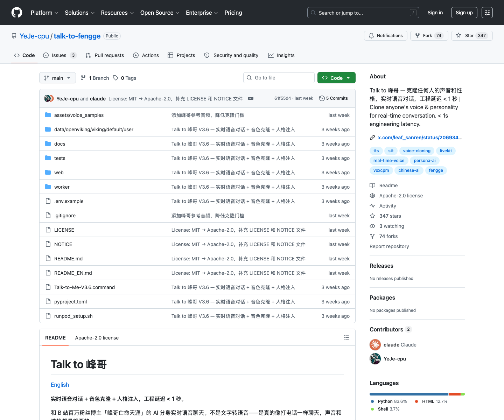

# 实时语音人格音色克隆项目：Talk to 峰哥

## 直观预览



> 已保存 GitHub 页面截图，并在 Vault 内备份源码 zip、Git bundle、README 中英快照和最近提交记录。这个项目的重点不是页面，而是“实时语音流 + STT + 流式 LLM + 音色克隆 TTS + 人格 prompt + 可选记忆”的工程组合。

## 一句话价值

Talk to 峰哥是一个把 LiveKit 实时音频、Cartesia / Deepgram / Gemini STT、MiniMax / DeepSeek / Gemini LLM、VoxCPM / MiniMax / Cartesia / MOSS TTS、峰哥人格 prompt 和 OpenViking 记忆串起来的实时语音数字分身项目，最值得收藏的是它的低延迟语音 Agent 技术链路。

## AI 选用指南

| 项目 | 选用说明 |
| --- | --- |
| 优先选用条件 | 需要实时语音 AI 原型，研究麦克风、STT、LLM、TTS、人格和记忆如何串联。 |
| 不适合或暂缓条件 | 只有文字聊天或文章风格需求时不引入整条音频链；不能承诺直接提供可靠生产服务。 |
| 复用方式 | 架构参考；使用项目源码 |
| 输入与产出 | 音频交互需求、模型服务、授权人格资料 → 实时对话原型和延迟拆解。 |
| 首次读取入口 | [本卡](./实时语音人格音色克隆项目-Talk-to-Fengge-2026-07-18.md) →「技术原理」；随后读取[本地历史资料](../../_附件/项目备份/Talk-to-Fengge/README-2026-07-18.md) |
| 同类选择依据 | Talk to 峰哥是语音链路参考；Soul Skill 是人格资料层；Writing DNA 是文章表达层。 对照：[人格思维风格蒸馏 Skill：soul.skill](../../03-Codex能力/Skills/人格思维风格蒸馏Skill-Soul-Skill-2026-07-23.md)、[写作风格蒸馏 Skill：Writing DNA](../../03-Codex能力/Skills/写作风格蒸馏Skill-Writing-DNA-2026-07-23.md)。 |
| 接入前提与待核实项 | 依赖 LiveKit、多个服务凭据及运行环境；音色和人格材料按实际授权使用，当前部署状态与性能未测试。 |
| 检索词 | Talk to Fengge LiveKit WebRTC STT TTS VoxCPM 实时语音 数字分身 |

> 选用说明整理于 2026-09-20：适用与比较为基于收藏证据的建议；正文中的版本、数量、价格与功能范围按原收录时间理解。本次未安装或运行所收藏的工具，当前环境安装状态另查。未对外部来源作全量实时复核。

## 内容摘要

这个项目的目标是和 B 站博主“峰哥亡命天涯”的 AI 分身进行实时语音对话。README 的定位是“实时语音对话 + 音色克隆 + 人格注入”，强调不是单纯文字转语音，而是像打电话一样：用户说话，系统识别语音，LLM 按峰哥人设生成回复，再用克隆音色合成语音返回。

项目默认技术栈：

1. **实时音频层**：LiveKit + WebRTC。浏览器前端采集麦克风，进入 LiveKit 房间，Python Agent Worker 接收音频流并返回远端音频。
2. **STT 层**：默认 Cartesia ink-whisper，备选 Deepgram nova-2、Gemini。
3. **LLM 层**：默认 MiniMax-M2.7-highspeed，备选 DeepSeek、Gemini；DeepSeek / MiniMax 用 OpenAI 兼容 SSE 流式接口自己包进 LiveKit LLM 协议。
4. **TTS 层**：默认 VoxCPM，备选 MOSS-TTS、Cartesia Sonic、MiniMax TTS；VoxCPM 需要 GPU，本地或云 GPU 都可。
5. **人格层**：`worker/persona.py` 内联峰哥人格 prompt，包含身份、经历、口头禅、禁用 AI 话术、典型问答、表达 DNA。
6. **记忆层**：OpenViking 可选，用于对话记忆沉淀和启动时压缩召回。
7. **前端层**：`web/index.html` 是单页语音入口，负责拿 token、连接 LiveKit、发布麦克风音轨、播放远端音轨，并用 Three.js 粒子做音频响应视觉。

GitHub API 当前显示主语言为 Python，同时包含 HTML 和 Shell。仓库 License 为 Apache-2.0，topics 包含 `real-time-voice`、`voice-cloning`、`livekit`、`voxcpm`、`persona-ai`、`stt`、`tts`、`chinese-ai`、`fengge`。

## 技术原理

核心链路可以理解成一个实时流水线：

```text
浏览器麦克风
  -> LiveKit WebRTC 房间
  -> Agent Worker 接收音频帧
  -> EnergyVAD 判断说话开始 / 结束
  -> STT 把语音转成文本
  -> LLM 结合人格 prompt / 记忆生成流式文本
  -> TTS 按句子或整段合成 PCM 音频
  -> LiveKit 把远端音频推回浏览器播放
```

技术上最关键的不是某一个模型，而是把这些异步组件接成可实时交互的闭环：

1. **LiveKit 负责实时音频通道**：前端只需要进房、发布 mic track、订阅远端音轨；房间、token 和 agent dispatch 由 `worker/web_server.py` 创建。
2. **LiveKit Agents 承担 Agent 生命周期**：`worker/agent.py` 里 `AgentServer` 注册 `rtc_session`，每次房间 dispatch 进来后启动 `AgentSession`。
3. **VAD 决定什么时候结束用户发言**：`worker/energy_vad.py` 用能量门限、滑动窗口、最短说话时长和静音时长判断 `START_OF_SPEECH` / `END_OF_SPEECH`，避免把底噪当成打断。
4. **LLM 需要适配 LiveKit 的事件协议**：项目自己实现 `_OpenAICompatLLM` 和 `_OpenAICompatLLMStream`，把 MiniMax / DeepSeek 的 OpenAI 兼容 SSE token 变成 LiveKit 能消费的 `ChatChunk`。
5. **TTS 是延迟瓶颈，所以做了 provider 工厂和流式策略**：`worker/tts_factory.py` 按环境变量切换 VoxCPM / Cartesia / MiniMax / MOSS，provider 初始化失败会降级到 MOSS。
6. **VoxCPM 的低延迟逻辑是句子级 pipeline**：`worker/voxcpm_tts.py` 把 LLM token 累积到中文/英文句末标点，一有完整句子就请求 VoxCPM `/v1/audio/speech/stream`，边拿 PCM chunk 边推给 LiveKit。
7. **人格不靠微调，靠强 prompt 模板**：`worker/persona.py` 把身份事实、表达风格、禁用话术、典型回答和口头禅写成 system prompt，用来约束 LLM 输出像目标人物。
8. **记忆不放在每轮工具调用里拖慢链路**：`worker/memory_recall.py` 启动时直接读本地 OpenViking 记忆 Markdown，合并压缩到约 800 字塞进 prompt，避免实时 tool call 增加 1-2 秒延迟。

## 技术逻辑拆解

### 1. 前端如何进入对话

`web/index.html` 里的按钮触发连接逻辑：

- 请求本地 `POST /token`。
- `worker/web_server.py` 创建 LiveKit 房间，并按 room 前缀 dispatch 到对应 agent，例如 MiniMax worker。
- 前端用 token 调 `room.connect(LIVEKIT_URL, token)`。
- 浏览器发布本地麦克风 track。
- 前端监听 `TrackSubscribed`，把远端 Agent 音频 attach 到 `<audio id="remoteAudio">`。

这个设计把 UI 和 Agent Worker 解耦：前端不直接调用 STT / LLM / TTS API，只和 LiveKit 房间交互。

### 2. Worker 如何把音频接进 Agent

`worker/agent.py` 的 `entrypoint(ctx)` 是房间会话入口。它做了几件很工程化的事：

- 先用 `local_service_env()` 直连本地 LiveKit，避免代理干扰 `ws://127.0.0.1:7880`。
- 进房后再配置出口代理，给 Google / Gemini / HTTP API 使用。
- monkey patch LiveKit 的音频输入流，允许 `SOURCE_UNKNOWN` 的 Python SDK 音轨进入 `_forward_task`，解决麦克风音频被 LiveKit Agents 过滤的问题。
- 构建 OpenViking recorder，用于记录用户和助手消息。
- 构建最终 system prompt：峰哥人格 + 运行时补充要求 + 启动时记忆快照 + 记忆使用规则。
- 启动 `AgentSession`，注入 `Dev3Agent`。

这里最有学习价值的是：它不是只写“业务逻辑”，而是补了很多实时音频系统会遇到的脏边界，包括代理、track source、worker 注册、agent dispatch 和日志探针。

### 3. Dev3Agent 如何组装组件

`Dev3Agent.__init__` 里按环境变量创建四个模块：

- `stt_instance = self._build_stt()`：Cartesia / Deepgram / Gemini。
- `llm_instance = self._build_llm()`：Gemini 原生 LiveKit LLM，或 MiniMax / DeepSeek OpenAI 兼容包装。
- `tts_instance, tts_label = build_tts(...)`：VoxCPM / Cartesia / MiniMax / MOSS。
- `vad_instance = EnergyVAD(...)`：本地能量 VAD。

然后把它们交给 LiveKit `Agent`：

```text
Agent(instructions, stt, llm, tts, vad)
```

这意味着项目把“实时语音 Agent”抽象成四个可替换 provider，加新人设或换模型时主要改 `.env.local` 和 persona，而不是重写整条链路。

### 4. LLM 为什么要自己包一层

LiveKit Agents 期待 LLM 按自己的 `llm.LLM` / `LLMStream` 协议吐事件。MiniMax 和 DeepSeek 虽然提供 OpenAI 兼容接口，但直接 async generator 不会被 LiveKit 正确消费。

所以 `worker/agent.py` 里写了 `_OpenAICompatLLM`：

- 把 LiveKit `chat_ctx` 序列化为 OpenAI messages。
- 截断上下文窗口，保留 system prompt 和最近消息。
- 调 `DeepSeekChatStream` / `MiniMaxChatStream`。
- 把 SSE token piece 包成 `llm.ChatChunk` 并 `send_nowait` 到 LiveKit event channel。

这段是项目里很关键的“框架适配层”：没有它，LLM token 到不了 TTS，Agent 会卡在 thinking / speaking 转换处。

### 5. VoxCPM TTS 如何降低延迟

`worker/voxcpm_tts.py` 的核心是 `_VoxCPMSynthesizeStream`：

- 接收 LiveKit 传来的 LLM token。
- 用 `。！？；!?;` 判断句子边界。
- 每得到一个完整句子就调用 VoxCPM HTTP 流式接口。
- 服务端返回 PCM chunk 后立刻推给 `output_emitter`。
- 如果源采样率和目标采样率不一致，用 `audioop.ratecv` 重采样到 24kHz。

这个策略的效果是：不等 LLM 全部说完，也不等 TTS 一次性合成整段，而是“LLM 首句完成 -> TTS 首句开始 -> 音频首包播放”。这就是它压体感延迟的主要技术逻辑。

同时它用了 `aiohttp.TCPConnector(force_close=True)`，避免 SSH 隧道空闲连接复用导致 `ServerDisconnectedError`。这个细节很实用，说明作者确实踩过远程 GPU / RunPod 隧道的坑。

### 6. 人格注入如何实现

项目不是训练一个“峰哥模型”，而是把人格做成 prompt 配置：

- 身份卡：峰哥是谁、经历、常聊话题。
- 铁律：用“我”说话、直接判断、少铺垫、高确定性。
- 禁用说法：禁止“首先其次最后”“作为 AI”“这是个好问题”等 AI 腔。
- 典型问答：被绿、没激情、办公室恋情、连线多少钱等高频场景。
- 表达 DNA：辩证反转、直白、荒诞类比、连环质问。
- 高频口头禅：如“这是个好事儿啊”“我跟你说实话”“不就那么回事吗”。

这套逻辑适合迁移到其他人格：准备 15-45 秒声音样本，再准备人格描述、典型语料和禁用话术，就能换成另一个“声音 + 性格”的语音 Agent。

### 7. 记忆系统为什么做启动预加载

OpenViking 是可选记忆服务。项目没有在每轮对话都实时调用记忆检索工具，因为那会拖慢语音对话的节奏。`worker/memory_recall.py` 的做法是：

- 启动时读取本地记忆 Markdown。
- 按 memory_type 分组。
- 去重、合并、压缩到 800 字以内。
- 注入 system prompt。

这种策略牺牲了一点“每轮精确检索”，换来更稳定的实时语音延迟。对于语音对话产品，这个取舍很值得记住。

## 为什么值得收藏

1. 它是一个完整的实时语音 Agent 拼装范例，不只是单个 STT、TTS 或 voice cloning demo。
2. 它把“声音像”和“性格像”分开处理：声音靠 VoxCPM / TTS，性格靠 persona prompt 和 few-shot 话术。
3. 它有大量真实工程适配细节：LiveKit track source patch、代理环境切换、worker dispatch、OpenAI-compatible LLM stream 包装、TTS provider fallback、SSH 隧道连接复用问题。
4. 它的低延迟逻辑可迁移：VAD 减少等待、LLM 流式输出、TTS 句子级合成、启动时记忆预热，而不是每一步都等完整结果。
5. 它适合反向学习“AI 数字分身”的产品骨架：WebRTC 房间、Agent Worker、人设、声音样本、记忆、前端音频反馈和启动脚本。

## 风险和边界

1. 声音克隆和人格复刻需要授权、版权和肖像 / 声音权益边界，不能用于冒充、诈骗、误导或未经同意的公开分发。
2. README 写“工程链路延迟 < 1 秒”，但也说明实际体感可能约 2-3 秒，受网络、API 和 TTS GPU 服务影响。
3. VoxCPM 推荐 GPU，部署门槛不低；MOSS 可 CPU 兜底但效果和速度都弱一些。
4. 峰哥人格是强 prompt 约束，不是稳定可控的人格模型；越长对话越需要控制上下文和输出风格漂移。
5. 依赖多个外部服务 API key，部署失败点多，适合做原型和技术参考，生产化需要更强的监控、鉴权、滥用防护和内容安全策略。

## 未来可以怎么用

1. 做自己的实时语音 AI 助手时，直接借鉴它的模块拆分：LiveKit / STT / LLM / TTS / persona / memory / frontend。
2. 做数字分身或 IP 互动 Demo 时，用它作为“人设 prompt + 参考音频 + 实时语音房间”的原型骨架。
3. 做低延迟语音链路时，复用它的句子级 TTS pipeline、VAD 参数、LLM streaming adapter 和启动时记忆预加载思路。
4. 做多模型切换时，参考它用 `.env.local` 和 factory 包装 provider，而不是在业务代码里写死 Cartesia / MiniMax / VoxCPM。
5. 做 Agent 产品时，参考它把“AI 编程助手可配置启动”写进 README 的方式，让 Codex 能读取 `.env.example` 后引导配置。

## 原始内容 / 链接

- GitHub：[https://github.com/YeJe-cpu/talk-to-fengge](https://github.com/YeJe-cpu/talk-to-fengge)
- Demo：[https://x.com/leaf_sanren/status/2069342335268507976](https://x.com/leaf_sanren/status/2069342335268507976)
- LiveKit：[https://livekit.io/](https://livekit.io/)
- VoxCPM：[https://github.com/openbmb/VoxCPM](https://github.com/openbmb/VoxCPM)
- OpenViking：[https://github.com/nicepkg/openviking](https://github.com/nicepkg/openviking)
- License：Apache-2.0
- 当前截图：`_附件/收藏预览/Talk-to-Fengge-GitHub-2026-07-18.png`
- 源码备份：`_附件/项目备份/Talk-to-Fengge/Talk-to-Fengge-2026-07-18.zip`
- Git bundle 备份：`_附件/项目备份/Talk-to-Fengge/Talk-to-Fengge-2026-07-18.bundle`
- README 快照：`_附件/项目备份/Talk-to-Fengge/README-2026-07-18.md`
- README 英文快照：`_附件/项目备份/Talk-to-Fengge/README-en-2026-07-18.md`
- 提交记录快照：`_附件/项目备份/Talk-to-Fengge/commits-2026-07-18.txt`

## 关键源码入口

- `worker/agent.py`：核心 Agent 组装、LiveKit session、LLM wrapper、VAD/STT/LLM/TTS 注入、记忆记录、音频输入 patch。
- `worker/voxcpm_tts.py`：VoxCPM 流式 TTS 插件，句子边界切分、HTTP streaming、PCM 推送、重采样、SSH 隧道断连重试。
- `worker/tts_factory.py`：TTS provider 工厂，支持 VoxCPM / Cartesia / MiniMax / MOSS，并提供 fallback。
- `worker/llm_factory.py`：DeepSeek / MiniMax OpenAI 兼容 SSE 流式包装。
- `worker/cartesia_stt.py`：Cartesia ink-whisper STT 包装。
- `worker/energy_vad.py`：本地能量 VAD 状态机。
- `worker/persona.py`：峰哥人格 prompt 模板。
- `worker/memory_recall.py`：本地 OpenViking 记忆扫描、合并、压缩到 prompt。
- `worker/web_server.py`：LiveKit 房间创建、token 生成、Agent dispatch。
- `web/index.html`：浏览器端 LiveKit 连接、麦克风发布、远端音频播放、Three.js 音频响应视觉。

## 相关联想

- 和 [[原生桌面应用开发工具包-Native-SDK-2026-07-18]] 的关系：Native SDK 强调“给 Agent 可操作的本地 app”，Talk to 峰哥强调“给人可实时对话的语音 Agent”，二者都把 AI 从文本框推向更直接的交互形态。
- 和 [[AI-Agent开源连接器网关-OpenConnector-2026-07-12]] 的关系：OpenConnector 解决 Agent 连接外部系统，Talk to 峰哥解决 Agent 的实时语音入口和人格化输出。
- 和 [[Web交互音效库-Cuelume-2026-07-17]] 的关系：Cuelume 是 UI 声音微交互，Talk to 峰哥是完整语音对话链路；都能启发“声音作为交互层”的产品设计。
- 和 [[终端视频下载工具-Yoinks-2026-07-18]] 的关系：Yoinks / Recordly / ChatCut 更偏视频素材入口和生产，Talk to 峰哥偏声音样本、语音交互和数字分身。

## 适合反向调用的场景

```text
请参考我的收藏：
Vault 根目录相对路径：04-工具网站/开源项目/实时语音人格音色克隆项目-Talk-to-Fengge-2026-07-18.md

当我要做实时语音 AI、数字分身、AI 客服、语音陪伴、虚拟主播连线、人格化助手或低延迟语音交互时，请优先借鉴 Talk to 峰哥的技术逻辑：
1. 前端只负责 WebRTC 房间、麦克风发布和远端音频播放；
2. Worker 侧用 LiveKit Agents 统一接 STT / LLM / TTS / VAD；
3. STT、LLM、TTS 都做 provider 工厂，方便按延迟、成本、音色效果切换；
4. LLM 输出必须流式适配到 Agent 框架事件协议；
5. TTS 不要等整段回答，优先按句子边界做 streaming / pipelining；
6. 人格先用 prompt、few-shot、禁用话术和典型场景约束，不急着微调；
7. 记忆可先启动时压缩注入，避免每轮 tool call 拖慢实时对话；
8. 必须加入声音授权、身份披露、防冒充、内容安全和滥用防护。

如果只是做技术 demo，可以先复用 LiveKit + Cartesia STT + MiniMax LLM + 云端 TTS；如果追求更像的音色，再上 VoxCPM + GPU。不要在未授权场景克隆真实人物声音。
```
