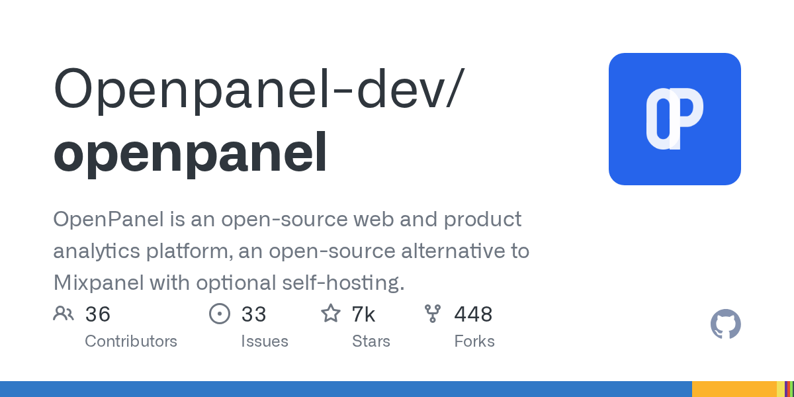

# 开源产品分析平台：Openpanel

## 直观预览

> Openpanel GitHub 项目预览。它定位为 Mixpanel 的开源替代方案，兼顾产品分析、隐私与自托管。

## 一句话价值

一个可自托管的开源 Web / 产品分析平台，把漏斗、cohort、用户档案、Session Replay、实时看板、A/B 测试、收入追踪与 MCP 数据问答放在同一套分析基础设施中。

## AI 选用指南

| 项目 | 选用说明 |
| --- | --- |
| 优先选用条件 | 产品需要埋点、漏斗、留存或会话回放，并愿意评估托管或自托管的数据分析服务。 |
| 不适合或暂缓条件 | 只想画一张数据图或查看基础设施存活时不必部署分析平台。 |
| 复用方式 | 使用服务；使用项目源码 |
| 输入与产出 | 事件字典、用户标识、分析问题 → 埋点方案与分析看板。 |
| 首次读取入口 | [本卡](./开源产品分析平台-Openpanel-2026-08-22.md) →「内容摘要」；随后读取[本地历史资料](../../_附件/网页快照/Openpanel-2026-08-22/README.md) |
| 同类选择依据 | Openpanel 分析产品行为；TokHub 监控模型服务；Lieflat Charts 呈现已有数据。 对照：[AI API 中转站监控与网关系统：TokHub](./AI-API中转站监控与网关系统-TokHub-2026-07-07.md)、[单色数据可视化 Skill：Lieflat Charts](../../03-Codex能力/Skills/单色数据可视化Skill-Lieflat-Charts-2026-07-23.md)。 |
| 接入前提与待核实项 | 历史许可证记录为 AGPL-3.0；部署前核实目标版本许可与数据处理要求。MCP 查询能力不代表当前 AI 已连接账号。 |
| 检索词 | Openpanel Mixpanel GA4 漏斗 留存 cohort Session Replay 埋点 |

> 选用说明整理于 2026-09-20：适用与比较为基于收藏证据的建议；正文中的版本、数量、价格与功能范围按原收录时间理解。本次未安装或运行所收藏的工具，当前环境安装状态另查。未对外部来源作全量实时复核。

## 内容摘要

Openpanel 是 “open-source alternative to Mixpanel”。README 描述其结合 Mixpanel 的分析能力、Plausible 的易用性和 Google Analytics 替代定位。功能包含漏斗、cohort、用户档案、会话历史、带隐私控制的 Session Replay、实时仪表盘、A/B 测试、事件 / 漏斗通知、无 Cookie 追踪、GDPR 取向、多端 SDK、收入与订阅 / LTV 追踪及 Google Search Console 等集成。

项目支持自托管，覆盖 Web、Swift、Kotlin、React Native 和服务端跟踪。README 还说明 MCP Server 可让 Claude、Cursor 或其他 MCP 客户端通过 38 个工具查询用户数据。技术栈包括 Next.js、Fastify、Postgres、ClickHouse、Redis、BullMQ / GroupMQ、tRPC、Tailwind 和 shadcn/ui。

项目许可证为 **AGPL-3.0**，不是宽松许可证：修改后以网络服务形式提供时，通常需要向该服务的用户提供相应源代码。接入前还必须决定事件字典、用户标识、数据保留、PII 最小化、同意机制和访问权限；自托管不等于自动合规。

## 为什么值得收藏

1. 从产品事件到回放、收入和实验都覆盖，适合作为统一数据工作台。
2. 自托管可减少对封闭第三方分析平台的依赖，但需要承担运行与数据治理责任。
3. MCP 数据入口是“数据可读、可问、可审计”产品设计的参考。

## 未来可以怎么用

- 为 SaaS 设计最小埋点体系：激活、关键任务完成、留存、错误、付费与漏斗流失，而不是采集所有点击。
- 自托管前建立 PII、脱敏、保留时长、权限、导出、删除、回放遮罩和同意管理清单。
- 对 Agent 只开放汇总、脱敏、只读数据查询，不暴露原始敏感用户资料。

## 原始内容 / 链接

- GitHub：[https://github.com/Openpanel-dev/openpanel](https://github.com/Openpanel-dev/openpanel)
- 官网：[https://openpanel.dev/](https://openpanel.dev/)
- 文档：[https://openpanel.dev/docs](https://openpanel.dev/docs)
- 自托管：[https://openpanel.dev/docs/self-hosting/self-hosting](https://openpanel.dev/docs/self-hosting/self-hosting)
- 来源帖文：[https://x.com/csaba_kissi/status/2090328699992432716](https://x.com/csaba_kissi/status/2090328699992432716)
- 本地预览：`_附件/收藏预览/Openpanel-2026-08-22.png`
- License：AGPL-3.0
- 本地快照：`_附件/网页快照/Openpanel-2026-08-22/github.html`、`README.md`、`LICENSE.md`

## 相关联想

- 与 GEO、OpenConnector 对照：GEO 分析 AI 搜索可见性，Openpanel 分析产品行为，连接器网关负责业务动作暴露。

## 适合反向调用的场景

- 我想找 Mixpanel / GA4 的开源或可自托管替代方案。
- 我需要产品漏斗、cohort、会话回放、A/B 测试和收入分析的一体化参考。
