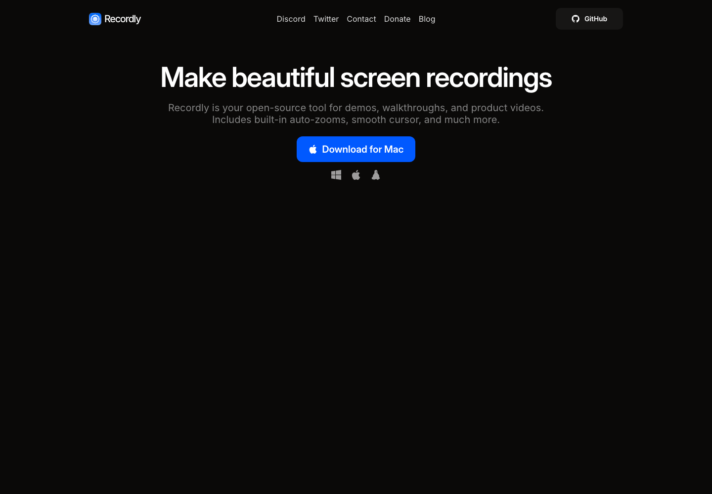

# 开源演示视频录屏编辑器：Recordly

## 直观预览

> Recordly 官网截图，直观看开源录屏和演示视频编辑器的产品形态。

## 一句话价值

Recordly 是一个开源桌面录屏和演示视频编辑器，适合把产品 walkthrough、功能 demo、教程录屏快速打磨成带自动缩放、鼠标动效、背景框架和导出的成品视频。

## AI 选用指南

| 项目 | 选用说明 |
| --- | --- |
| 优先选用条件 | 要录制真实软件操作，加入自动缩放、鼠标美化、背景与时间线编辑，制作 demo 或教程。 |
| 不适合或暂缓条件 | 只想下载已有视频时用下载器；纯提示词生成视频不属于录屏任务。 |
| 复用方式 | 使用桌面应用；架构参考 |
| 输入与产出 | 可操作软件、录制脚本、系统录屏权限 → 可编辑录屏项目与演示视频。 |
| 首次读取入口 | [本卡](./开源演示视频录屏编辑器-Recordly-2026-07-09.md) →「内容摘要」 |
| 同类选择依据 | Recordly 产生真实录屏；ChatCut 可处理后续剪辑；Yoinks 获取已有媒体文件。 对照：[AI 提示词视频编辑器：ChatCut](../在线工具/AI提示词视频编辑器-ChatCut-2026-07-12.md)、[终端视频下载工具：Yoinks](./终端视频下载工具-Yoinks-2026-07-18.md)。 |
| 接入前提与待核实项 | 平台原生录屏与音频能力有差异，实际下载版本、权限和导出效果需试录验证。 |
| 检索词 | Recordly screen recorder demo walkthrough 自动缩放 鼠标美化 Electron |

> 选用说明整理于 2026-09-20：适用与比较为基于收藏证据的建议；正文中的版本、数量、价格与功能范围按原收录时间理解。本次未安装或运行所收藏的工具，当前环境安装状态另查。未对外部来源作全量实时复核。

## 内容摘要

`webadderallorg/Recordly` 是一个面向创作者和产品团队的开源屏幕录制工具，定位为 open-source screen recorder and editor。它不是单纯录屏，而是把录制、时间线编辑、自动缩放、鼠标美化、背景样式、Webcam 气泡和导出能力放在一个桌面应用里。

项目使用 Electron / Vite / TypeScript 体系，支持 macOS、Windows 和 Linux。macOS 侧使用 ScreenCaptureKit 相关原生能力，Windows 侧使用 Windows Graphics Capture 和 WASAPI，Linux 通过 Electron capture APIs 录制。它支持保存 `.recordly` 项目文件，后续可以重新打开继续编辑。

核心功能包括整屏或窗口录制、麦克风和系统音频捕获、自动 zoom 建议、手动 zoom 区域、剪辑、速度区域、注释、额外音频轨、裁剪、鼠标平滑 / 动效 / 点击反馈、Webcam 气泡、内置壁纸和自定义背景，以及 MP4 / GIF 导出。

## 为什么值得收藏

1. 它解决的是“产品演示视频不够精致”的问题，自动缩放、鼠标效果、背景框架和时间线编辑都直接服务于 demo 成片质量。
2. 对做 SaaS、工具站、开源项目展示很有价值，可以减少把普通录屏再交给动效设计师处理的成本。
3. 它是一个完整的跨平台 Electron 桌面应用样本，包含原生录屏 helper、导出脚本、扩展系统、打包发布和多平台构建配置。
4. Recordly 的扩展市场思路也值得参考：可以通过插件补充鼠标声音、设备框、浏览器 mockup、壁纸、render hooks 和设置面板等能力。

## 未来可以怎么用

- 录制产品功能 walkthrough、教程视频、开源项目 demo 或发布说明视频。
- 做 glint.red 或其他项目展示时，参考它的“录屏 + 自动 zoom + 背景框架 + 鼠标美化”成片路径。
- 研究 Electron 桌面工具如何结合平台原生录屏能力、时间线编辑和视频导出。
- 设计自己的视频制作工作流时，把它作为“轻量成片工具”或“开源实现参考”。
- 如果后续需要做录屏工具、演示视频编辑器或创作者工具，可以深入看它的录制、导出、扩展系统和多平台打包实现。

## 原始内容 / 链接

- GitHub：[https://github.com/webadderallorg/Recordly](https://github.com/webadderallorg/Recordly)
- 官网：[https://www.recordly.dev](https://www.recordly.dev)
- Releases：[https://github.com/webadderallorg/Recordly/releases](https://github.com/webadderallorg/Recordly/releases)
- Marketplace：[https://marketplace.recordly.dev/extensions](https://marketplace.recordly.dev/extensions)
- 当前读取到的版本：`1.3.4`
- License：AGPL-3.0
- 技术栈：Electron、Vite、TypeScript、React、原生录屏 helper

## 相关联想

- 可以和 DashiAI PPT 一起组成“演示材料生产线”：先用 PPT/网页组织内容，再用 Recordly 录制成产品演示视频。
- 可以和 AI 视频 Skill、动效素材、页面过渡素材一起用于提升产品展示质量。
- 对教程型内容、产品更新视频、功能发布视频、开源项目 README 动图都有复用价值。
- 它的扩展系统可以启发“创作者工具主应用 + 社区扩展市场”的产品设计。

## 适合反向调用的场景

- 我想录制一个更像产品宣传片的 demo 视频。
- 有没有开源的录屏和演示视频编辑工具？
- 我想做自动缩放、鼠标美化、背景框架的视频编辑器。
- 我想研究 Electron 桌面应用如何做屏幕录制和导出。
- 我想给开源项目或 SaaS 做功能 walkthrough。
