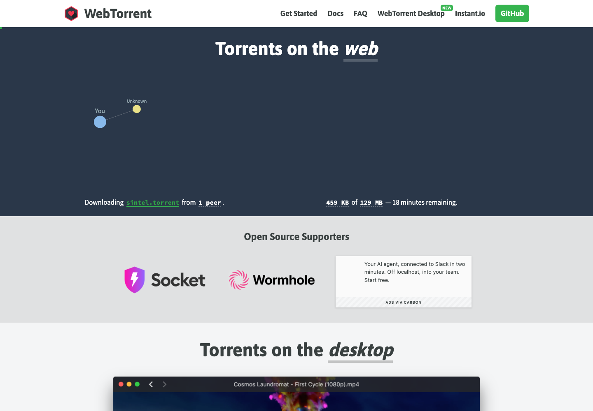

# 浏览器与 Node 流式 Torrent 客户端：WebTorrent

## 直观预览

> WebTorrent 官网截图，直观看浏览器和 Node 流式 Torrent 客户端的项目入口。

## 一句话价值

一个用 JavaScript 实现的流式 Torrent 客户端，同时覆盖 Node.js 和浏览器场景，适合研究 WebRTC P2P、浏览器文件分发和流媒体按需加载。

## AI 选用指南

| 项目 | 选用说明 |
| --- | --- |
| 优先选用条件 | JavaScript 项目要探索 Torrent 流式读取、边下边播或浏览器 WebRTC 对等分发。 |
| 不适合或暂缓条件 | 普通文件上传下载不一定需要 P2P；浏览器不能直接连接普通 UDP/TCP Torrent peers。 |
| 复用方式 | 安装依赖；架构参考 |
| 输入与产出 | 分发内容、运行环境、peer 与 tracker 方案 → 流式读取或 P2P 原型。 |
| 首次读取入口 | [本卡](./浏览器与Node流式Torrent客户端-WebTorrent-2026-07-08.md) →「内容摘要」 |
| 同类选择依据 | WebTorrent 负责分发协议；Yoinks 从网站取得视频；Recordly 制作视频，三者不是互换下载方案。 对照：[终端视频下载工具：Yoinks](./终端视频下载工具-Yoinks-2026-07-18.md)、[开源演示视频录屏编辑器：Recordly](./开源演示视频录屏编辑器-Recordly-2026-07-09.md)。 |
| 接入前提与待核实项 | 浏览器需兼容 WebRTC peers，Node 与浏览器接口能力不同；网络连通性、做种条件及目标版本要实测。 |
| 检索词 | WebTorrent magnet WebRTC torrent P2P streaming Node 边下边播 |

> 选用说明整理于 2026-09-20：适用与比较为基于收藏证据的建议；正文中的版本、数量、价格与功能范围按原收录时间理解。本次未安装或运行所收藏的工具，当前环境安装状态另查。未对外部来源作全量实时复核。

## 内容摘要

WebTorrent 是 `webtorrent/webtorrent` 开源项目，定位是 streaming torrent client for Node.js and the web。它把 BitTorrent 客户端能力做成 JavaScript 包，在 Node.js 中可以通过 TCP / UDP 与传统 Torrent 客户端通信，在浏览器中则使用 WebRTC data channels 做点对点传输，不需要浏览器插件或扩展。

项目支持 magnet uri、DHT、tracker、LSD、ut_pex、协议扩展 API 等常见 Torrent 能力，并把文件暴露为 stream。它的核心特点是可以边下载边播放或读取，按需获取文件片段，因此适合视频播放、文件预览和大文件分发场景。浏览器侧需要注意：WebTorrent web peer 只能连接支持 WebTorrent / WebRTC 的客户端，不能直接连接普通 UDP / TCP Torrent peer。

## 为什么值得收藏

1. 它是少数把 BitTorrent、WebRTC 和浏览器运行时结合得比较完整的开源实现，适合研究浏览器端 P2P 网络的真实工程边界。
2. 同一套 npm 包覆盖 Node.js 和 Web，能作为跨运行时 JavaScript 网络库设计参考。
3. 文件以 stream 形式暴露，并支持按需 piece 获取，对流媒体、预览、断点式加载和大文件体验设计有参考价值。
4. 对去中心化内容分发、多人共享文件、离线优先资源同步等产品方向都有启发。

## 未来可以怎么用

- 做浏览器端 P2P 文件共享、局域网协作或临时文件分发时，参考它的 WebRTC data channel 传输模型。
- 做流媒体播放或大文件预览时，参考它按需取片、边下载边播放的设计。
- 做 Node.js 下载器、媒体工具或命令行工具时，参考其 Torrent API、stream 接口和生态包拆分方式。
- 研究“无需中心服务器承载全部带宽”的内容分发产品时，把它作为技术可行性样本。
- 给 AI 代理生成 P2P / WebRTC 原型时，把 WebTorrent 作为可调用的工程参考，而不是从零手写协议。

## 原始内容 / 链接

- GitHub：[https://github.com/webtorrent/webtorrent](https://github.com/webtorrent/webtorrent)
- 官网：[https://webtorrent.io/](https://webtorrent.io/)
- npm 包：`webtorrent`
- 当前读取到的包版本：`3.0.16`
- License：MIT
- 项目描述：Streaming torrent client
- 核心技术：JavaScript、WebRTC data channels、BitTorrent、Node.js streams

## 相关联想

- 可以和 `WebRTC`、`实时协作`、`大文件传输`、`离线优先同步` 这几类素材一起查。
- 如果后续做一个临时文件分享工具，可以用它验证“浏览器直接参与分发”的产品体验。
- 它与传统 CDN / 对象存储思路不同，更像是把用户端浏览器也纳入分发网络，适合启发低成本分发、社区共传、边看边下类产品。
- 和 Instant.io、WebTorrent Desktop、webtorrent-hybrid 这些生态项目一起看，会更容易理解浏览器 peer 与普通 Torrent peer 的连接边界。

## 适合反向调用的场景

- 我想做浏览器 P2P 文件传输，有没有可参考的开源项目？
- 我想研究 WebRTC data channel 的真实产品用法。
- 我想做边下边播、流式加载、大文件预览，有什么技术参考？
- 我想找 JavaScript 网络协议或跨 Node / Web 运行时的项目设计样本。
- 我想做去中心化内容分发或低带宽成本的产品原型。
