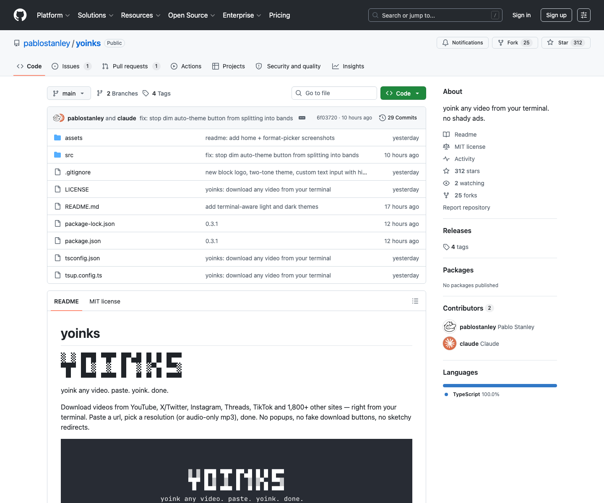

# 终端视频下载工具：Yoinks

## 直观预览



> 已保存 GitHub 页面截图，并在 Vault 内备份源码 zip、Git bundle、README 快照和最近提交记录。这个工具适合用来保存自己有权下载和归档的视频素材。

## 一句话价值

Yoinks 是一个用终端下载视频的开源工具，把 yt-dlp、ffmpeg 和 Ink 做成更友好的全屏终端 UI，适合快速保存 YouTube、X/Twitter、Instagram、Threads、TikTok 等平台上的视频素材。

## AI 选用指南

| 项目 | 选用说明 |
| --- | --- |
| 优先选用条件 | 需要把有权保存的公开视频按画质或音频格式下载到本地，作为后续剪辑输入。 |
| 不适合或暂缓条件 | 不能提供评论数据、录制软件操作或绕过 DRM/访问限制；站点支持数量不是成功保证。 |
| 复用方式 | 安装 CLI；使用下载工具 |
| 输入与产出 | 视频链接、保存权限、格式与目录 → 本地视频或音频文件。 |
| 首次读取入口 | [本卡](./终端视频下载工具-Yoinks-2026-07-18.md) →「原始内容 / 链接」；随后读取[本地历史资料](../../_附件/项目备份/Yoinks/README-2026-07-18.md) |
| 同类选择依据 | Yoinks 获取媒体文件；MediaCrawler 研究内容评论数据；Recordly 录屏；ChatCut 剪辑。 对照：[多平台自媒体数据采集工具：MediaCrawler](./多平台自媒体数据采集工具-MediaCrawler-2026-07-27.md)、[开源演示视频录屏编辑器：Recordly](./开源演示视频录屏编辑器-Recordly-2026-07-09.md)、[AI 提示词视频编辑器：ChatCut](../在线工具/AI提示词视频编辑器-ChatCut-2026-07-12.md)。 |
| 接入前提与待核实项 | 历史版本依赖 Node 18+、yt-dlp、ffmpeg；站点变化会导致失效，运行前检查版本与下载目标。 |
| 检索词 | Yoinks yt-dlp ffmpeg 视频下载 MP3 分辨率 终端 |

> 选用说明整理于 2026-09-20：适用与比较为基于收藏证据的建议；正文中的版本、数量、价格与功能范围按原收录时间理解。本次未安装或运行所收藏的工具，当前环境安装状态另查。未对外部来源作全量实时复核。

## 内容摘要

Yoinks 的 README 口号是 `yoink any video. paste. yoink. done.`，核心体验是：在终端里粘贴一个视频链接，选择分辨率或音频 mp3，然后下载到本地。它强调没有弹窗、假下载按钮和可疑跳转，比网页下载站更干净。

项目当前信息：

1. 支持 YouTube、X/Twitter、Instagram、Threads、TikTok 和 1800+ 其他站点。
2. 安装方式是 `npm install -g yoinks`，也可以直接 `npx yoinks`。
3. 需要 Node 18+。
4. 首次运行会把 standalone `yt-dlp` binary 下载到 `~/.yoinks/bin`，不需要用户额外安装 Python。
5. `ffmpeg` 会优先使用 PATH 里的版本，也提供 `ffmpeg-static` fallback，用于高分辨率流合并和 mp3 提取。
6. UI 使用 Ink 构建，也就是 React for terminal。
7. 文件默认保存到 `~/Downloads`，完成后会在终端打印文件路径。
8. 支持 auto / light / dark 主题，也支持鼠标点击、方向键、j/k、数字键选择格式。

GitHub API 当前显示项目主语言是 TypeScript，License 为 MIT，仓库描述为 `yoink any video from your terminal. no shady ads.`。

## 为什么值得收藏

1. 它适合做“视频素材保存”的轻量工具：以后遇到公开演示、设计动效、产品视频、社媒素材时，可以更方便地保存本地副本。
2. 它是一个不错的 CLI 产品设计案例：用 Ink 做全屏终端 UI，不是传统参数堆叠式命令行。
3. 它把复杂依赖处理得比较顺：yt-dlp 自动获取，ffmpeg 自动 fallback，降低普通用户上手门槛。
4. 它适合和 ChatCut、Recordly、DashiAI PPT、rnskill 组合成“素材保存 -> 录屏 / 剪辑 -> 视频包装 -> 发布”的内容生产链路。
5. 它也能作为 Codex 生成 CLI 工具时的参考：交互式 UI、主题、键盘/鼠标操作、下载进度、完成路径提示都值得复用。

## 未来可以怎么用

1. 保存自己发布过或有权归档的公开视频素材，作为 Obsidian 收藏卡片里的本地视频附件。
2. 做视频类收藏时，用 Yoinks 下载视频，再把 mp4 或关键帧截图放进 `## 直观预览`，让收藏不再只是文字描述。
3. 做终端工具或开发者工具时，参考它的 Ink 全屏 UI、格式选择器、主题切换和完成反馈。
4. 做内容生产工作流时，把 Yoinks 放在素材入口，后接 Recordly / ChatCut / DashiAI PPT / rnskill。
5. 做“下载器类工具”时，参考它对 yt-dlp、ffmpeg、Node 版本和用户下载目录的封装方式。

## 原始内容 / 链接

- GitHub：[https://github.com/pablostanley/yoinks](https://github.com/pablostanley/yoinks)
- 安装：`npm install -g yoinks`
- 直接运行：`npx yoinks`
- 运行示例：`yoinks https://youtu.be/dQw4w9WgXcQ`
- 依赖：Node 18+、yt-dlp、ffmpeg / ffmpeg-static、Ink
- License：MIT
- 当前截图：`_附件/收藏预览/Yoinks-GitHub-2026-07-18.png`
- 源码备份：`_附件/项目备份/Yoinks/Yoinks-2026-07-18.zip`
- Git bundle 备份：`_附件/项目备份/Yoinks/Yoinks-2026-07-18.bundle`
- README 快照：`_附件/项目备份/Yoinks/README-2026-07-18.md`
- 提交记录快照：`_附件/项目备份/Yoinks/commits-2026-07-18.txt`

## 相关联想

- 和 [[AI提示词视频编辑器-ChatCut-2026-07-12]] 的关系：Yoinks 适合做素材下载入口，ChatCut 适合做后续 AI 剪辑、字幕和视频包装。
- 和 [[开源演示视频录屏编辑器-Recordly-2026-07-09]] 的关系：Recordly 偏自己录制产品 demo，Yoinks 偏保存外部公开视频素材；两者都能进入视频素材库。
- 和 [[雪踏乌云AI-Agent-Skills集合-rnskill-2026-07-07]] 的关系：rnskill 可做视频动效导演和质检，Yoinks 可补足参考视频下载与素材归档。
- 和 [[App-Store-Connect自动化CLI-asc-2026-07-18]] 的关系：asc 是生产发布型 CLI，Yoinks 是内容采集型 CLI；两者都可以作为“把复杂外部平台操作包装成终端产品”的参考。

## 适合反向调用的场景

```text
请参考我的收藏：
Vault 根目录相对路径：04-工具网站/开源项目/终端视频下载工具-Yoinks-2026-07-18.md

当我要保存视频参考、产品 demo、社媒公开素材或给 Obsidian 收藏补视频预览时，可以考虑使用 Yoinks。

执行前请先判断：
1. 该视频是否是我自己发布、公开可下载，或我有权保存和归档；
2. 是否只需要关键帧截图，而不是完整视频；
3. 是否需要 mp3 音频、低分辨率预览或原始清晰度；
4. 下载后应放入哪个 Vault 附件目录，并在卡片 `## 直观预览` 中引用；
5. 不要绕过付费墙、DRM、登录限制或平台明确禁止的下载限制。

如果是设计 / 动效参考，下载后请再提取 2-4 张关键帧或保留短视频预览，方便以后打开卡片第一眼看懂。
```
