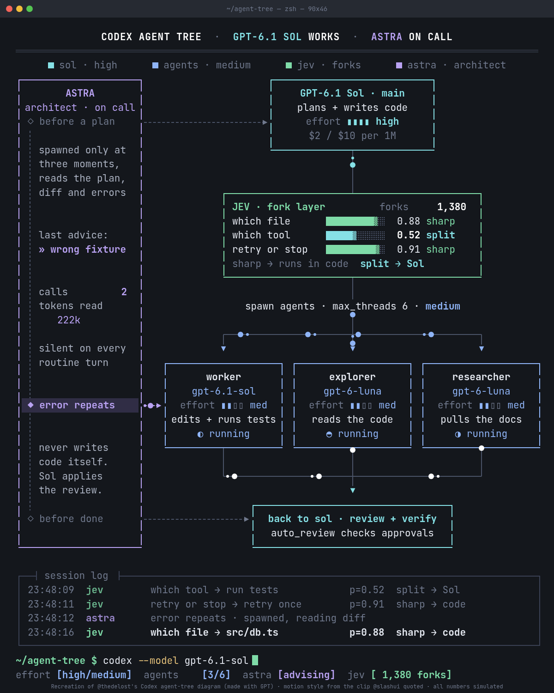

# 终端风动态架构图生成器：live-panel-skill

## 直观预览

> 项目 README 中的关键帧：terminal-dark 主题、4:5 画幅，对 @thedelost Codex agent 分工动态图的复刻。版面固定不动，实际输出是光点沿连线流动、日志滚动、计数跳动的 mp4 或可实时打开的网页。

## 一句话价值

一个 JSON 配置就能生成"终端风、一直在运行"的动态架构图：版面不动、光点沿连线流动、日志滚动、计数跳动，输出 H.264 mp4（X/小红书就绪）或实时网页，还附带一份 Claude Code Skill 工作流。

## AI 选用指南

| 项目 | 选用说明 |
| --- | --- |
| 优先选用条件 | 需要把系统 / Agent / 组织架构图做成"像在运行的监控面板"那样的视频（终端风或浅色信息图风），发 X 或小红书；或想让 Agent 按固定流程自动批量生产这类讲解视频。 |
| 不适合或暂缓条件 | 需要交互、接入真实遥测数据、或做分步讲解式演示时不适合（作者明确建议用幻灯片或普通图表工具）；只需要静态信息图时，用它属于杀鸡用牛刀。 |
| 复用方式 | 读取 Skill、复制源码、运行脚本、视觉参考 |
| 输入与产出 | 系统描述 / 数字 / 文案（写成单个 JSON 配置）→ H.264 mp4（约 28-30 秒、30fps；4:5 适配 X、3:4 适配小红书、1:1 方形）或可直接打开的实时网页；模板无需改动，坐标按画布绝对像素，换画幅需另存配置重排。 |
| 首次读取入口 | [本卡](./终端风动态架构图生成器-live-panel-skill-2026-10-05.md) →「内容摘要」；Skill 固定流程见仓库 SKILL.md；配置字段参考 references/config-schema.md。 |
| 同类选择依据 | 库内视频链路：Yoinks（获取）、Recordly（录制）、ChatCut（剪辑）都不做"从零生成动态图表视频"，只有 live-panel 覆盖"生成"环节；反过来，需要剪辑已有素材或录屏演示时，live-panel 帮不上忙。 |
| 接入前提与待核实项 | 需要 Python 3.8+（仅标准库，无 pip 依赖）、Chrome/Chromium、ffmpeg；未在本机安装运行过，本地渲染效果待核实。examples/codex-agents 是对 @thedelost 原图的复刻，公开发布时须保留出处署名；代码 MIT，但复刻示例的设计归原作者、不在 MIT 授权范围内。 |
| 检索词 | 动态架构图 终端风 live-panel live panel 视频生成 信息图动画 Agent架构可视化 terminal-dark 监控面板风 mp4 |

> 核查记录：整理于 2026-10-05，基于 GitHub README（含中文说明）+ SKILL.md + 仓库文件树（建仓 2026-10-03，收录时约 406 stars；LICENSE 文件声明代码 MIT，但 GitHub API 的 license 字段为 NOASSERTION，以文件声明为准）。仅阅读文档，未安装运行。截图取自 README 的 examples/codex-agents 关键帧（frame_1.png，1200x1500）。examples/codex-agents 与 examples/agent-architecture 为署名复刻，其设计分别归 @thedelost 与小红书 @林纾，不在 MIT 授权范围内。

## 内容摘要

live-panel 把一份系统描述（单个 JSON 配置）变成两种东西：

1. **终端风格、一直在运行的动态架构图**：版面固定不动，连线上有光点流动，日志滚动，计数器跳动，进度条过阈值翻状态，侧栏触发点依次点亮。
2. **浅色粉彩、会动的信息图**（light-pastel 主题，圆角柔光，适合小红书）。

产物是 H.264 mp4（X / 小红书就绪）或可直接在浏览器打开的实时网页。仓库同时是一份 Claude Code 风格的 Skill（SKILL.md），Agent 可按固定流程调用。

技术要点：

- **渲染**：`python3 scripts/render.py --config <配置> --out out.mp4`，依赖只有 Python 3.8+ 标准库、Chrome/Chromium、ffmpeg，无 pip 包；`--html-out page.html` 可保留自包含的实时页面。
- **自检**：`scripts/check_frames.py` 在约 120 个时间点采样，用 DOM 测量文字溢出与重叠，`--repeat` 模式重渲染证明逐帧确定性（同一示例两次渲染，900 帧解码后字节完全一致）。
- **确定性设计**：页面暴露 `window.seek(t)`，所有视觉都是时间的纯函数，无 `Math.random`、无墙钟、无 CSS 动画；渲染器逐帧 seek 后截图。
- **动效语法（三速并行）**：快（连线光点、计数器、旋转指示）、中（日志滚动、新行高亮、进度条过阈值翻色翻标签）、慢（侧栏触发点依次点亮、建议逐字打出、总数累积）；"一处为真处处为真"——日志里的数字就是柱条上的数字，点亮的触发点就是日志提到的那个。
- **无真实数据就说"示意"**：固定事实保持固定，只有动画自身的计数器在动，且必须标注；Skill 流程第一步就是给每个数字标注来源。
- **三个示例**：codex-agents（复刻 @thedelost 的 Codex agent 分工图）、agent-architecture（把小红书 @林纾 的《AI Agent 的完整架构》静态图做成动态版）、airbnb（Latent.Space 访谈数字的可视化，跳动计数为示意）。
- **配置参考**：`references/config-schema.md`（字段表）、`references/motion-grammar.md`（动效规则全文）；模板 `assets/template.html` 无需改动。

## 为什么值得收藏

1. **补上库里"视频生成"环节**：现有视频链路是 Yoinks（获取）、Recordly（录制）、ChatCut（剪辑），缺"从零生成"；live-panel 正好补这一块，四个环节齐了。
2. **为 X/小红书内容而生**：作者明确写"Intended as the base for posts on X and Xiaohongshu"，画幅预设直接对齐两个平台——这正是用户的内容主战场。
3. **确定性渲染 + 帧级自检是高质量工程样本**：两次渲染字节一致、check_frames 抓几何问题，这套"Agent 产出视频"的质量验收思路可以直接迁移。
4. **热度真实**：2026-10-03 建仓，收录时约 406 stars，两天内的增长说明"架构图做成动态视频"是个真实存在的需求。
5. **无依赖地狱**：Python 纯标准库 + Chrome + ffmpeg，跑起来门槛低。
6. **许可边界写得清楚**：代码 MIT，复刻示例需署名原作者——引用时知道红线在哪，不会踩坑。

## 未来可以怎么用

- 把 xiegao2.0 的 Agent 架构、bot 素材 pipeline 的架构做成动态讲解视频，发 X。
- 把静态信息图（比如林纾《AI Agent 的完整架构》这类高赞干货图）转成动态版，发小红书。
- 作为 Claude Code Skill，让 Agent 按固定流程自动产出架构讲解视频（比如每个新项目自动生成一张"系统运行图"当门面）。
- 把 motion-grammar.md 的规则（三速并行、版面不动、数字处处一致）迁移到自己做的动态图表或数据看板。
- check_frames 的"采样时间点 + DOM 测量 + 重渲染字节对比"可作为 Agent 视觉产物的通用验收模式。

## 原始内容 / 链接

- 仓库：https://github.com/ythx-101/live-panel-skill
- README（英文 + 中文说明）：已读全文；LICENSE：MIT（文件声明）；package.json：无（Python 项目）。
- 灵感来源：@thedelost 的 Codex agent 分工动态图（https://x.com/thedelost/status/2105398038026195279），经 @slashui 引用转发传播（https://x.com/slashui/status/2105850132365443528）。
- 小红书 @林纾《AI Agent 的完整架构》静态图（9 月 4 日发布）被做成动态版，画面底部有出处。
- 截图来源：examples/codex-agents/screenshots/frame_1.png（1200x1500 PNG，已存 `_附件/收藏预览/`）。
- 未访问：X 原帖（需登录，未假装看过）；未安装运行（本地渲染效果待核实）。

## 相关联想

- 传播路径值得注意：一个 X 上的动态架构图短片 → 被 quote 传播 → 有人把它的"方法论"（motion grammar）提炼成可配置模板 + Skill。内容形式的"可复制方法论"本身就是产品。
- 和库里 Lieflat Charts（单色数据可视化 Skill）、DashiAI PPT（演示生成 Skill）同属"Agent 生产视觉产物"一类，可比较三者的输入形态：数据→图表 / 结构→演示 / 系统描述→动态图。
- 确定性渲染（纯函数 + seek）思想可用于 paper-s3-dashboard 这类服务端渲染管线：同样的输入永远得到同样的画面。
- 小红书信息图"动起来"是个内容趋势：静态干货图 → 动态信息图，信息密度不变、停留时长可能更高。

## 适合反向调用的场景

- 我想把某个系统 / Agent 架构做成发 X 或小红书的动态讲解视频，有什么现成工具？
- Agent 能不能按固定流程自动产出一批架构图视频？质量怎么验收？
- 有没有"终端监控面板"风格的视觉参考，或可直接跑的生成器？
