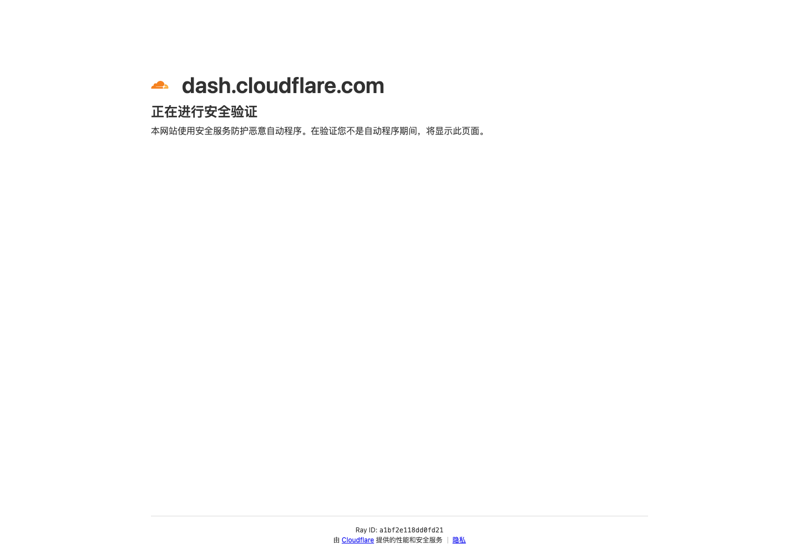

# Cloudflare 仪表盘管理入口

## 直观预览

> Cloudflare Dashboard 入口截图，用于提示这是登录后查看仪表盘、域名和运维配置的服务入口。

## 一句话价值

这是当前 Cloudflare 账号下 Dashboards 页面的快捷入口，适合之后快速进入监控看板、站点指标、运维配置和域名购买 / 管理相关页面。

## AI 选用指南

| 项目 | 选用说明 |
| --- | --- |
| 优先选用条件 | 要回到自己的 Cloudflare 账号查看站点、域名、DNS、缓存或安全配置。 |
| 不适合或暂缓条件 | 不是公开素材、SDK 或可复制的监控产品；未登录的远程 AI 不能凭链接读取账号数据。 |
| 复用方式 | 查询入口 |
| 输入与产出 | 当前账号与目标站点 → 找到相关管理页面并按任务查看。 |
| 首次读取入口 | [本卡](./Cloudflare仪表盘管理入口-2026-07-08.md) →「原始内容 / 链接」 |
| 同类选择依据 | 本卡提供账号入口；letsfinddomain 用于命名和查询；TokHub 是独立模型服务监控项目。 对照：[域名命名与可用性查询 Skill：letsfinddomain](../../03-Codex能力/Skills/域名命名与可用性查询Skill-letsfinddomain-2026-07-27.md)、[AI API 中转站监控与网关系统：TokHub](../开源项目/AI-API中转站监控与网关系统-TokHub-2026-07-07.md)。 |
| 接入前提与待核实项 | 依赖用户登录与账号权限；页面数据仅能通过实际访问确认，索引不复制账号专用 URL。 |
| 检索词 | Cloudflare Dashboard DNS 域名 缓存 WAF 账号入口 |

> 选用说明整理于 2026-09-20：适用与比较为基于收藏证据的建议；正文中的版本、数量、价格与功能范围按原收录时间理解。本次未安装或运行所收藏的工具，当前环境安装状态另查。未对外部来源作全量实时复核。

## 内容摘要

该链接指向 Cloudflare Dashboard 中的 `dashboards` 页面，属于账号私有的服务管理入口。它不是公开素材页，而是后续查看 Cloudflare 站点数据、监控面板、服务状态、相关配置，以及购买和管理域名时可以直接反向调用的入口。

由于该页面依赖当前账号登录状态，公开环境下无法直接查看内容；收藏时重点保留入口地址、用途和后续调用场景。

## 为什么值得收藏

1. Cloudflare 是站点访问、DNS、安全、缓存和边缘服务的重要管理平台，入口本身有长期使用价值。
2. Dashboards 页面适合查看站点指标、运维数据和服务状态，比临时从浏览器历史里找更稳定。
3. Cloudflare 也可以用于购买、注册和管理域名，适合作为域名采购入口之一。
4. 后续如果需要排查站点访问、流量、WAF、安全事件或性能问题，可以先从这个入口进入。
5. 对多个项目同时使用 Cloudflare 时，这张卡片可以作为统一运维和域名管理入口。

## 未来可以怎么用

- 排查网站访问异常、DNS、缓存、WAF 或安全事件时，先从该入口进入 Cloudflare Dashboard。
- 做站点运营复盘时，查看 Cloudflare 相关监控面板和访问数据。
- 需要购买新域名、注册域名或管理已有域名时，从该入口进入 Cloudflare。
- 需要新增、调整或回查 Cloudflare Dashboard 时，把这张卡片作为账号入口。
- 后续可以继续补充具体项目、域名、常用 Dashboard 名称和排查路径。

## 原始内容 / 链接

- Cloudflare Dashboards：[https://dash.cloudflare.com/dbda4f837a17c587ea85ef6765e0193c/dashboards](https://dash.cloudflare.com/dbda4f837a17c587ea85ef6765e0193c/dashboards)
- 来源平台：Cloudflare Dashboard
- 访问限制：需要当前 Cloudflare 账号登录

## 相关联想

- 可以和站点部署、域名管理、DNS、WAF、缓存、访问分析等运维入口放在一起。
- 可以把它和域名注册商、Vercel、GitHub、DNS 配置等入口组成“上线前基础设施入口组”。
- 如果后续经常排查 glint.red 或其他站点问题，可以在这张卡片里继续补充常用路径。
- 可以逐步建立一组“服务平台管理入口”索引，例如 Vercel、Cloudflare、GitHub、域名注册商、监控服务等。

## 适合反向调用的场景

- 我要去 Cloudflare 看站点数据或仪表盘。
- 网站访问异常时，Cloudflare 入口在哪里？
- 我需要检查 DNS、缓存、WAF 或安全配置。
- 我想买域名，Cloudflare 入口在哪里？
- 我需要管理域名、DNS 或站点接入。
- 我有哪些服务平台管理入口可以快速打开？
