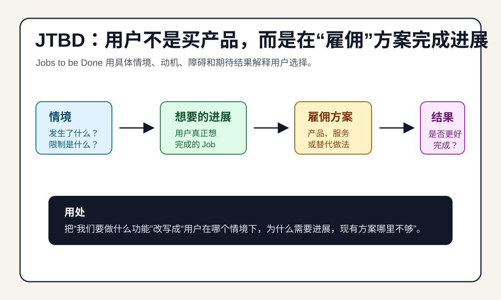

# JTBD 用户任务理论

## 直观预览

## 一句话价值

JTBD 的核心不是问“用户是谁”，而是问“用户在什么情境下，想取得什么进展，所以才会雇佣某个产品、服务或替代方案”。

## AI 选用指南

| 项目 | 选用说明 |
| --- | --- |
| 优先选用条件 | 新产品、功能或文案需求模糊，需要明确用户情境、期待进展、替代方案和选择原因。 |
| 不适合或暂缓条件 | 不能凭理论替代用户访谈或真实证据；需要现成代码时不是实现资源。 |
| 复用方式 | 套用方法 |
| 输入与产出 | 真实选择案例、用户材料与业务假设 → Job Story、访谈问题和待验证需求。 |
| 首次读取入口 | [本卡](./JTBD用户任务理论-2026-07-29.md) →「未来可以怎么用」 |
| 同类选择依据 | JTBD 判断解决什么任务；Vibe 视觉词典把任务转成页面选择；复盘方法用于评估已发生项目。 对照：[Vibe Coding 视觉词典：布局、结构、导航与组件](../01-界面设计/交互细节/Vibe-Coding视觉词典-布局结构导航组件-2026-08-05.md)、[项目复盘方法：从流水账到可验证判断](../11-可复用模板/项目复盘方法-从流水账到可验证判断-2026-09-01.md)。 |
| 接入前提与待核实项 | 区分用户事实与分析假设；先用实际材料推导，证据不足就提出待验证问题。 |
| 检索词 | JTBD Jobs to be Done Job Story 用户任务 需求访谈 产品定位 替代方案 |

> 选用说明整理于 2026-09-20：适用与比较为基于收藏证据的建议；正文中的版本、数量、价格与功能范围按原收录时间理解。本次未安装或运行所收藏的工具，当前环境安装状态另查。未对外部来源作全量实时复核。

## 内容摘要

JTBD 是 Jobs to be Done 的缩写，常译为“待完成的任务”“用户任务”或“要完成的工作”。它把产品选择理解成一种“雇佣”：当人们处在某个具体情境里，想从当前状态走向更好的状态，就会拉进一个产品、服务、流程、内容或人来帮助自己完成这个进展。

它关心的不是人口属性本身，也不只是产品功能清单，而是功能、情绪、社会认同和场景限制共同形成的选择原因。例如，同一个“买咖啡”行为，可能对应提神、找一个短暂休息借口、显得更专业、和同事建立连接、快速解决早餐等不同 Job。

从产品角度看，JTBD 的价值在于把问题从“怎么优化我的产品”改成“用户真正要完成什么进展，当前可选方案为什么不够好”。这样更容易发现真实竞争对手，因为竞品不一定是同类产品，也可能是 Excel、微信群、人工外包、备忘录、拖延，甚至什么都不做。

## 为什么值得收藏

JTBD 很适合以后做产品、工具、内容、广告和界面时反向调用。它能帮助避免只按画像、行业、功能表做判断，而是回到用户的触发情境、焦虑、约束、替代方案和期待结果。

这个框架尤其适合早期产品：当功能还没成形、用户表达也很模糊时，可以用 JTBD 把“我想要一个功能”拆成“什么时候发生、为什么现在要解决、之前怎么解决、为什么旧办法不行、怎样才算成功”。

## 未来可以怎么用

- 写产品定位：用“帮助谁在什么情境下完成什么进展”代替泛泛的“面向某类人提供某功能”。
- 做用户访谈：重点问最近一次真实发生的选择，而不是抽象偏好。
- 设计功能：先写 Job Story，再决定界面和功能。例如：“当我在某个情境下，我想要某种进展，这样我就能得到某个结果。”
- 写营销文案：把卖点从功能名改写成用户想逃离的旧处境和想抵达的新结果。
- 做竞品分析：把竞争范围扩大到所有替代方案，包括手工流程、其他工具、线下服务和不行动。
- 判断需求优先级：优先解决高频、高痛、现有方案代价高、结果可明确评价的 Job。

## 原始内容 / 链接

- [Harvard Business Review：Know Your Customers' "Jobs to Be Done"](https://hbr.org/2016/09/know-your-customers-jobs-to-be-done)：Clayton M. Christensen 等人从创新成功率角度解释 JTBD，强调理解客户为什么做选择。
- [Christensen Institute：Jobs to Be Done Theory](https://www.christenseninstitute.org/theory/jobs-to-be-done/)：把 JTBD 定义为理解人和组织如何、为何做决策的理论镜头，强调 functional、social、emotional 维度。
- [Strategyn：Jobs-to-be-Done Comprehensive Guide](https://strategyn.com/jobs-to-be-done/)：Tony Ulwick 体系下的 JTBD / Outcome-Driven Innovation 视角，强调从客户要解决的问题和期望结果组织需求。
- [Intercom：Designing Features Using Job Stories](https://www.intercom.com/blog/using-job-stories-design-features-ui-ux/)：把 JTBD 落到产品设计里的 Job Stories，强调情境、动机和期望结果，而不是只写 persona 或 user story。

## 相关联想

- 可以和用户访谈模板组合：先问最近一次真实选择，再追问触发事件、旧方案、阻力、决策标准和结果评价。
- 可以和营销文案组合：把“功能卖点”翻译成“用户终于不用再怎样 / 可以更快更稳地做到什么”。
- 可以和界面设计组合：页面上的信息架构优先服务用户 Job，而不是服务内部功能模块。
- 可以和产品路线图组合：把需求列表改成 Job 列表，再看哪些功能同时服务高价值 Job。

## 适合反向调用的场景

- 我现在做一个新产品，帮我用 JTBD 重写定位。
- 我想访谈用户，帮我按 JTBD 设计问题。
- 这个功能到底解决什么 Job？
- 帮我找真实竞品，不只看同类产品。
- 这段广告文案能不能更贴近用户任务？
- 帮我把 persona 改成更具体的 Job Story。
