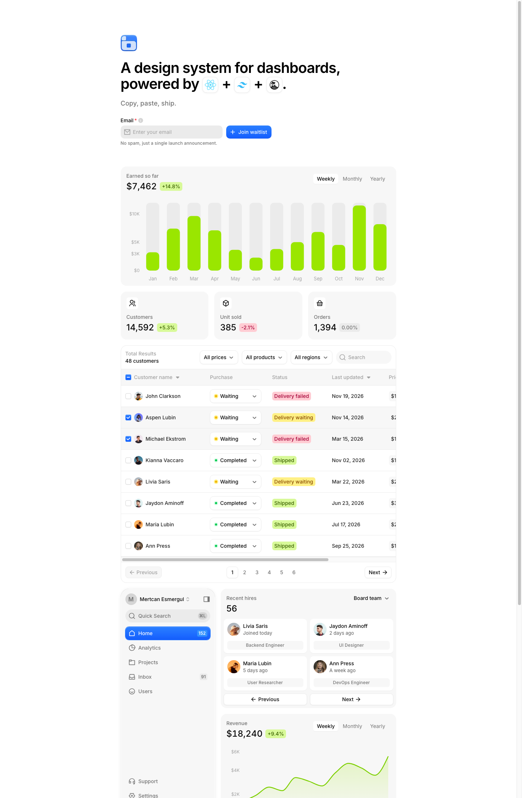
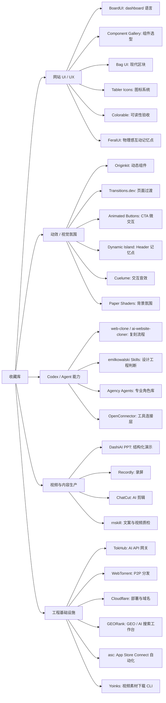

# 多媒体收藏地图

这页不是按时间排，而是按“未来怎么用”重新整理收藏。目标是让收藏从文字卡片变成一个可看、可点、可调用、可继续补图补视频的素材墙。

## 先看有画面的素材

### BoardUI：Dashboard UI / UX 快照



- 主卡片：[[01-界面设计/组件/Dashboard设计系统-BoardUI-2026-07-09|Dashboard 设计系统：BoardUI]]
- 详细拆解：[[_附件/网页快照/BoardUI-2026-07-09/BoardUI设计拆解|BoardUI 设计拆解]]
- 本地网页快照：[[_附件/网页快照/BoardUI-2026-07-09/index.html|index.html]]
- 适合调用：SaaS 后台、数据看板、KPI 卡片、数据表格、筛选器、状态标签、侧边栏、趋势图、热力图。

### Dynamic Island Header：动效视频参考


- 主卡片：[[01-界面设计/动效/灵感Header动效-Dynamic-Island-2026-07-06|灵感 Header 动效：Dynamic Island]]
- 适合调用：悬浮 Header、胶囊导航、状态提示、轻量 command/nav 入口、作品集顶部交互。

### 待纳入媒体池

当前仓库里还有一个未提交的 `配图/` 文件夹，包含 Codex 对话截图和能力介绍卡片。它可以作为“Codex 能力展示图集”的候选，但目前先不纳入正式索引，避免误提交未确认素材。

## 按任务调用收藏

### 1. 做网站 UI / UX

这组是现在最适合喂给 Codex 做网站设计重组的素材。

| 素材 | 主要用途 | 调用方式 |
| --- | --- | --- |
| [[01-界面设计/组件/物理感互动React组件库-FeralUI-2026-07-18|FeralUI]] | 物理感互动、趣味验证码、局部 UX 记忆点 | 每个项目只挑 1 个互动隐喻，放在 Hero、CTA、确认流程或作品展示 |
| [[01-界面设计/组件/Dashboard设计系统-BoardUI-2026-07-09|BoardUI]] | SaaS dashboard、后台、数据表格、KPI 卡片 | 作为工具型产品主设计语言 |
| [[01-界面设计/组件/界面组件设计案例库-Component-Gallery-2026-07-16|Component Gallery]] | 组件学名、组件案例、UX 选型 | 先选组件模式，再生成页面 |
| [[01-界面设计/组件/现代UI组件区块库-BagUI-2026-07-16|Bag UI]] | 现代 UI 区块、landing page 组件 | 作为区块结构参考，不整包照搬 |
| [[01-界面设计/组件/开源SVG图标库-Tablericons-2026-07-16|Tabler Icons]] | SVG 图标系统 | 统一导航、按钮、空状态图标 |
| [[04-工具网站/在线工具/免费设计库-Uiverse-UI-Kits-2026-07-02|Uiverse UI Kits]] | UI kit 和组件风格探索 | 前期找视觉方向 |
| [[04-工具网站/在线工具/配色对比度检测工具-Colorable-2026-07-07|Colorable]] | 配色对比度和可访问性 | 最后做颜色验收 |

一句话调用：先用 Component Gallery 决定“该用什么组件”，再用 BoardUI / Bag UI 决定“长什么样”，用 Tabler Icons 统一图标，最后用 Colorable 查可读性。

### 2. 做动效和微交互

| 素材 | 主要用途 | 调用边界 |
| --- | --- | --- |
| [[01-界面设计/组件/物理感互动React组件库-FeralUI-2026-07-18|FeralUI]] | physics-driven UI、拉绳、翻页、揉纸、吸走、软弹吉祥物等互动 | 只用于一个关键记忆点 |
| [[04-工具网站/在线工具/免费动画组件库-Originkit-2026-07-06|Originkit]] | 文字动效、背景动画、图库交互、微交互 | 用作局部质感补充 |
| [[01-界面设计/动效/Web过渡动效参考库-Transitions-dev-2026-07-07|Transitions.dev]] | 页面切换、组件入场、状态过渡 | 统一 motion 节奏 |
| [[01-界面设计/按钮/CSS动画按钮库-Animated-Buttons-2026-07-16|Animated Buttons]] | CTA、提交、上传、下载按钮动效 | 只用在关键按钮 |
| [[01-界面设计/动效/React发光边框动效组件-Border-Beam-2026-07-07|Border Beam]] | 重点卡片、CTA、定价模块边框强调 | 小面积使用 |
| [[01-界面设计/动效/灵感Header动效-Dynamic-Island-2026-07-06|Dynamic Island Header]] | 悬浮导航、状态胶囊、Header 记忆点 | 用在顶部入口 |
| [[01-界面设计/收藏按钮流光高亮效果-2026-07-02|收藏按钮流光高亮效果]] | 收藏、点赞、关注反馈 | 高频点击后的状态反馈 |
| [[01-界面设计/动效/Web交互音效库-Cuelume-2026-07-17|Cuelume]] | Web 交互音效、按钮/开关/完成反馈声音 | 只用于关键操作，默认可关闭 |
| [[04-工具网站/在线工具/零依赖着色器效果库-Paper-Shaders-2026-07-03|Paper Shaders]] | shader 背景、Logo 动效、视觉氛围 | 适合品牌页和实验页 |

一句话调用：动效不要全站乱飞；Header、CTA、卡片边框、页面切换、背景氛围各用一个明确素材，动效才会像设计而不是特效堆叠。

### 3. 做 Codex / Agent 能力

| 素材 | 主要用途 | 适合什么时候用 |
| --- | --- | --- |
| [[03-Codex能力/Skills/设计工程AI技能库-emilkowalski-Skills-2026-07-02|emilkowalski Skills]] | 给 AI 补设计工程判断 | 做前端界面和动效前 |
| [[03-Codex能力/工作流/AI协作执行心得-Vibe开发-2026-07-03|Vibe 开发 5 条]] | AI 协作执行规则 | 防止补丁堆叠、样式漂移 |
| [[03-Codex能力/工作流/AI网站反向重建模板-ai-website-cloner-2026-07-09|ai-website-cloner]] | 网站反向重建流程 | 迁移/复刻自有网站 |
| [[03-Codex能力/Skills/网站复刻真源码优先方法论-web-clone-2026-07-09|web-clone]] | 真源码优先、证据分级、visual diff | 复杂前端复刻和核验 |
| [[03-Codex能力/Skills/可编辑演示文稿生成Skill-DashiAI-PPT-2026-07-08|DashiAI PPT]] | 生成可编辑 HTML / PPTX 演示 | 汇报、路演、方案材料 |
| [[03-Codex能力/Skills/雪踏乌云AI-Agent-Skills集合-rnskill-2026-07-07|rnskill]] | 中文写作、视频动效、视频质检 Skill | 内容表达和视频制作 |
| [[03-Codex能力/Agents规则/AI专业角色Agent库-Agency-Agents-2026-07-16|Agency Agents]] | 专业 AI Agent 角色库、多工具安装体系 | 搭建自己的 Codex 专业团队 |
| [[04-工具网站/开源项目/AI-Agent开源连接器网关-OpenConnector-2026-07-12|OpenConnector]] | Agent 工具连接层、MCP、OpenAPI | 跨 SaaS 工具调用产品 |

一句话调用：如果任务是“让 Codex 做一个东西”，先给它工作流素材；如果任务是“让 Codex 做得好看”，再给它 UI / 动效素材。

### 4. 做视频、演示和内容生产

| 素材 | 主要用途 | 可以组合成什么 |
| --- | --- | --- |
| [[04-工具网站/开源项目/终端视频下载工具-Yoinks-2026-07-18|Yoinks]] | 合法公开视频素材下载、视频参考本地化 | 收藏卡片视频预览、动效参考素材池 |
| [[04-工具网站/在线工具/AI提示词视频编辑器-ChatCut-2026-07-12|ChatCut]] | 提示词剪辑、字幕、AI 视频生成 | 社媒短视频、产品介绍 |
| [[04-工具网站/开源项目/开源演示视频录屏编辑器-Recordly-2026-07-09|Recordly]] | 产品录屏、自动 zoom、演示视频编辑 | 产品 walkthrough、README 动图 |
| [[03-Codex能力/Skills/可编辑演示文稿生成Skill-DashiAI-PPT-2026-07-08|DashiAI PPT]] | 演示文稿生成与导出 | 路演稿、汇报材料 |
| [[03-Codex能力/Skills/雪踏乌云AI-Agent-Skills集合-rnskill-2026-07-07|rnskill]] | 视频动效导演、视频质检 | 视频风格和质量门 |

内容生产线：Yoinks 保存合法外部视频素材，DashiAI PPT 生成结构，Recordly 录屏，ChatCut 剪辑包装，rnskill 做文案/动效/质检。

### 5. 做开源工程、平台和基础设施

| 素材 | 主要用途 | 适合发散 |
| --- | --- | --- |
| [[04-工具网站/开源项目/终端视频下载工具-Yoinks-2026-07-18|Yoinks]] | yt-dlp / ffmpeg 封装、终端视频下载、React terminal UI | 视频素材库、CLI 产品体验、内容采集工具 |
| [[04-工具网站/开源项目/App-Store-Connect自动化CLI-asc-2026-07-18|asc]] | App Store Connect、TestFlight、构建、提交、元数据和发布自动化 | Apple App 发布助手、Codex 移动端 DevOps 工作流 |
| [[04-工具网站/开源项目/GEO开源工作台-GEORank-2026-07-18|GEORank]] | GEO / AI 搜索可见性诊断、行动方案、拓词和结构化工具 | AI 搜索增长工具、自托管 GEO 工作台 |
| [[04-工具网站/开源项目/AI-API中转站监控与网关系统-TokHub-2026-07-07|TokHub]] | AI API 网关、监控、运营后台 | AI 服务聚合平台 |
| [[04-工具网站/开源项目/AI-Agent开源连接器网关-OpenConnector-2026-07-12|OpenConnector]] | SaaS 连接器、Action 目录、MCP / OpenAPI | 个人/团队 AI 助手基础设施 |
| [[04-工具网站/开源项目/浏览器与Node流式Torrent客户端-WebTorrent-2026-07-08|WebTorrent]] | P2P 文件分发、WebRTC、流式加载 | 临时文件分享、低带宽分发 |
| [[04-工具网站/开源项目/开源演示视频录屏编辑器-Recordly-2026-07-09|Recordly]] | Electron 桌面录屏编辑器 | 创作者工具、产品 demo 工具 |
| [[04-工具网站/服务平台/Cloudflare仪表盘管理入口-2026-07-08|Cloudflare 仪表盘管理入口]] | 运维、DNS、监控、域名购买 | 网站部署和域名管理入口 |

## 思维发散图



## 给 Codex 的调用提示词

```text
请先读取我的收藏库多媒体地图：
/Users/youfei/Desktop/obsidian/_索引/多媒体收藏地图.md

然后根据当前项目类型，只挑选最适合的素材，不要全部塞进项目。

如果是 SaaS / 后台 / 数据看板：
- 优先用 BoardUI、Component Gallery、Tabler Icons、Colorable。
- 动效只少量使用 Transitions.dev、Animated Buttons、Border Beam。

如果是 landing page / 产品官网：
- 优先用 Bag UI、Component Gallery、Tabler Icons。
- 用 Originkit / Paper Shaders / Animated Buttons 做局部质感。

如果是 Codex 工作流 / Agent 产品：
- 优先参考 web-clone、ai-website-cloner、OpenConnector、emilkowalski Skills。

如果是视频 / 演示内容：
- 优先组合 DashiAI PPT、Recordly、ChatCut、rnskill。

执行时请输出：
1. 选择了哪些收藏素材；
2. 为什么选它们；
3. 分别应用到哪些页面、组件、交互或工作流；
4. 哪些素材没有采用，以及原因；
5. 修改完成后做截图或运行检查，确认不是只做文字描述。
```

## 待补媒体清单

后续每次收藏，建议至少补一种非文字材料。

| 类型 | 应补材料 | 优先级 |
| --- | --- | --- |
| UI / UX 网站 | 首屏截图、关键组件截图、移动端截图、设计拆解图 | 高 |
| 动效参考 | 原视频、本地 mp4、关键帧截图、动效拆解 | 高 |
| 开源项目 | README 截图、架构图、核心界面截图、源码 zip / git bundle | 中 |
| 在线工具 | 官网截图、功能页截图、输入输出示例 | 中 |
| Codex Skill / 工作流 | 流程图、命令截图、输入输出样例 | 中 |
| 内容生产工具 | 样片、视频、封面图、流程截图 | 中 |

## 当前媒体资产

- 收藏卡片首屏预览图：`_附件/收藏预览/`
- BoardUI 本地截图：`_附件/网页快照/BoardUI-2026-07-09/screenshots/boardui-desktop-1440.png`
- BoardUI 本地网页快照：`_附件/网页快照/BoardUI-2026-07-09/index.html`
- BoardUI 设计拆解：`_附件/网页快照/BoardUI-2026-07-09/BoardUI设计拆解.md`
- Dynamic Island 本地视频：`_附件/视频/2026-07-06-Yonathan-Dejene-dynamic-island-inspired-header.mp4`
- TokHub 项目备份：`_附件/项目备份/TokHub/`
- 待确认配图：`配图/`
